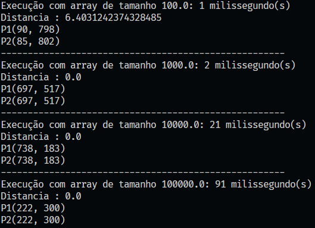
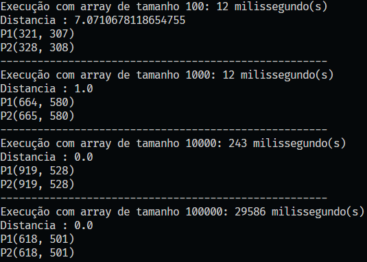

# Par mair próximo

> Alunos

| Aluno                       | Matricula   |
| --------------------------- | ----------- |
| Luis Gustavo Seiji Tateishi | 11921BCC034 |
| Heitor Freitas Ferreira     | 11921BCC026 |


## Implementacao em Java

### Class Main

> Classe cliente que utiliza os algoritmos

```java
import java.util.ArrayList;

public class App {
    public static void main(String[] args) throws Exception {
        for (int k = 2; k < 7; k++) {
            ArrayList<Point> pontos = new ArrayList<>();
            for (int i = 0; i < Math.pow(10, k); i++) {
                pontos.add(new Point(Math.random() * 1000, Math.random() * 1000));
            }
            long startTime = System.nanoTime();
            Tupla<Double, Tupla<Point, Point>> tupla = PMP.divideCoquerPiggyBack(pontos);// PMP.divideCoquer(pontos);
            long endTime = System.nanoTime() - startTime;

            System.out.println(
                    "Execução com array de tamanho " + (int) Math.pow(10, k) + ": " + endTime / 1000000
                            + " milissegundo(s)");
            System.out.println("Distancia : " + tupla.first);
            System.out.println("P1" + tupla.second.first.toString());
            System.out.println("P2" + tupla.second.second.toString());
            System.out.println("-----------------------------------------------------");
        }

    }
}

```

### Class PMP
  
> Classe que realiza os algoritmos de busca de par mais próximo com e sem piggybacking, e seus métodos auxiliares

```java
import java.util.*;

public class PMP {
    private static PMP instance = new PMP();

    private PMP() {
        super();
    }

    public static PMP getInstance() {
        return instance;
    }

    // #region Estratégia dividir e conquistar
    private static Tupla<Double, Tupla<Point, Point>> divideCoquerBase(ArrayList<Point> pontos, int start, int end) {
        double dist = pontos.get(start).distance(pontos.get(start + 1));
        Tupla<Double, Tupla<Point, Point>> ret = new Tupla<>(dist,
                new Tupla<>(pontos.get(start), pontos.get(start + 1)));
        for (int i = start; i < end - 1; i++) {
            for (int j = i + 1; j < end; j++) {
                double aux = pontos.get(i).distance(pontos.get(j));
                if (aux < dist) {
                    dist = aux;
                    ret.first = aux;
                    ret.second.first = pontos.get(i);
                    ret.second.second = pontos.get(j);
                }
            }
        }
        return ret;
    }

    public static Tupla<Double, Tupla<Point, Point>> divideConquer(ArrayList<Point> pontos) {
        return divideCoquerHidden(pontos, 0, pontos.size() - 1);

    }

    private static Tupla<Double, Tupla<Point, Point>> divideCoquerHidden(ArrayList<Point> pontos, int start, int end) {
        if (end - start <= 100)
            return divideCoquerBase(pontos, start, end);
        int mid = Math.floorDiv((start + end), 2);
        Tupla<Double, Tupla<Point, Point>> left = divideCoquerHidden(pontos, start, mid);
        Tupla<Double, Tupla<Point, Point>> right = divideCoquerHidden(pontos, mid + 1, end);

        Tupla<Double, Tupla<Point, Point>> ret = new Tupla<>(0.0, new Tupla<>(new Point(0, 0), new Point(0, 0)));
        if (left.first < right.first) {
            ret.first = left.first;

            ret.second.first = left.second.first;
            ret.second.second = left.second.second;
        } else {
            ret.first = right.first;

            ret.second.first = right.second.first;
            ret.second.second = right.second.second;
        }

        ArrayList<Point> range = new ArrayList<>();

        for (int i = start; i < end; i++) {
            if (Math.abs(pontos.get(i).x - pontos.get(mid).x) < ret.first) {
                range.add(pontos.get(i));
            }
        }
        for (int i = 0; i < range.size(); i++) {
            for (int j = 0; j < 8; j++) {
                if (i + j < range.size()) {
                    Double dAux = range.get(i).distance(range.get(i + j));
                    if (dAux < ret.first) {
                        ret.first = dAux;
                        ret.second.first = range.get(i);
                        ret.second.second = range.get(i + j);
                    }
                }
            }
        }
        return ret;
    }
    // #endregion Dividir e conquistar

    // #region Piggybacking
    private static ArrayList<Point> mergePiggyBackArrayList(ArrayList<Point> list1, ArrayList<Point> list2) {
        ArrayList<Point> ret = new ArrayList<>();
        int i = 0, j = 0;
        while (i < list1.size() && j < list2.size()) {
            if (list1.get(i).getY() < list1.get(i).getY()) {
                ret.add(list1.get(i));
                i++;
            } else {
                ret.add(list2.get(j));
                j++;
            }
        }
        while (i < list1.size()) {
            ret.add(list1.get(i));
            i++;
        }
        while (j < list2.size()) {
            ret.add(list2.get(j));
            j++;
        }
        return ret;
    }

    private static Tripla<Double, Tupla<Point, Point>, ArrayList<Point>> divideCoquerPiggyBackBase(
            ArrayList<Point> pontos, int start, int end) {
        double dist = pontos.get(start).distance(pontos.get(start + 1));
        Tripla<Double, Tupla<Point, Point>, ArrayList<Point>> ret = new Tripla<>(dist,
                new Tupla<>(pontos.get(start), pontos.get(start + 1)), pontos);
        for (int i = start; i < end - 1; i++) {
            for (int j = i + 1; j < end; j++) {
                double aux = pontos.get(i).distance(pontos.get(j));
                if (aux < dist) {
                    dist = aux;
                    ret.first = aux;
                    ret.second.first = pontos.get(i);
                    ret.second.second = pontos.get(j);
                }
            }
        }
        ret.getSortedArray().sort((a, b) -> a.y.compareTo(b.y));
        return ret;
    }

    private static Tripla<Double, Tupla<Point, Point>, ArrayList<Point>> divideCoquerPiggyBackHidden(
            ArrayList<Point> pontos, int start, int end) {
        if (end - start < 100)
            return divideCoquerPiggyBackBase(pontos, start, end);
        int mid = Math.floorDiv((start + end), 2);
        Tripla<Double, Tupla<Point, Point>, ArrayList<Point>> left = divideCoquerPiggyBackBase(pontos, start, mid);
        Tripla<Double, Tupla<Point, Point>, ArrayList<Point>> right = divideCoquerPiggyBackBase(pontos, mid + 1, end);
        Tripla<Double, Tupla<Point, Point>, ArrayList<Point>> ret = new Tripla<>(
                left.first < right.first ? left.first : right.first, new Tupla<>(left.second.first, right.second.first),
                mergePiggyBackArrayList(left.getSortedArray(), right.getSortedArray()));
        if (left.first < right.first) {
            ret.first = left.first;
            ret.second = left.second;
        } else {
            ret.first = right.first;
            ret.second = right.second;
        }
        ArrayList<Point> range = new ArrayList<>();
        for (Point point : pontos) {
            if (Math.abs(point.x - pontos.get(mid).x) < ret.first) {
                range.add(point);
            }
        }

        for (int i = 0; i < range.size(); i++) {
            for (int j = 1; j < 8; j++) {
                if (i + j < range.size()) {
                    Double dAux = range.get(i).distance(range.get(i + j));
                    if (dAux < ret.first) {
                        ret.first = dAux;
                        ret.second.first = range.get(i);
                        ret.second.second = range.get(i + j);
                    }
                }
            }
        }
        return ret;
    }

    public static Tupla<Double, Tupla<Point, Point>> divideCoquerPiggyBack(ArrayList<Point> param) {
        Tripla<Double, Tupla<Point, Point>, ArrayList<Point>> ret = divideCoquerPiggyBackHidden(param, 0,
                param.size() - 1);
        return new Tupla<>(ret.getDistance(), ret.getPoints());
    }

    // #endregion Piggybacking

}
```

### Classes Tripla e Tupla

> Interfaces de retorno das funções de busca de par mais próximo

```java
public class Tripla<Type1,Type2,Type3> {
    public Type1 first;
    public Type2 second;
    public Type3 third;
    public Tripla(Type1 first, Type2 second, Type3 third) {
        this.first = first;
        this.second = second;
        this.third = third;
    }
    public Type1 getDistance() {
        return first;
    }
    public Type2 getPoints() {
        return second;
    }
    public Type3 getSortedArray() {
        return third;
    }
    public void setDistance(Type1 value) {
        this.first = value;
    }
    public void setPoints(Type2 value) {
        this.second = value;
    }
    public void setSortedArray(Type3 value) {
        this.third = value;
    }

}
public class Tupla<Type1,Type2> {
    public Type1 first;
    public Type2 second;
    public Tupla(Type1 first, Type2 second) {
        this.first = first;
        this.second = second;
    }
}

```


## Comparação dentre os algoritmos em tempo de execução

> Sem Piggyback



> Com Piggyback


