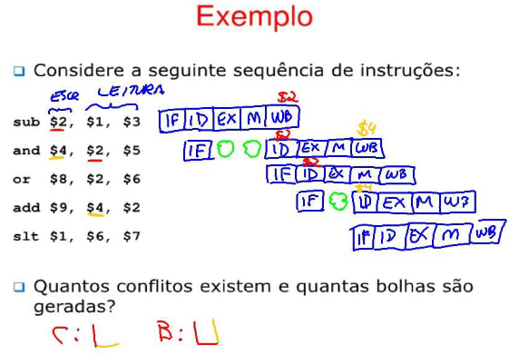

# ARQUITETURA E ORGANIZAÇÃO DE COMPUTADORES 2

> Importante quando a performancê é desejada. *(Sistemas de bancos de dados, jogos, bibliotecas de álgebra linear, aplicativos ciêntificos, etc.*

## Benefícios

- Fundamental para o desenvolvimento de sistemas computacionais de alto desempenho e processamento paralelo.
- Estar apto a tomar desições de compra de hardware, melhor entendimento sobre as necessidades do software alvo e as características do hardware disponível.
  - Evitar superdimensionamento de hardware
- Para aparender a utilizar técnicas de otimização de desempenho em sistemas computacionais.
- Para entender a estrutura e funcionamento de computadores.

## Deandas constantes da computação

- Melhor desempenho
- Computadores menores e mais leves
- Maior capacidade de memória e armazenamento
- Menor consumo de energia (menor dissipação de calor)

## Aperfeiçoamento em arquitetura de conjunto de instruição

- **Pipeline** para diminuir a ociosidade da CPU no ciclo de instrução.
  - Problema: um algoritmo quase nunca é linear, logo é difícil saber para onde ir nos caminhos do algoritmo
  - Solução: Branch prediction
- Emissão de várias instruições para execução, em processamento **Superescalar**.
  - Emissão das instruções em paralelo;
  - Problema: o programa é sequêncial, mas as execuções são em paralelo;
  - Gera paralelismo de instruções a nível do processador;
  - Problema do paralelismo: supondo que duas instruções são feitas, uma entre int e float, e outra entre float e float, como ambas tem tempos de execução diferentes, uma fica pronta antes da outra, logo é necessário mecânismos para verificação desses casos.
- Melhor organização dos circuitos aritméticos para se obter muitos resutlados intermediários simultâneos.

## [Hazards](https://en.wikipedia.org/wiki/Hazard_(computer_architecture)#:~:text=In%20the%20domain%20of%20central,lead%20to%20incorrect%20computation%20results.)

> Problemas com o pipeline de instruções na microarquitetura da CPU, quando a próxima instrução não possa ser executada no próximo clock.

# Capítulo 1

> Princípios quantitativos do projeto de um computador

Tcpu = #Instr * CPI * Período do clock

Pipeline: CPI se aproxime de 1

Superscalares: CPI ser menor que 1

## Tendências de projeto, eficiência energética, dependência e custo

### CPU

A capacidade de executar ciclos de instrução por segundo vem aumentando exponêncialmente em uma frequência altíssima, esse aumento vem diminuíndo após a entrada dos anos 2000.

> **Lei de Moore:** número de transistores em um único chip dobram no período de 18 a 24 meses

Garantiu a supremacia de microcomputadores com único processador, levando à queda dos, sendo substituídos por sistemas distribuídos.

#### Redução da capacidade

> Motivos

- **Superaquecimento**, necessidade de refrigeração forçada
- Saturação do **paralelismo** a nível de instrução
- Saturação da **velocidade da memória**

> Em anos recentes, o aumento da velocidade de *clock* tem caído *1%* ao ano

#### Pós redução da capacidade

Foco em construção de processadores de vários núcleos e incentivo de criação de aplicações executando em paralelo, tanto os dados quanto o processamento

### Memória primária

Aumento da capacidade e densidade de memória DRAMs, semicondutoras e flash semicondutoras

### Transistores e fios

Atrasos em fios não reduzem na mesma escala que escala nos circuitos lógicos (tamanho de chips *vs* fios deles e os que os ligam)

### Potência

Não é possível consistentemente operar em frequência altas sem alcançar os **limites de potência/térmicos**

#### Overclock

> Turbo mode na intel

CPU roda em uma taxa maior de *clock* por um curto intervalo de tempo, sneod forçado pelo usuário ou não


### Melhorar desempenho sem aumentar clock

1. Realizar **mais trabalho por** ciclo de **clock**
   - Transistores são mais rápidos e com maior eficiência energética
2. Melhorias arquiteturais
   - Explorar mais **paralelismos** em uma thread e em nível de thread
   - Melhorar **previsão de desvios**
   - Melhorar política de **cache**
   - Melhorar **organização da memória**

### Formas de melhorar o desempenho

- Multi-núcleos
- Melhores modelos de programação e eficiência em multi-thread
  - Esforço de cada programador
- Melhor hirarquia de memória
- Melhor eficiência energética
  - M**ulti-núcleos** com caracteristicas de processamento diferentes,** alguns com maior capacidade** para tarefas mais demandantes, e **outros com menor capacidade** para momentos que não necessitem de uma alta taxa de trabalho da CPU
  - **Reduzir movimentação de dados** (dados no computador é energia)
- SoC (System on a Chip) e ARM
  - Memória, processador e outros componentes juntos no mesmo chip físico
  - Proposta de ser a unificação dos diferentes tipos de chips (pcs, mobile, mainframes...)
  - Destaque para os Chips M1 e M2 da Apple

## Equação de desempenho e Benchmarks Suites

> Como definir, medir e resumir desempenho

Observaões importantes sobre projeto

- Tirar proveito do paralelismo
- Explorar o princíoio da localidade
- Foco no caso comum (Lei de Amdahl)
  - Melhorar o que é muito usado primeiro

### O que é desempenho, como medir métricas básicas

> A frequência do trabalho não impacta tanto quanto como o trabalho é feito

#### Perguntas motivacionais

- Por que alguns hardwares tem melhor desempenho para programas diferentes
  - Algumas aplicações usam diferentes partes do hardware mais que outras
- Quais fatores de desempenho do sistemas estão relacionados com hardware
  - Alguns casos o problema pode ser derivado do software e da sua implementação
- Como o conjunto de instruções da máquina afeta o desempenho?

### Tempo de resposta 

> Latência

- Quando tempo leva para executar meu programa
- QUanto tempo leva pra executar um programa qualquer
- Quanto tempo eu devo esperar para um consulta ao banco de dados

#### Tempo consumido

> Elapsed TIme

- Contabiliza vários aspectos
  - Tempo de memória
  - Outros processos na máquina
  - I/O
- Útil, mas não é bom para comparação

#### Tempo de CPU *(CPU Time)*

- Não contabiliza I/O ou tempo de outros programas
- Pode ser quebrado em tempo de sistema e tempo de usuário
  - Pode ser medido usando UNIX **time**command


### Vazão

> Throughput

- Quantos processos (threads) a máquina pode executar por vez
- Qual a taxa média de execução
- Quanto trabalho foi feito

### Ciclo de clock

- Considerar unidade de ciclos ao invés de segundos omo referência de desempenho
  - $(segundos/programa) = (ciclos/programa) * (segundos/ciclos)$
- Eventos de click indicam quando começam as atividades
- tempo de ciclo = tempo entre os eventos de clock
- Taxa de clock = ciclos/segundo
- Um clock de $500MHz$ tem um tempo de ciclo de $2ns$

> Métricas básicas

- Cycle time (segundos por ciclo)
- Clock rate (ciclos por segundo)
- CPI (ciclos por intrução)
- MIPS (Milhões de instruções por segundo)
  - Não confiavel pois cada instrução demora uma quantidade de tempo variável
- Flops (instruções de ponto flutuante por segundo)

tempo_cpu = #ciclosClock(prog) * tempoCiclo(clock)

tempo_cpu = (#ciclos_clock/frequência)

tempo_cpu = #intruçõesPorClock * ciclosPorIntruções * cicloDeClock

> Para melhorar o tempo de CPU

- Aumentar a frequência do clock = diminuir o período de clock
  - Tecnologia de organização do Hardware
  - Para obter uma melhora na performance apenas melhorando essa métrica, ela deve ser aumentada significantemente, que leva a um custo muito alto
- Reduzir o número de **ciclos por instrução**
  - Melhorar organização e arquitetura do conjunto de intruções (ISA)
- Reduzir a quantidade de intruções
  - ISA e tecnologias do compilador (implementação)

> é Dificil mudar um parâmetro de modo completamenteo isolado, as **tecnologias envolvidas** na mudanção de caracteristicas são **interdependentes**

## Arquitetura do Conjunto de instruções (***ISA***)

### O que é a ISA

> Especifica funcionalidade do processador

> Tranforma o código de montagem em movimentações da microarquitetura

- Operações suportadas
- Elementos armazenadores e como os acessar
- Como programador/compilador interage com o processador

### O que determina um bom projeto ISA

- Implementabilidade
  - Suportar várias implementações
    - Custo
    - Desempenho
    - Implementações de alto desempenho
- Programabilidade
  - Facilidade de expressar soluções algoritmicas
- Backward/Foward Compatibility

### Arquitetura de conjunto de intruções

> Parte visível ao programador

- Formatos de instruções
- Opcodes (instruções disponíveis)
- Número e tipos de 

#### Objetivos principais

- Ser implementada por hardwares
  - Simples
  - Rápidos


### Decisões de projeto de um ISA

- Tamanho da intrução
- Quantos registradores
- Formato de intrução
- Operandos
- Operações
  - Última coisa a ser escolhida

#### Exemplos de ISAs

- **VAX** da Digital (elegante)
- **Intel x86** (feia, bem sucedida)
- **MIPS** foco de texto, usado em diversas máquinas
- **PowerPC** (Mac's e supercomputadores IBM)

> CISC's (Computadores de Conjunto de Instruções **Complexas**)

- VAX
- x86


> RISC's (Computadores com Conjunto de Instruções **Reduzido**)

- MIPS
- PowerPC
- DEC Alpha (sucessor do VAX)

#### Tamanho da Instrução

- Variável
  - x86 (1 a 17 bytes)
  - VAX (1 a 54 bytes)
- Fixo
  - MIPS
  - PowerPC
  - Maioria dos RISCs
  - 4 bytes

Tamanho fixo é mais fácil de trocar de posição da instrução

#### Quantidade de registradores

> Poucos registradores: vantagem

-  Menos bits pra especificar qual
- Menor hardware
- Acesso mais rápido (fios menores e menos gates)
- Troca de contexto mais rápida

> Vantagem de um número maior

- Menos **loads** e **stores** 
- Mais fácil realizar várias operações ao mesmo tempo

#### Formado te instruções

> O que significa cada bit

- Muitos formatos
  - Complica a decodificação
  - Bits de instruição pra especificar o formato
- Máquina precisa determinar se:
  - "É uma instrução de 6 bytes"
  - "Bits 7-11 especificam um registrador

#### Quantidade de operandos

- Dois endereços de código: destino pode ser o mesmo que o operando
  - $x = x + y$
- Três o destino pode ser outro
  - $x = y + z$


## **Projeto *RISC***, implementação da ISA

# Capítulo 2

> Projeto da hierarquia da memória

## Organização Hierárquica da memória

> Endereçada a byte

Estudo de caso no MIPS

### Registradores e memória

- Operações feitas entre registradores
- Caso falte registradores realizar *spill*


### Formato das intruções tipo R

> Instruções e lógicas

- op-code (6 bits)
  - Código da operação
- rs (5 bits)
  - Registrador de origem
- rt (5 bits)
  - Registrador de origem
- rd (5 bits)
  - Registrador de destino
- shamt (5 bits)
  - Tamanho do desvio
- funct (6 bits)

### Formato das instruções tipo I

> Aritméticas e lógicas com operando imediato, loads e stores, desvios 

- op-code (6 bits)
  - Código da operação
- rs (5 bits)
  - Registrador de origem
- rt (5 bits)
  - Registrador de origem
  - Pode ser o destino
- Operador de deslocamento (16 bits)


### Formato das intruções tipo J

> Chamada de sub-rotina, desvio com endereçamento absoluto

- op-code (6 bits)
  - Código da operação
- Endereço (26 bits)

### Estágios da instrução

1. Busca de instrução
   - Controlador de programa (PC) para armazenar o endereço da instrução
   - Um somador para calcular o endereço da próxima instrução
   - Memória onde estão armazenadas as instruções
2. 

### Máquina de cicli único

- Todas operações devem ser feitas em um único ciclo
- Duração do ciclo calculada pelo pior ciclo
- Leitura da instrução e acesso à memória no mesmo ciclos duas memórias
- Cálculos de endereço e operações aritméticas no mesmo ciclo: três unidades funcionais (ALU, somadores)

> Todas intruções completam em um ciclo de relógio

Algumas instruções usam mais HW que outras, logo gastam menos que um clock para serem executadas, o load é uma que demora mais dentre as mesmas

Exemplo numérico

- 2ns para acesso s memórias
- 1ns para leitura e escrita no banco de registradores
- 2ns para a ALU
- Período de relógio no monoclico = 8ns

Imagine um programa com 24% loads, 12% stores, 44% R-format, 20% branches, todas executariam em 8ns

Se tivéssemos um rológio variável, cada instrução demoraria apenas o tempo necessário, levando a uma melhora de trazer o clock de 8ns para 6ns em média

> Surgimento de máquina ***multi-ciclo***

### Máquina multicliclo

- Vários ciclos por instrução
- Cada instrução pode ser executada num número diferente de ciclos
- **Unidades funcionais podem ser reutilizadas em ciclos distintos**
- Pequeno acréscimo de multiplexadores e registradores

### Passos das instruções

1. Busca
   1. Busca da instrução, incremento do PC
2. Decodificação
   1. Decodificação da instruição
   2. Leitura dos registradores - mesmo que não utilizados
   3. Cálculo do endereço do branch - mesmo que a instrução não seja branch
3. Execução
   1. Tipo R -- Execução da operação
   2. Load Store - Cálculo do endereço efetivo do operando
   3. Branch - Determinar se branch deve ser executado, Atualiza o PC (acaba)
   4. Jump - Atualiza o PC (acaba)
4. Memória
   1. Tipo R - Grava resultado no registrador (acaba)
   2. Store - Grava dado na memória (acaba)
   3. Load - Busca dado na memória
5. Write-Back
   1. Load - Grava resultado no registrador (acaba)


## Otimizações básicas para o **Cache**

# Capítulo 3

> Paralelismo em nível de instrução, mecanismos para melhorar o **CPI**

## Arquitetura pipelining e superscalares

> RELEMBRANDO: Estágios da instrução mips

1. Busca
2. Decodificação
3. Execução na ULA
4. Memória
5. Escrita do resultado no registrador de destino

Dependendo de que estágio se está, os componentes para execução dos outros estados estão **ociososos**, logo se está desperdiçãndo hardware

Exemplo:

- Instrução 1: lw $t0, 0($s0)
- Instrução 2: $y = y + z$

Enquanto a primeira instrução estiver no estágio de **decodificação (2)**, a segunda estará no estágio de **busca (1)**

### Definição de **pipeline**	

- Ténica ed otimização que **maximiza o uso do hardware** ao sobrepor a **execução das instruções**
- Baseia-se no fato de que cada um dos 5 estágios de execução da instrução MIPS pode ser executado em paralelo

> Latência: Número de ciclos que uma instrução leva para executar o complementamente

*O pipeline não melhora a latência*

> Vazão: Número de ciclos necessários para que uma nova instrução seja concluída, a partir 

*Pipeline melhora a vazão* a partir da 5 instrução

- Pipeline está ***em preenchimento*** quando ainda **há componentes não utilizados** (até chegar na 5 instrução)
- Pipeline está ***cheio*** quando **todos os componentes estão em uso** (a partir da 5 instrução)
- Pipeline ***está em esvaziamento*** quando há **componentes funcionais vão sendo liberados** (nas 4 últimas instruções)

> Paradoxo do pipeline: **melhorar a vazão** pode **piorar a latência**

### Hazzards

#### Hazzard de dados

> Ocorre quando uma instrução depende do resultado de outra instrução que ainda não foi executada

Exemplo:

```
sub $2, $1, $3
add $12, $2, $5
or  $13, $6, $2
add $14, $1, $3
add $15, 100($3)
```

- A instrução 2 depende do resultado da instrução 1
- A instrução 3 depende do resultado da instrução 2 e consequêntemente do resultado da instrução 1
- A instrução 4 depende do resultado da instrução 1

##### Possíveis soluções

- Escalonamento: trocar a ordem das instruções para que as dependencias estejam resolvidas quando for executar a instrução, antecipando as interdependentes
  - Pode ser executada pelo programador e/ou pelo compilador
- NOP
  - No OPeration: Instrução que apenas aumenta o PC
  - Programador ou compilador insere NOPs para aguardar o resultado de uma instrução
  - Gasta ciclo atoa
- Congelamento do pipeline
  - Detectar ocorrência de hazzard implementada em hardware
  - Como fazer: colocando zeros nos sinais de controles
  - Assim serão geradas Bolhas (stalls)
  - 
  - **Como:** Comparar índices de registradores a serem lidos e escritos nos registradores do pipeline e se a instrução escreve em um registrador
  - Resultado similar à NOP, mas implementado com hardware
  - 
  - Legenda: Verde - bolha adiconada
  - **Em resumo:** instrução $N+1$ precisa da saída da $N$. Logo a unidade de detecção de hazzards após buscar $N+1$ congela o pipeline por **2 ciclos**, até alinhas a *decodificação (ID)* de $N+1$ com o *WriteBack (WB)* de $N$. Se for no lugar da $N+1$ a $N+2$, será congelado apenas por **1 ciclo**
- Adiantamento (Fowarding)
  - Quando os registradores de pipeline já tem o resutado da ULA o mesmo pode ser adiantado para as próximas instruções que precisam do resultado
  - Funciona com base que as instruções só precisam do dado no estágio de execução, e após a execução o dado já existe
  - Logo se a instrução $N+1$ precisa do resultado da instrução $N$, ela pega direto do registrador de pipeline após a execução de $N$ ao invés de pegar do registrador de destino de $N$
  - 
  - **Em resumo:** O parametro da instrução que é executada na ULA ou pega direto da saída da ULA se precisa do dado gerado pela instrução imediatamente atrás, ou do registrador de barreira após a saída da ULA se precisa do dado gerado por uma instrução duas atrás
  - ***NÃO* PRECISA DE BOLHAS PARA INSTRUÇÕES DO ```TIPO R``` APENAS SE FOR APÓS UM ```LW```**
- Predição de desvio
  - Problema: O que colocar no pipeline após um desvio (if ou else)?
  - Caso carregue o errado, teremos que descartar todo o pipeline (flush), 2 ciclos de clock perdidos pois a decisão ocorre no estágio de execução (3º)
  - Técnicas para previsão
    - Desvio NUNCA é tomado
    - Desvio SEMPRE é tomado
      - Bom para o FOR, pois o mesmo é sempre tomado 
    - Desvio DEPENDE DO CÓDIGO
    - Desvio DEPENDE DO HISTÓRICO
      - Tabela auxiliar de uma tabela de histórico de desvios
      - Armazena endereço de instrução, endereço do desvio e estado
      - Se adapta ao programador/compilador

## Arquitetura superpipeline

> Cada estágio do pipeline é quebrado em mais partes ainda

Mesmo raciocício do projeto multiciclo  aplicado ao pipeline, muitos estágios do pipeline necessitam menos que a metade de um clock

Também conhecido como *deep-pipeline*

Cada substágio continua executando uma instrução por clock, mas, como o clock é multiplicado, o pipeline pode aceitar duas ou mais instruções para cada clock externo

### Consequências

- Ritmo do sistema é dado pelo tempo de execução de um subestágio
  - Substágio mais lento
  - Caminho crítico
  - Gargalo
- Aumento da frequência do processador
- Cada subestágio faz menos trabalho que no estágio do pipeline original

### Limitações

- Hazards de dados
  - Pipeline maior, + dependências, + stalls
- Hazards de controle
  - Pipeline maior, + estágios para preencher, saltos mais lentos
- Tempo dos registradores do pipeline (barreiras temporais)
  - Limita o tempo mínimo do estágio
  - Overhead

## Arquitetura VLIW(Very Large Instruction Word): Emissão múltipla

> Compilador entrega ao processador um pacote de instruções paralelizaveis

> Usadas múltiplas inidades funcionais com a mesma função

- Replicação de hardware
- São usadas múltiplas unidades funcionais com a mesma função, o que permite ao processador executar várias instruções similares concorrentemente

> Despacho múltiplo

Disparar várias instruções por estágio permite que a velocidade de execução da instrução exceda a velocidade de clock. Assim, conseguimos um $CPI < 1$, ou sob a ótica da instrução por ciclo, um $IPC > 1$

$CPI = \frac{1}{IPC}$

> Despacho múltiplo: implementação

- **Estático**
  - Decisões são tomadas **em tempo de compilação**
  - Precisa da **ajuda do compilador**
  - Gasta *menos energia*, sobrecarga no compilador, logo é preferivel em *dispositivos baseados em bateria*
- Dinâmico
  - Decisões tomadas em **tempo de execução**
  - Unidades funcionais são replicadas para executar múltiplas instruções simultaneamente

Criado então **pacotes de despacho** chamados de *Very Long Instruction Word (VLIW)*, normalmente 2 instruções concatenadas juntas, tem que ser uma do tipo R e outra 


# Capítulo 4

> Paralelismo em nível de dados, entender como a GPU funciona

## Sobre paralelismo

- ILP:Paralelismo a nível de **instrução**
  - Execução fora de ordem
  - IPC com muito esforço atinge pouco mais que 2
- DLP:Paralelismo a nível de **dados**
  - Processadores vetoriais, *SIMDe GPU's*
    - **S**ingle **I**nstruction **M**ultiple **D**ata
- TLP:Paralelismo a nível de **thread**
  - Multiprocessadores e hardware multhreading
- RLP:Paralelismo a nível de **requisições**
  - Datacenters


## Arquiteturas vetoriais

> SIMD

ˋˋˋpy
l1 = [1,2,3,4,5]
l2 = [6,7,8,9,10]
l3 = []
for i in range(len(l1)):
  l3.push(l1[i]+l2[1])
ˋˋˋ
Cada iteração do for é feita em uma thread

Comumente usado em computação cientifica e em tratamento de áudio e vídeo

## Extensões SIMD

Arquitetura vetorial VMIPS

- Baseado no supercomputador Cray-I
- Registradores vetoriais
  - Cada registrador vetorial mantém 64 elementos de 64bits/elemento
  - O arquivo de re gistradores possui 16 portas de leitura e 9 portas de escrita
- Unidade Funcionais Vetoriais
  - Totalmente pipelined
  - Hazards de dados e controles são detectados
- Unidade Load-Store Vetorial
  - Totalmente pipelined
  - Uma palavra por ciclo de clock após a latência inicial
- Conjunto de registradores escalares

### Chaining

- Sequencias com dependências RAW podem ser colocadas no mesmo comooio atráves do chaining
- Sem encadeamento, deve esperar que o último elemento do resultado seja escrito antes de iniciar a instrução dependente
- Oencadeamento permite que uma operação vetorial comece assim que os elementos individuais do operando-fonte desse vetor fiquem disponíveis   

### Múltiplas Pistas - Multiple Lanes

O n-ésimo elemento do registrador vetorial A partidpa das operaçãoes
(hardwired) com o n-ésimo elemento do registrador vetorial B


A unidade funcional vetorial pode ser estruturada com múltplas pistas (lanes)
paralelas.

### Como tratar os casos em que o tamanho dos vetores é diferente do tamanho dos registradores?

> O tamanho de determinada operação vetorial normalmente é desconhecido durante a compilação.
 
A soluçīo para esse prablema é disponiblilizar um registrador que controle o tamanho de qualquer operação vetorial (Vector Length Register - VLR)

O valor de VLR no pode ser maior do *tamanho máximo dos registradores vetorials(MVL)*.
Empregar a técnica **strip mining** para vetores maiores do que MVL


### Otimização do Sistema de Memória

- O Sistema de memória deve ser projetado para suportar grande largura de banda (high bandwidth) para as operações de carregamento-armazenamento vetorial (vector loads and stores)
- Espalhar o acesso através de mjiltiplos bancos
  - Control bank addresses independently
  - Load or store non sequential words
- Support multiple vector processors sharing the same memory

Exemplo:
32 processors, each generating 4 loads and 2 stores/cycle
Processor cycle time is 2.1 67 ns, SRAM cycle time is 15 ns
Quantos bancos de memória serão necessários?
[TODO]

## GPUs, Graphical Processing Units

# Capítulo 5

> Paralelismo em nível de threads

## Multiprocessadores e Paralelismo em nível de threads

# Capítulo 6

> Paralelsimo em nível de requsições

## Design of warehouse-scale machines
