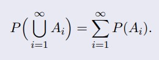

# Estatística

## Estatística descritiva

>Lida com organização, resumo e apresentação de dados

- Tabelas;
- Gráficos;
- Medidas Descritivas (média, variância, entre outras).

### Variáveis Qualitativas

>Atributos

- Exemplos:
  - Sexo
  - Religião
  - Naturalizade
  - Sabor
  - Altura
- Nominal
  - Ex.: região
- Ordinal
  - Ex.: classe social

- Primeiro passo -> Criar uma tabela de frequências
  - Frequência
    - Quantifica a ocorrência de valores de uma variável
      - Podem ser:
        - Absoluta(**fa**) - contagem das observações de uma variável
        - Relativa(**fr**) - divisão da frequência absoluta pelo total de observações
          - fr = fa/n
        - Percentual(**fp**) - frequência relativa multiplicado por 100
          - fp = fr * 100
        - Acumulada (**fa**) - soma das frequências absolutas
        - Percentual Acumulada (**fp**) - soma de frenquências percentuais

### Variáveis Quantitativas discretas

- Podem ser resumidos por tabelas de frequências
- É em geral é bem semelhante a variáveis qualitativas

### Variáveis Quantitativas contínuas

- Para construir tabelas envolve os seguintes passos
  - Decidir sobre o número de classes *k*. Para não ser arbitrário pode-se se usar a *raiz quadrada do total de valores* como número de classes
    - k ~= sqrt(n)
  - Determinar a amplitude de dados
    - A = Max - Min
  - Determinar a amplitude de classe c
    - c = A/(k-1)
  - Determinar o limite *inferior* da primeira classe LI¹:
    - LI¹ = Min - (c/2)
  - Determinar o limite *superior* da primeira classe LS¹:
    - LS¹ = LI¹ + c

## Amostras de população

### Média

>Soma dos valores divididos pela soma dos pesos

### Mediana

>Deixa metade da frequência abaixo e metade acima

- Caso a amostra tenha tamanho ímpar é só ordenar e pegar o do meio
- Caso a amostra tenha tamanho par pegamos os 2 valores do meio e tiramos a média deles

### Moda

>Valor mais recorrente na frequência

- Caso não aja moda, falamos que o conjunto é *amodal*
- Caso exista 2 modas o conjunto é *bimodal*

### Simetria

- Caso um em uma amostra, a média, mediana e a moda sejam iguais, dizemos que o conjunto é **simétrico**
- Caso não seja o conjunto é **assimétrico**
  - Assimetria a *direita*: ***Média>Mediana>Móda***
  - Assimetria a *esquerda*: ***Média<Mediana<Móda***

### Quantis

- Quartil
  - Valores de uma série que a divide em quatro partes *iguais*
  - Fórmula
    - EQi = [ i(n+1) ]/2
    - i = número de quartis
    - n = número de observações

### Percentis

>Mesma ideia do quartil, porém dividido em 4

### Boxplot

- Desenho esquemático
- Análise gráfica que oferece ideia de:
  - posição
  - dispersão
  - assimetria
  - caudas
  - dados discrepantes
- Como construír
  - desenhar uma "caixa"com o nível superior dado pelo terceiro quartil e inferior pelo primeiro quartil
  - mediana (Quartil 2) é representada por um traço no interior da caixa
  - Limites:
    - LI = Q1 − 1, 5dq
    - LS = Q3 + 1, 5dq
      - dq = Q3 − Q1 denominando diferença quartílica.
- Etapas de construção de um boxplot
  1. Contruir um retângulo de tal maneira que os lados menores correspondem aos primeiro e terceiro quartis da distribuição.
  1. Cortar o retângulo por um segmento paralelo aos lados menores, na altura correspondente à mediana;
  1. Traçar um segmento paralelo ao eixo, partindo do ponto médio até o maior valor observado que NÃO supere LS;
  1. Traçar um segmento paralelo ao eixo, partindo do ponto médio até o menor valor que NÃO é menor LI;
  1. Caso tenha valores superiores a LS ou inferiores a LI, marcar os pontos, este valores são considerados observações discrepantes.

## Probabilidade

- Evento
  - conjunto de resultados ao qual é associado um valor de probabilidade. Denotado por letras maiusculas (A,B,C)
  - Exemplo
    - No lançamento de um dado, a ocorrência de faces ímpares, ou seja, A = {1, 3, 5}
  - Eventos especiais
    - Conjunto vazio
    - Espaço amostral

### Probabilidade clássica

- Podemos calcular a probabilidade do jeito clássico
- Eventos/Espaço amostral
- Definição usando conjuntos
- \#A/#Ω 
  - Sendo:
    - A: Conjunto dos eventos favoráveis (desejados)
    - Ω: Conjunto do espaço amostral (eventos totais)
    - \#cardinalidade do conjuntos

### Probabilidade Frequentista

- Seja A um evento a probabilidade desse evento será denotada pela conta:
- P(A) = lim(_n_->∞) _n_ A/_n_
  - Sendo:
    - _n_ A: número de ocorrência do evento A em...
    - _n_ realizações

### Probabilidade Axiomática

>Axiomática-Axiomas de Kolmogorov

Uma função P, definida na σ-álgebra F de subconjuntos de Ω com valores em [0, 1] é uma probabilidade ou medida de probabilidade se satisfaz os axiomasseguintes

- Ax1: P(Ω) = 1;
  - Probabilidade do espaço amostral é 1
- Ax2: Para todo subconjunto A ∈ F, P(A) ≥ 0;
  - Se A está no espaço a probabilidade dele é x sendo x 0>=x<=1
- Ax3: Para toda sequência A1, A2, . . . ∈ F, mutuamente exclusivos, temos:
  - 
  - A trinca (Ω, F,P) é denominada espaço de probabilidade.
- Dado um espaço de probabilidade (Ω, F,P) e considerando os eventos abaixo nesse espaço, tem-se as propriedades de probabilidade:
  - P1: P(A) = 1 − P(A^c)
    - P de A é 1 - probabilidade do complementar de A
  - P2: Se A ⊂ B então P(A) ≤ P(B)
    - se a ta dentro de b, então a probabilidade de a é menor que a de b né
  - P3: Sendo A e B dois eventos quaisquer:
    - P(B) = P(B ∩ A) + P(B ∩ A^c)
    - 
  - P4: Regra da Adição de Probabilidades:
    - P(A ∪ B) = P(A) + P(B) − P(A ∩ B)
  - P5: Para eventos quaisquer A1, A2,..., An
    - 

### Probabilidade Condicional

>: Seja (Ω, F, P) um espaço de probabilidade. Se A e B ∈ F e P(B) > 0, então a probabilidade condicional de A dado B é definida por: _```P(A|B) = P(A ∩ B)/P(B)```_

- Observações:
  - Se A e B forem mutuamente exclusivos, então A ∩ B = ∅, desse modo P(A|B) = 0
  - Se B ⊂ A então P(A|B) = 1

Como calcular a probabilidade da interseção de dois eventos A e B em função destes eventos. Esta expressão é denominada regra do produto de probabilidade _```P(A ∩ B) = P(B)P(A|B) = P(A)P(B|A)```_