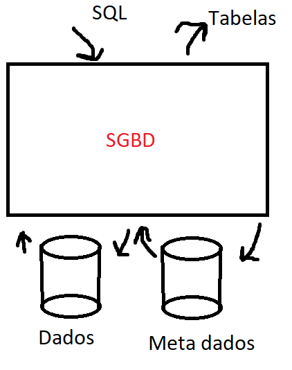
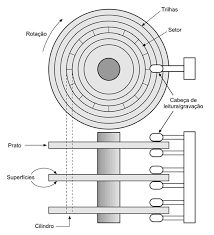

# SGBD

## Plano de ensino

> Capaz de criar e manipular grandes volumes de dados

- SGBD usam técnicas de desesenvolviemento de software importante para um bacharel em CC
- Escolha e configuração de SGBD é um problema prático



### Ementa

- Arquitetura de um SGBD *(revisão)*
- Armazenamento de Dados: dispositivos, gerenciamento e organização de arquivos
- Arqjuivos de Índice> Árvores B+ e Hash
- Ordenação em Disco
- Implementação de um SGBD
  - Tipos de dados
  - Formas de armazenamento 
  - Processamento de instruções de manipulação de dados
    - inserção
    - alteração
    - exclusão
    - consulta

### Objetivos específicos

> Capacitar o alunoa:

- Escolher métodos de organização de arquivos
- Implementar algoritmos de indexaçao de dados em disco
- Implementar algoritmos de ordenação de dados em disco
- Calcular custos de I/O envolvidos no acesso a dados
- Implementar os operadores básicos da algebra relacional
- Implementar um optimizador de SGBD


### Programa

1. Introdução 
   1. Integridade de dados: Restrição de domonimo
2. Coisa
3. Índices baseados em árvores
   1. Fundamentos
   2. ISAM
   3. Arvore B+
4. Índices baseados em hash
   1. Hash estático
   2. Hash Dinamico
5. Coisa
6. Processamento de consultas
   1. Visão geral
   2. Ordenação em Disco

### Metodologia

- Aulas expositivas
- Exercícios em sala
- Exercícios no MS Teams
- Implementação especificadas e atribuídas no MS Temas, incluindo apresentação e arguição
- Atendimento síncrono no MS Teams, sob agendamento prévio via chat

## Fundmentos

> Integridade de dados: dado armazenado está completo e correto de acordo com regras da aplicação

- Restrição de **Domínio**: estebelece o conjunto de valores válidos para atributos
- Restrição de **Chave**: nunhum par de *tuplas* pode ter os mesmo valores (if not null)
- Restrição de **Chave estrangeira**

### Transação

> Unidade lógica de trabalho formada por um **conjunto de oprações** com as seguintes caracteristicas

- **A**tômica - *executam-se todas operações ou nenhuma*
- **C**onsistente - *mantêm a integridade do BD*
- **I**solada - *transações intercaladas não interferem entre si*
- **D**urável - *as modificações feitas por uma transação não são removidas por falhas*

## Hierarquia de memórias

### Vecolidade/Capacidade

> A velocidade de um tipo de disco é inversamente proporcional ao custo e da capacidade

Tratando-se de um SGBD devemos considerar que iremos trabalhar entre  a memória principal (DRAM) e a secundária (HHD ou SSD), passando do primeiro para o segundo onde será armazenado segundo os principios ACID

#### Memória SSD

> Vantagens

- Não volátil
- Mais resistente a choques
- Velocidade (entre a RAM e o Disco Rigido)
- Transferencia/leitura/gravação é da ordem de uma DRAM DDR2

> Desvantagens

- Gravação por bloco
- Número limitado de ciclos de regravação

#### Discos rigidos



> Estruturas de Discos

- Setor é uma divisão fisica de acesso, analogamente 
- ...
- Controladora de disco: interface entre o disco e a RAM
- Controle de erro por meio de um "check sum" por setor, que é conferido na leitura
- ```Tempo de acesso = seek + atraso_rotacional _ tempo_de_tranferencia```
  - Considerar valores médios para seek e atraso por os dois dependem do posicionamento atual do mecanismo

### Desempenho de disco - Alocação

- IO domina custo
- Otimização depende de localização estratégica de dados
- Acesso sequencial permite seek por triha
- Alocação sequencial e procimidade 
- Pré-fetching minimiza o tempo médio de busca

> Exemplo 1

- Seek médio = 8ms
- rotação 10000rpm
  - 1 rotação completa = 1/10000 min = 6ms
  - Média de atraso rotacional = 6ms/2 = 3ms
- setores por trilha = 170 setores
- tamanho setor = 512 bytes
- transferência = 6ms/170 = 0,035/setor

**Logo:**
Tempo de acesso a um setor

```8 + 3 + 0,035 = 11,0,35ms```

## RAID

> Gerência de espaço em disco

Tecnollgia para acesso a múltiplos discos

### Objetivo

> Redundant Arrays of Independent Disks

- Prover paralelismo
- Maior confiabilidade
  - Redundância
    - Espalhamento ou
  - Discos de dados com espalhamento + disco de verificação combit de paridade
    - Permite a reconstruição de discos com falha, por exemplo:
      - Paridade 1 se numero de 1's é ímpar
      - bit do disco que falhou é inferido pelo valor do bit de paridade
- Melhora desempenho
  - Partições de mesmo tamanho distribuídos em discos
  - Para D discos a partição i é escrita no disco (i mod D)
  - Permite a leitura em paralelo
  - Partiçao pode ser por bit ou bloco

## Gerência de espaço em disco

- Página ou bloco éa unidade de acesso definida pelo software, no aso o SGBD
- Otimização de acesso sequencial é feita por meio de alocação de blocos contíguos (mesma trilha, mesmo cilindro, cilindros adjacentes)
- Midificações podem criar espaços livres
- Gerência de espaços livres pode ser lista de blocos livres ou bitmap

### Quem gerencia o espaço? 

- SO 
- Sistema de arquivos
- Camada de baixo nível de SGBD
  - Da maior portabilidade ao sistema e melhora gerência de buffer pool 
- Gerência compartilhada (SO + SGBD)
- Deixar a alocação física de páginas para camadas de baixo nível, podemos trabalhar com a seguinte abstração:
  - Arquivo: array de bytes (ou de páginas)
  - Solicitação: acesso byte *i* (ou página *i*) do arquivo *f*
  - Execução pelas camadas de baixo nível: acesso ao bloco *m* da trilha *t* do cilindro *c* do disco *d*
