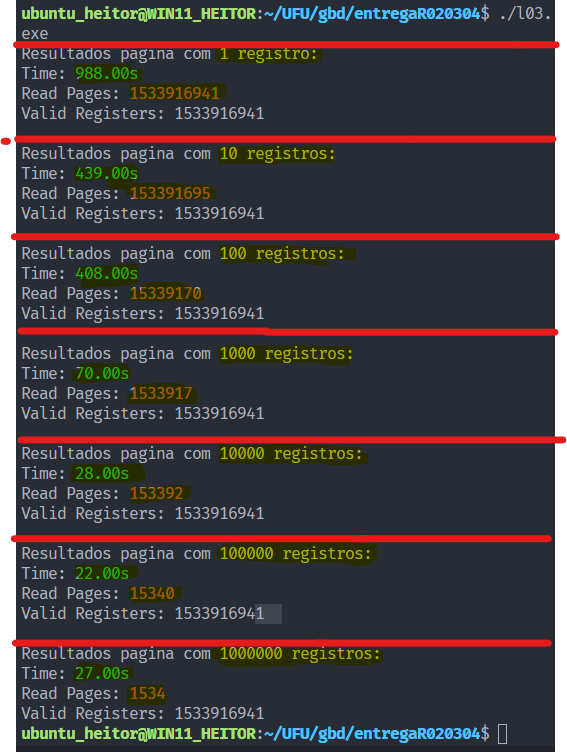
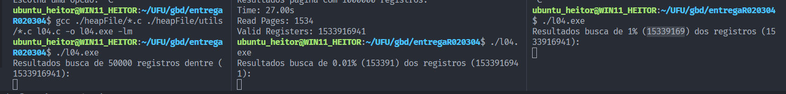

# Relatório trabalho 1

> Heitor Freitas Ferreira - 11921BCC026
> Entrega dos códigos: Guilherme Alves Carvalho - 11921BCC016

## Especificações da máquina

- CPU: Intel Core i3-9100F
- RAM: 16 Gigabytes = 2x 8 Gigabytes DDR4-2666 (1333MHz) Patriot Memory
- DISCO: ATA Disk 931GiB (1TB)
- SISTEMA OPERACIONAL: Windows Subsystem for Linux (rodando "em cima" de um Windows 11)

---
Devido ao tamanho da partição criada para o WSL pelo Windows ser dinâmico, e [uma vez expandida a partição linux, mesmo apagar os arquivos que ocupavam o espaço não volta a partição para o tamanho original](https://askubuntu.com/questions/1363015/understanding-disk-space-using-wsl2) (pré-criação do arquivo de 80GB). Visto isso foi usada a partição do Windows para armazenar os arquivos do projeto. Isto acarretou em demoras devido ao gargalo criado tanto pela utilização da WLS quanto pela demora do WLS acessar o filesystem do Windows, logo os tempos de execução do projeto foram muito maiores do que o contado pelo programa, mas os mesmos são uma representação de como o experimento se comportaria fora de um sistema como o WSL.

---

## L03

## L04

Devido aos problemas citados acima da máquina e suas especificações, o necessário uso da "máquina virtual" impossibilitou a execução do programa a tempo. Além de tentar rodar para 1% dos registos, o programa foi executado para0.01% dos registros, e 50000 registros, nenhuma das opções terminaram a execução à tempo.

