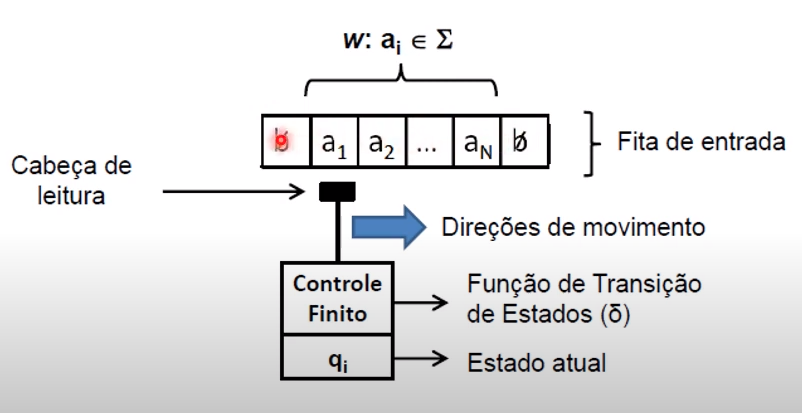
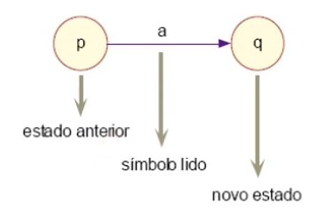
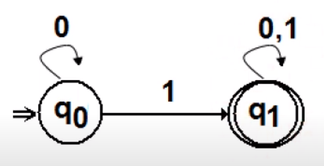

# Linguagens formais e autômatos

## Autômatos ou Máquinas abstratas

- Estado inicial
  - Normalmente denotado por Q0
  - Pode ter
- Estado final (de aceitação)
  - Normalmente denotado por Q1

## Definição de automato finito (determinístico)

## Forma de representação em grafo

- Um nó pra cada estádo
- Uma seta para indicar quem é o estado inicial
- Um circulo duplo para indicar quem é o estado de aceitação

## Formalismo operacional
## Formalismo axiomático
## Formalismo denotacional (ou gerador)

> Expressões regulares

### Associam-se regras às componentes da linguagem

> Regras

- Permitem afirmar o que será verdadeiro após a ocorrência de cada cláusula

## Introdução

### Símbolo

> Entidade básica que escolhemos para escrever nossa linguagem

- Unidade mais básica da palavra

### Alfabeto

> Conjunto finito de símbolos

- Exemplo:
  - Σ¹ = {a,b,c}
  - Σ² = {0,1,2,3,...,9}
  - Σ³ = {}
    - Especial, conjunto vazio, linguagem sem símbolo
    - É usado para gerar a palavra vazia (ε)

### Palavra/cadeia de caracteres

> Qualquer sequência *finita* de símbolos justapostos

- Exemplos
  - 31156 palavra usando o alfabeto Σ³
  - abba palavra usando o alfabeto Σ²

#### Tamanho de palavras

- Denotado entre "pipes"
- Exemplos:
  - |31156| = 5
  - |abba| = 4

#### Concatenação

> Justaposição de duas palavras

- v = **ab**, w = _cd_
  - vw = **ab**_cd_
  - wv = _cd_**ab**
  - vv = **abab**
  - ww = _cdcd_

> Propriedades

- Associatividade
- Elemento neutro = palavra vazia (εw) = w

> Prefixo: qualquer sequência de símbolos iniciais de uma palavra

- Toda palavra é prefixo dela mesma
- Palavra vazia é prefixo de qualquer palavra

> Sufixo: qualquer sequência de símbolos finais de uma palavra

- Toda palavra é sufixo dela mesma
- Palavra vazia é sufixo de qualquer palavra

> Sub-palavra: qualquer sequência de símbolos dentro de uma palavra

#### Concatenação sucessiva

- w³ = www
- w¹ = w
- a^5 = aaaaa
- w^0 = ε, para w != ε

> Não confundir com **potenciação**

- Para distinguir se o que estiver abaixo for uma palavra é concatenação sucessiva

#### Produto de conjunto de palavras

> V e W é o conjunto de palavras sobre Σ
> VW = {vw/v ∈ V, w ∈ W}

- Exemplo
  - Σ = {0,1,2,3}  V = {00,11}  W = {222,333}
  - VW = {00222,00333,11222,11333}
  - VV = V² = {0000,0011,1100,1111}
  - V^0 = {ε}, por definição

#### Fechamento de Kleene

> Seja W um conjunto de palavras qualquer sobre um alfabeto Σ
> W\* = ∪Wi -> i>=**0**
> W* = W0 ∪ W1 ∪ W2 ∪ W3 ∪...

- Exemplos:
  - V = {00,11}
    - V* = {ε,00,11,0000,0011,1100,1111,0011111,...}
  - Σ = {0,1}
    - Σ* = {ε,0,1,01,10,00,11,...}
      - Ou seja, Σ* = qualquer palavra binária

#### Fechamento Positivo

> Seja W um conjunto de palavras qualquer sobre um alfabeto Σ
> W\* = ∪Wi -> i>=**1**
> W* = W0 ∪ W1 ∪ W2 ∪ W3 ∪...

- A única diferença é que o fechamento positivo começa em 1, logo não teremos o **ε**

## Definição de linguagem formal

> Uma linguagem L é um conjunto  de palavras sobre um alfabeto Σ, ou seja L ⊂ Σ*

- Exemplo sendo Σ = {a,b}
  - conjunto vazio
  - conjunto formado pela ε
    - Note que {ε} != {}
  
> A definição de linguagem só faz sentido ao conhecer o alfabeto

### Como representar uma linguagem formal L

- Se L é finito basta listar todas as palavras
- Se L é infinito, existem 2 formalismos
  - Formalismo __Gerador__: ***Gramática***
  - Formalismo __Reconhecedor__: ***Autômato***

## Definição de gramática

> G = {V,T,P,S}

- V = conjunto __finito__ de símbolos
  - _Variáveis_ ou _não-terminais_
- T = conjunto __finito de símbolos__
  - _terminais_
  - disjunto de V
- P = conjunto finito de pares ordenados (α,β)
  - Regra de produção
  - α é a palavra de __V ∪ T__+
  - β é a palavra de __V ∪ T__*
    - Aqui pode aparecer ε
- S = elemento de V
  - variável inicial

### Notação (α,β)

- α -> β
- Notação abreviada para ```α -> β1, ..., α -> βn```
  - ```α -> β1|```

### Exemplo de gramática: números naturais

- G = {V,T,P,S}
  - V = {S,D}
  - T = {0,1,2,3,4,5,6,7,8,9}
  - P = {S -> D, S-> DS, D -> 0|1|2|3|4|5|6|7|8|9}
- Uma derivação do número 234
  - S => DS => 2S => 2DS => 23S => 23D => 234
- Portanto
  - S =>* 234
  - S =>+ 234
  - S =>6 234

### Derivação

> Partir do símbolo inicial e ir aplicando as regras quantas vezes for necessário

- Par da relação denotada por =>
  - Com domínio em __V ∪ T__+
  - contra-domínio em __V ∪ T__*
  - representado de forma infixa α => β

#### Sucessivos passos de derivação

- =>\*
  - fecho transitivo e reflexivo da relação =>
  - zero ou mais passos de derivação sucessivos
- =>+
  - fecho transitivo da relação =>
  - zero ou mais passos de derivação sucessivos
- =>i
  - fecho transitivo da relação =>
  - zero ou mais passos de derivação sucessivos

## Automatos finitos (determinísticos)

> Não possúi memória

### Por que é importante estudar linguagens regulares

- Aparecem em vários contextos
- Exemplos
  - Editores de texto
  - Processamento de texto
  - Pesquisa de dados
  - Interface simples homem x máquina
  - Protocolos de comunicação
  - Lógica

> Formalismos

- *Operacionais* ou *reconhecedores*
  - Autômato *finito* determinístico
  - Autômato *finito* **não**-determinístico
  - Autômato finito com Movimento vazio
- *Axiomático* ou *gerador*
  - Gramática Regular
- Denotacional
  - Expressão regular
  - Considerado também formalismo *gerador*

### Definição: Sistemas de Estados Finitos

- Modelo matemático com I/O discretas
- Pode assumir um número finito e pré definido de estados
- Cada Estado resume somente as informações do passado **necessárias** para determinar as ações da próxima entrada
- Exemplo (elevador):
  - **Entrada**
    - Requisições pendentes
  - **Estado**
    - Andar corrente
    - Direção do Movimento
  - ***Não*** memoriza as requisições anteriores

### Definição: Autômato Finito (Determinístico) - Ḍef·1̣

> **Máquina** reconhecedora composta por

- Fita de entrada
  - Dividida em células
  - Cada célula armazena um símbolo
  - ***Não é possível gravar***
- Unidade de controle
  - Lê célula a célula da fita
  - Armazena o estado corrente
  - Movimento sempre a **direita**
  - Onde fica armazenado o programa definido abaixo
- Programa de transição de estados
  - É o que caracteriza o autômato
  - Define o novo estado a partir do estado corrente e do valor lido da fita

> Estado serve como única forma de memória



> Branco (b/) representa o início e fim da fita

### Definição: Autômato Finito (Determinístico) - Ḍef·1

Caracterizado por uma quíntupla

- A(Q,Σ,δ,q₀,F)
- Q: Conjunto finito de estados
- Σ: Alfabeto(símbolos da fita): Σ ∩ Q = ∅
  - O que eu escolher pro alfabeto, não escolher como estado
  - Alfabeto binário não pode ter nem o estado 0 nem o estado 1
- q₀: Estado inicial: q₀ ⊆ Q
  - Tem que estar contido no meu conjunto de estados
  - "Dos elementos de Q, qual é o estado que é considerado **inicial**
- δ: Função de transição de estado: Q x Σ -> Q
  - Conjunto de instruções
  - Estado com Símbolo do Alfabeto gera outro estado
- F: Conjunto de estados finais (aceitação): F ⊆ Q
  - Tem que estar contido no meu conjunto de estados
  - "Dos elementos de Q, quais são os estados que são considerados **finais**

### Definição: Função de Transição de Estados ou Programa (δ)

> a.k.a.: O porquê da piada milenar de "Garoto de Programa"

Para todo os estados possível do autômato (q ∈ Q), a função deve definir qual o próximo estado do autômato (q' ∈ Q), quando for lido qualquer símbolo na fita (a ∈ Σ)

δ(q,a) = q'

Ou seja,

O autômato estando no estado ***q*** e lendo **a**, avança a fita e vai pro estado ***q'***

#### Notação matemática

- A = (Q,Σ,δ,q₀,F)
- Q = {q₀,q₁}
- Σ = {0,1}
- F = {q1}
- δ
  - δ(q₀, 0) = q₀
  - δ(q₀, 1) = q₁
  - δ(q₁, 0) = q₁
  - δ(q₁, 1) = q₁

#### Notação matricial

δ|a₀|a₁|...|aₙ
-|-|-|-|-
q₀|q|q||q
q₁|q|q||q
q₂|q|q||q
...|
qᶠ|q|q||q

##### Exemplo anterior em notação matricial

δ|0|q
-|-|-
=> q₀|q₀|q₁
q₁|q₁|q₁

> =>q₀ é estado inicial, indicado pela notação "=>"

#### Notação em grafo

> Mais alto nível



##### Exemplo anterior em notação em grafo




### Definição: Função de transição de estados Estendida(δ̲)

A função δ̲ é uma função δ̲: Q x Σ\* -> Q.

- δ̲(q,ε) = q
- δ̲(q,aw) = δ̲(δ(q,a),w), sendo w ∈ Σ\*, α ∈ Σ
  - a = primeiro símbolo da palavra
  - w = restante da palavra

### Definição: Palavra aceita por um Autômato Finito

Dado um autômato A = (Q,Σ,δ,q₀,F), uma palavra w ∈ Σ\*, w é aceito por A se δ̲(q₀,w) ∈ F.  

> Se o autômato, partindo de q₀ e lendo todos os símbolos da palavra terminar em um estado final, a palavra é aceita.

### Condição de parada do Autômato Finito

Sempre para ao terminar de processar uma palavra, aceitando-a ou não

### Definição: Linguagem reconhecida por um Autômato Finito

**```L(A) = {w ∈ Σ | δ̲(q₀,w) ∈ F}```**

<<<<<<< Updated upstream
## Autômato Finito Não Determinístico

> Para cada momento de não determinismo, a máquina abre uma cópia de sí mesma para resolver o problema

### Definição: Não Determinismo

Em uma transição não determinista, a partir de um estado q₁, é possível ir para mais de um estado, exemplo

> ```δ(q₁,a) = {q₁,q₂}```

### Definição: Autômato Finito Não Determinístico - Def1

É um Autômato Finito em que são permitidas transições não determinísticas

### Definição: Autômato Finito Não Determinístico - Def2

> Igual à AFD, diferença na definição de função de transição

- A = (Q,Σ,δ,q₀,F)
- Q: Conjunto finito de estados
- Σ: Alfabeto(símbolos da fita): Σ ∩ Q = ∅
- q₀: Estado inicial: q₀ ⊆ Q
- **δ: Função de transição de estado: Q x Σ -> 2Q**
  - 2Q é o conjunto potência de Q (todos os subconjuntos)
  - Saída é um conjunto de estados
- F: Conjunto de estados finais (aceitação): F ⊆ Q

### Definição: Função de Transição de Estados

δ = (q,a) = {q₁,q₂,...,qₙ}

Estando em um estado "q", e lendo o símbolo "a", quais são os possíveis estados para qual a máquina irá transacionar

### Exemplo 1

#### Representação em matriz

δ₅|a|b
-|-|-
q₀|{q₀,q₁}|{q₀,q₂}|
q₁|{qᶠ}|
q₂||{qᶠ}
qᶠ|{qᶠ}|{qᶠ}

> L = {w ∈ {a,b}* | "aa" ou "bb" é subpalavra de w}

=======
Ou seja,

Se existir algum estado final em δ̲(q₀,w)

## Determinismo x Não-Determinismo

- Não determinismo
  - aparentemente há um maior poder computacional de um AF
  - Na realidade não aumenta com relação ao AFD

> Pra cada AFD existe um AFND correspondente, o contrário é verdadeiro

### Equivalência entre AFD e AFND

Seja uma L(A) de um AFND, exise um AFD'A que também aceita L(A)

Seja o AFND A = (Q,Σ,δ,q₀,F)

O AFD A' equivalente a A é dado por  A' = (Q',Σ',δ',q₀',F'), sendo:

- Q' = 2ᵠ, elementos de Q' do tipo {q₁,q₂,..., qₖ}, sendo qᵢ = (i = 1, 2,..., k) ∈ Q, representados por <q₁ q₂ qₖ>
- F' = Estados de Q' que contêm pelo menos 1 estado de F
- Q₀' = q₀, representado por <q₀>
- δ'({q₁,q₂,..., qⱼ},a) = δ(q₁,a) ∪ δ(q₂,a) ∪ ... ∪ δ(qⱼ,a) = {r₁, r,₂, ..., rᵢ}

## Autômato Finito não Determinístico com Movimentos Vazios (AFε)

> AFND com a capacidade de trocar de estados sem ler símbolo

### Definição: Autômato Finito Determinístico com Movimentos Vazios (AFε) - Ḍef·1

Caracterizado por uma quíntupla

- A(Q,Σ,δ,q₀,F)
- Q: Conjunto finito de estados
- Σ: Alfabeto(símbolos da fita): Σ ∩ Q = ∅
- q₀: Estado inicial: q₀ ⊆ Q
- δ: Função de transição de estado: Q x Σ -> Q
  - TODO
  - Estado com Símbolo do Alfabeto gera outro estado
- F: Conjunto de estados finais (aceitação): F ⊆ Q
>>>>>>> Stashed changes
