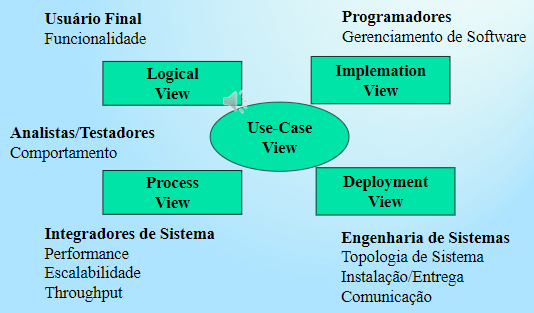

# Modelagem de Software

## Requisitos de software

- Engenharia de requisitos de software
- Elicitação de requisitos
  - Obtenção de informações detalhadas sobre o que iremos fazer
  - Levantamento e obtenção de problemas
  - Identificar
- Análise de requirimentos
- Especificação de Software
- Validação de requerimentos
- Gerenciamento de requerimentos

### Documento de requisito de Software

- Declaração oficial do que é demandado dos desenvolvedores
- Deve incluir uma definição de requisitos do **usuário** e uma especificação de requisitos do sistema
- **Não** é um documento de projeto
  - Defini ***O QUE*** e não o ***COMO*** fazer

### Capitulos presma
[TODO]
- Prefacio
- Introdução
- Glossário
- Difinição de usuario
- Arquitetura do sistema
- Especiicação de requisitos de sistema
- ***Modelos do sistema***
  - Você está aqui!
  - Modelos gráficos descritos no capítulo: RUP: UML
- Evolução do sistema
- Apêndices
- Índices

## *UML*

### ***Use case***

> Funcionalidade pela visão do usuário

- *MOPS*: Business Analyst: **5**
- *MOSS:* Designer: **2**
- *MOBS:* Architect: **1**

#### O Que é:

- Forma de capturar requisitos funcionais
  - Problema: e requisitos não-funcionais?
- Descreve ***interação*** entre "usuários" e os sistemas
- Prove uma narrativa de como o sitema é usado

#### Como criar

> UM caso de uso é um conjunto de roteiros ligados conjuntamente por um objetivo comum do usuário

- Roteiros:
  1. O consumidor ve o catalho e adiciona ao carrinho os itens desejados
  2. QUando o consumidor quiser pagar, irá descrever o endereço de entrega e forma de pagamento para confirmar a senha
  3. O sistema checa a autorização do cartão e confirma a senha imediatamente e por e-mail
- E se:
  1. A autorização de cartão falhar?
  2. Se o cliente já tem informação de envio e de cartão cadastradas?

#### Atores

> O sujeito do predicado que é o caso de uso

- Papéis representados por elementos que interagem em um sistema
- Um ator por interagir atráves de város casos de uso
- Um caso de uso pode ser executado por vários atores
- Ator é algo externo ao sistema
- **Um ator por der um sistema externo** (API)

#### Descrição de um caso de uso

> Mostra a interação entre cliente e sistema

Comprar um produto:

1. Cliente navega no catalogo e seleciona item
2. Cliente clica para fazer checkout
3. Cliente preenche as informações de de envio
   1. Cliente é um cliente regular
      1. [TODO]
4. Sistema apresenta informação completa do pedido, incluindo frete
5. Cliente preenche as informações de pagamento
6. Sistema autoriza a compra
7. Sistema confirma a compra
8. Sistema envia informações de confirmação da compra por e-mail

#### Outras possíveis informações

- Pré-condição: o que o sistema deve garantir antes do caso de uso começar
  - Exemplo: verificar se o cliente já está logad
- Garantia: o que o sistema vai garantir no final
  - Pós-condição
  - Após um cenário bem sucedido, o que irá acontecer
  - Exemplo: e-mail foi enviado após a compra
- Gatilho: qual evento iráiniciar o caso de uso
  - Exemplo: meia noite será enviada um e-mail com promoções

### Activity

> O fluxo dentro de um "use case" ou do sistema

- *MOPS*: Business Analyst: **5**
- *MOSS:* Designer: **2**
- *MOBS:* Architect: **1**

### ***Class***

> Classes, entidades, dominio de negocios

- *MOPS*: Business Analyst: **3**
- *MOSS:* Designer: **5**
- *MOBS:* Architect: **2**

### Sequence

> Interação entre os objetos

- *MOPS*: Business Analyst: **4**
- *MOSS:* Designer: **5**
- *MOBS:* Architect: **1**

### Interaction overview

> Interação a um alto nível 

- *MOPS*: Business Analyst: **4**
- *MOSS:* Designer: **2**
- *MOBS:* Architect: **2**

### Communication

>  Interação entre os objetos

- *MOPS*: Business Analyst: **1**
- *MOSS:* Designer: **3**
- *MOBS:* Architect: **1**

### Object

> Objetos e seus links 

- *MOPS*: Business Analyst: **1**
- *MOSS:* Designer: **5**
- *MOBS:* Architect: **3**

### State machine

>  

- *MOPS*: Business Analyst: **3**
- *MOSS:* Designer: **4**
- *MOBS:* Architect: **2**

### Composite structe

>  

- *MOPS*: Business Analyst: **1**
- *MOSS:* Designer: **5**
- *MOBS:* Architect: **4**

### Component

>  

- *MOPS*: Business Analyst: **1**
- *MOSS:* Designer: **3**
- *MOBS:* Architect: **5**

### Deployent

>  

- *MOPS*: Business Analyst: **2**
- *MOSS:* Designer: **2**
- *MOBS:* Architect: **5**

### Package

>  

- *MOPS*: Business Analyst: **3**
- *MOSS:* Designer: **2**
- *MOBS:* Architect: **4**

### Timing

>  

- *MOPS*: Business Analyst: **1**
- *MOSS:* Designer: **3**
- *MOBS:* Architect: **3**

## Modelo em Cascata
[TODO]

## RUP

> Rational Unified Process

- Um processo de engenharia de software
- *Framework* para processos
- Utiliza as melhores práticas de desenvolvimento

### Processo

> Define quem irá fazer o que, quando, e comoa fim de alcançar um objetivo.

### Definição do processo

- Objetivos
  - prover guia
  - especificar artefatos e quando devem ser desenvolvidos
  - direcionar as tarefas
  - oferecer criterio que monitora e mede o processo  

### Melhores práticas

- Desenvolvimento **iterativo**
- Gerenciar requisitos
- Arquitetura baseada em componentes
- Modelar visualmente
- Verificação continua de qualidade
- Controlar alterações no software

### Casos de uso no RUP

> RUP é dirigido por casos de uso (use-case driven)

- Criação e validação dos modelos de projeto
- Definição dos casos de testes
- Planejamento de iterações
- Criação do manual do usuário

### Arquitetura em RUP

- Centrado na arquitetura
- Central em relação aos esforços
  - Requisitos analisados para montar uma arquitetura
  - Arquitetura orienta a implementação e mudanças

### 4+1

[TODO]

### Fases RUP

> Alto nível do processo de desenvolvimento

1. ***Concepção***
   - Estabelecidos lógica de dominio da aplicação e escopo do projeto
2. ***Elaboração***
   - Coleta de requisitos mais detalhados, análise do plano para construção do sistema
3. ***Contrução***
   - Váris iterações para *produção do sistema*
4. ***Transição***
   -  Teste ajuste de performance e treinamento de usuário

### Iteratividade RUP

> Disciplinas iterativas ao longo do tempo no desenvolvimento com RUP

#### Análise de risco

#### Diferença do Cascata pro RUP

No cascata eu só começo a uma disciplina após encerrar 100% a outra, no RUP as disciplinas são levementes concorrentes, algumas com mais intensidade do que outras dependendo de qual momento estou

### Vantagens do RUP

[TODO]

## Manifesto Ágil

- Interações individuais *vs* Processos e ferramentas
- Software funcionando *vs* Documentação extensa
- Colaboração do cliente *vs* Negociação fixa contratual
- Responder às mudanças *vs* Seguir o plano no contrato

### Premissas (ir)reais do desenvolviemento

> Mentiras na hora 

- Cliente e capaz de especificar um software antes de iniciar o desenvolviemtno
- Equipe de desenvolvimento é capaz de quantificar o esforço
- Equipe é capaz de quantificar o esforço
- Equipe é capaz de criar o software imaginado pelo cleinte
- Cliente ficará feliz

### Práticas

> Aqui estamos falando 100% de ambiente de desenvolvimento, não misturar com o código em produção (código que o usuário está executando)

- ***Whole Team Together***
  - Deu origem ao SCRUM
  - *Evitar ruídos de comunicação*
  - Escritórios "Open Plan"
- ***User Stories***
  - Desempenhando um certo papel, desejo atingir tal objetivo para que me beneficie de alguma forma
  - *Usuário contando o que quer fazer, como e para que*
- ***Information Workspace***
  - Trello
  - Kamban (técnica japonesa de organização)
    - Quadro divido em:
      - A fazer
        - Importante priorizar qual tarefa é prioritária a fazer
      - Fazendo
      - Feito
  - *Quadro com todas as informações do projeto e coisas a serem feitas*
- ***Pequenas entregas***
  - Cada nova versão do sistema tem ciclos de vida menores (semanais por exemplo) que entregam novas funcionalidades ou correção de bugs pequenas
- ***Integração contínuas***
  - Faz um commit -> da um build
  - Sempre há uma nova versão 
- ***Testes contínuos***
  - Com novas versões constantes, a chance de um novo efeito colateral não testado antes é grande
- ***Refatoração de código***
  - Etapa normalmente negligenciada
  - *Organizar o código para simplificação e melhoria da arquitetura*

### SCRUM

> Jogada do RUGBY

- Product Backlog
  - Lista de itens a serem feitos no projeto todo
- Sprint Backlog
  - Sub-lista do Product Backlog com os itens planejados para serem feitos durante a Sprint
- Daily Scrum
  - Reunião recorrente para alinhar o time e destravar problemas

#### SCRUM Framwork

- Roles
  - Product Owner
    - Define as funcionalidades do produtoo
    - Decide as datas de entregas
    - Responsável pela rentabilidade do produto
    - Prioriza funcionalidades de acordo com as necessidades do mercado
  - Scrum Master
  - Team
- Artifacts
  - Product Backlog
  - Sprint Backlog
  - Burn

[TODO]

## Lean Software Development

> 7 Princípios

1. Eliminate Waste
2. Amplify Learning
   - Comunicação dentro do time
   - As coisas que estão dando certo no projeto espalhar para a organização inteira
3. ***Decide*** as **Late** as Possible
   - Imagine decidir no começo do planejamento do projeto o tipo de banco de dados **X**, mas antes de começar a mexer com isso surgiu alguma peculiaridade ou questão do sistema que faria ser bom usar o banco **Y**, seria melhor decidir que banco usar somente quando começar a mexer com isso!
4. ***Deliver*** as **Fast** as Possible
5. Empower the team
6. Build Integrity In
   - Evite débito técnico
7. See the Whole

### Eliminar desperdício

> Coisas a se eliminar

- Tudo que não adiciona valor (para o consumidor do software) ao produto
- Código ou funcionalidade desnecessário z
- Requisitos não claros
- Comunicações ou processos internos lentos
- Burocracia

#### Enchergar desperdício

Wastes of Manufacturing | Wastes o  Softwares Development
-|-
Inventory | Partially work done
Expre processing| Paperwork or excess documentation (RUP)
Overproduction | Extra features
Transportation | Building the whole
Waiting | Waiting for information
Motion |  Task switich & Motion (Rond Robin)
Defects | Defects (concertar bugs)

### Amplificar aprendizado

> A natureza do desenvolviemento de software

- Propor o uso ao invés de confirmar aos requisitos
- Tente teste e concerte
- Não tente criar resultados repetiveis, mas tente criar soluções para problemas indivíduais
- Design é feito melhor ao usar ciclos pequenos com investigação repetitiva, experimentação e conferência de resultados
- Feedback koops são essenciais

### Decida o mais tardiamnete possível

Sequencial (Cascata) | Concorrente
-|-
Depht First | 

[TODO]

### Entregue o mais rápido possível

> Por que?

- Cliente gostam de entregas rápidas (Olha a amazon)
- Entregas rápidas significa menos tempo para os clientes mudarem de ideia

### Empoderar o time

> Um time deve ser auto determinado

- Odever de um cargo de gerência é de treinador, e de assitênte
- Um time motivado trabalha mais
  - Salário é um fator mas não o único

### Construa integridade intrinceca

Integridade percebida | Integridade Conceitual
-|-
Quão intuitivo é o sistema | Há um balanço entre manutenabilidade, usabilidade e expansividade? 
[TODO] | [TODO]

### Veja o todo

> Um sistema não é a soma de suas partes, é o produto delas

> Pergunte os porquês
# Modelos

> Grafos usados pra representação

## Pra que serve um modelo

- Um modelo é um mecanismo de avaliação e comunicação de ante mão sobre algo que será construído.
- Não é prático um prédio ser modelo dele mesmo
- A ideia do modelo é ser uma representaçao conceitual do produto completo que se quer representar

## Formas de Modelar 

> Planejar o código  e o sistema antes de sua concepção

- O problema de modelar
  - Definição
  - Nível abstrato
  - Formal, semi-formal,informal
- Linguagem de Modelagem
  - Notações Pré-OO
  - UML
  - Notações Formais

# UML - Diagrama de Classes

Retangulos tri partidos

primeira seção representa o nome da classe

Segunda representa seus atributos, visibilidades e tipos

Terceira representa seus métodos, visibilidade e tipo de retono

## Relacionamentos

- Dependencia
  - Seta pontilhada
- Associação
  - Linha reta simples
  - Está ligada, se tem q importar é associação
- Agregação
  - Linha reta com losangulo vazio
- Composição
  - Linha reta com losangulo preenchido
- Classificação
  - Linha com seta vazia
  - Herança ou Generalização