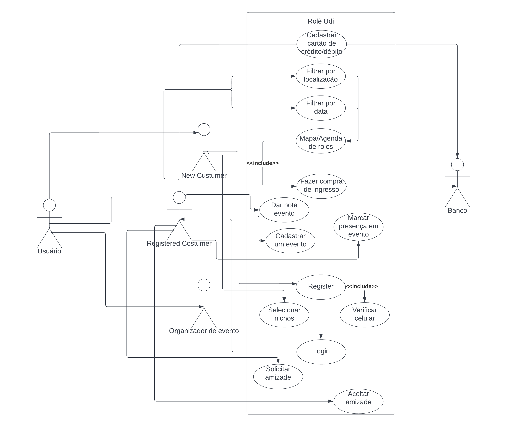

# Role Udi 

Aluno | Matricula
-|-
Heitor Freitas Ferreira | 11921BCC026
Luis Gustavo Seiji Tateishi | 11921BCC034

## TO-DO's

- [x] Texto apresentando o sistema
- [x] Escolha da ferramenta UML
- [x] Use Case Model
- [x] Correção entrega 1
- [x] Estudo de viabilidade
- [x] Requisitos funcionais
- [x] Requisitos não funcionais
- [ ] Diagrama de classe

## Entrega 1

### Concepção do sistema

> RoleUdi

RoleUdi será um sistema para conectar as pessoas à eventos de seu interesse e também mante-las organizadas quanto à datas, custos locais e formas de chegar.  
Ao abrir a aplicação (com front-end web e mobile (iOS e Android usando framework de desenvolvimento hibrido), o usuário deverá criar uma conta obrigatóriamente para o uso da aplicação, apenas com um e-mail, senha, confirmação de senha e aguardar confirmação via e-mail.  
Ao criar a conta a primeira ação que o usuário deverá ser escolher os nichos de eventos que irá seguir (universitário, cervejeiro, sertanejo, baile, etc), um usuário poderá seguir vários nichos ao criar a conta e mudar os nichos seguidos a qualquer momento em uma seção de configuração de perfil.  
Com a conta criada e os nichos escolhidos, haverá duas formas de visualização dos eventos, via mapa e via calendário, sendo possível alternar entre as duas livremente, eventos sem datas definidas aparecerão no mapa mas não no calendário, eventos com data definida e sem local aparecerão somente no calendário, eventos com estas informações não definidas mas já anunciados irão para uma janela separada.  
Usando a visualização de calendário será aberta uma interface similar à interface do Google Agenda, mas com as "colunas" ordenadas com os eventos com mais destaques (chamados: roles quentes) acima. Os eventos "sobem" na escala de "quente" com votos populares, média de nota das festas dos organizadores dos eventos, quantidade de usuários que marquem que estão com vontade de ir/com ingresso comprado/querendo comprar ingresso e quantidade de pessoas vendendo o ingresso (esta diminuíndo o "score" do evento).  
Visualizando em mapa, os eventos serão dispostos tais quais os locais no Google Maps com um mini banner do evento em forma de pin alocado no local onde será o evento, caso tenham vários eventos no mesmo local, o que será mostrado será o próximo que acontecerá, será possível escolher a data exata que o mapa mostrará os eventos.  
Um filtro poderá ser aplicado em qualquer tipo de visualização para visualizar somente os eventos que o usuário marcou que irá e os eventos que os usuários que a conta segue irão.  
Caso o usuário clique em um evento, será aberta uma página que mostrará os detalhes do evento, como nome, lista de contatos que marcaram que irão no evento, data, local, organizadore, será possível marcar que está com interesse de ir, presença confirmada (ingresso comprado) e lista dos perfis de instagram do evento, organizadores e das atrações.  
A forma de monetização será a venda de dados (e alma) sobre os eventos e os usuários para potênciais compradores e a opçao de compra dos ingressos dos eventos.

### Definição da ferramenta UML

A ferramenta que usaremos para fazer a modelagem UML será o site *[Lucidchart](https://www.lucidchart.com/)*

### Modelo de casos de Uso Preliminar do Sistema

Atores:

- Usuário
  - Consumidor novo
  - Consumidor cadastrado
  - Organizador de evento
- Banco

#### Register 

1. Novo usuário entra no APP pela primeira vez ou após "deslogar" e seleciona "registar"
2. Novo usuário digita email, senha, telefone, confirmação da senha
3. Sistema verifica se já existe usuário com este email
4. Sistema verifica se a senha é igual a confirmação
5. Sistema envia SMS com código verificador
6. Usuário entra com o código verificador

Extensão:

3a. Não é possível criar conta pois já existe
1. Sistema colhe as informações novamente

4a. Senha não confere com a contra senha
1. Sistema colhe as senhas novamente

5a. Erro ao enviar ou receber SMS
1. Usuário solicita outro SMS

5b. Usuário errou o número de telefone
1. Usuário corrigi o telefone e sistema envia SMS para o novo número

6a. Usuário entra com código errado
1. Sistema apaga campo, avisa que está errado e solicita re-inserção do código verificador

#### Login

1. Usuário registrado entra no APP pela primeira vez ou após "deslogar" e seleciona "login"
2. Usuário registrado digita email, senha
3. Sistema verifica se existe um cadastro com essas informações
4. Sistema da acesso à aplicação

Extensão:

3a. Usuário ou senha incorretos
1. Sistema colhe as informações novamente 

#### Filtrar por localização

1. Usuário registrado(logado) seleciona a opção de visualização por mapa
2. Sistema mostra o mapa com os eventos cadastrados

#### Filtrar por data

1. Usuário registrado(logado) seleciona a opção de visualização por data
2. Sistema mostra o mapa com os eventos cadastrados

#### Entrar na página do evento

1. Usuário registrado(logado) clica em um evento estando no modo mapa ou calendário
2. Sistema mostra a opção de comprar o ingresso por fora ou pelo aplicativo(se possível)

#### Fazer compra do ingresso

1. Estando na página do evento, usuário clica no botão de compra
2. Sistema redireciona ao provedor de ingressos utilizado pelo evento

#### Cadastrar um evento

1. Cliente cadastrado como organizador do evento clica em cadastrar evento
2. Cliente cadastrado insere localização, data e link para compra do evento
3. Sistema registra o evento no banco

Extensão:

2a. Localização, data ou link inválidos
1. Sistema colhe as informações novamente

#### Dar nota ao evento

1. Usuário entra na página do evento já encerrado
2. Seleciona uma nota de 1 a 5 para o evento

#### Marcar presença em evento

1. Usuário entra na página do evento que ainda não aconteceu
2. Usuário marca dentre as opções "Ingresso comprado", "Quero ir" e "Não vou" (opção padrão)

#### Selecionar nichos

1. Novo usuário ao entra na conta pela primeira vez
2. Sistema apresenta $n$ "nichos" de eventos
3. Novo usuário clica para selecionar $m$ "nichos" sendo $m<=n$ e $m>0$

Extensão

2a. Usuário não seleciona nenhum nicho
1. Sistema não permite avanço para a tela inicial enquanto não selecionar pelo menos um

#### Solicitar amizade

1. Usuário registrado entra na lista que contem os contatos dele que tem conta cadastrada no Sistema (chave->telefone)
2. Usuário clica em "Adicionar amigo"
3. Sistema envia para o "amigo" uma notificação avisando que houve a solicitação e perguntando se aceita ou não

Extensão

1a. Usuário não deu permissão à aplicação para ver seus contatos ou não possui contatos com conta no Sistema
1. Sistema mostra lista vazia de possíveis amigos

2a. Segundo clique no botão de "Adicionar amigo"
1. Sistema cancela o envio da solicitação

#### Aceitar amizade

1. Usuário recebe notificação por push e dentro do sistema que ouve uma solicitação para criar um vinculo de amizade
2. Usuário seleciona se aceita,rejeita ou bloqueia

Extensão

2a. Usuário clica em aceitar
1. Sistema cria um vinculo de amizade entre os dois nós

2b. Usuário clica em rejeitar
1. Sistema deleta a notificação e ambos conseguem solicitar a amizade posteriormente

3c. Usuário clica em bloquear
1. Sistema não permite a solicitação novamente até que o(s) usuário(s) que bloqueou(aram) retire o outro da lista de bloqueados

## Entrega 2

### [Revisão da concepção](https://lucid.app/lucidchart/b8a76db0-6efb-4d23-b990-8e3574a5bb37/edit?invitationId=inv_1f545b16-af5d-4e81-a343-37cf4b573c58&page=0_0#)

Sugestões do professor durante a apresentação:
- Feedback com opção de comentar o por que da avaliação
- Tirar Role Udi Maps/Role Udi Agenda
- Sistema de compra de ingressos

### Estudo da viabilidade

 O estudo da viabilidade nada mais é que uma análise para saber se seu négocio é lucrativo ou desvantojoso.  
    O ideal para saber com maior exatidão todas as previsões para seu negócio seria fazer estudos sobre o nicho da area de atuação,
  ou seja, estudar o seu público-alvo, seus concorrentes e todas as adversidades que possivelmente podem mudar
  suas vendas, despesas ou oportunidades novas.  
    No entanto é quase impossível estar ciente de todas as adversidades, portanto uma ótima qualidade para aumentar
  a chance do seu negócio sucedir é a capacidade de se **Adaptar** as situações que forem encontradas pelo caminho.  
  Uma das técnicas usadas para esse estudo é dividi-lo em 4 pilares, estes são:
1. Projeção de receitas
2. Projeção de custos, despesas e investimentos
3. Projeção de fluxo dos caixas

#### Projeção de receitas
  Os possíveis ganhos monetários da RoleUdi são a partir das taxas das vendas de ingressos e venda de dados dos usuários.  
   Como pensamos inicialmente no aplicativo sendo apenas para Uberlândia(para lançarmos em outras regiões teria que ser 
  feito outro estudo nas devidas regiões para saber sua viabilidade), fizemos as previsões com base nos números das festa 
  que ocorreram em Uberlândia:
  - HH Chama na chama - Aproximadamente 800 pessoas
  - HH Hello World - Aproximadamente 800 pessoas  
(Geralmente tem uma média de 800 pessoas por rolê)  
Como são projeções de lucros é muito importante ser realista ou até pessimista em relação aos números para que nap haja muita quebra de expectativas.  
Portanto com uma taxa de R$1,00 e 4% de taxas de bancos para compras com cartão de crédito e 2% para débito(como a maioria compra com crédito,decidi optar
por usar a taxa de 4% e com uma margem de erro aumentar para 5%).  
Se obtivermos a exclusividade com as atléticas/baterias de os ingressos serem comprados apenas através do RoleUdi os lucros nessas 3 festas seria de  
800 + 800 +  = 1600 * ( 1 * 0,95) = R$1520,00 nos 2 rolês.  
Portanto como ocorrem em média 2 rolês por final de semana(8 por mês).  
4 * 1520 = R$6080 na média por mês

#### Projeção de custos, despesas e investimentos

Primeiramente um dos primeiros gastos seria o investimento:  
- Em alguns sites de freelance o preço para desevolver um aplicativo custa em torno de R$1000 a R$2000, sendo o maior investimento.
- Outro ponto é que mesmo que as taxas sejam mais baratas que nos concorrentes(IngressoLive e CheersApp cobram pelo menos R$3 de taxa), ele só começará a ser usado se tiver uma funcionalidade melhor ou pelo menos igual aos concorrentes e quando tiver popularidade.   
   Por isso um dos investimentos é comprar a exclusidade da compra do ingresso via RoleUdi com os organizadores dos eventos. A sugestão inicial seria R$500 por essa exclusividade, porém é algo flexível e discutível, porém no máximo de R$1000 por festa e no máximo para até 4 festas.
Outros custos e despesas seriam:
- A manutenção do aplicativo caso ocorra bugs - em torno de R$500 com freelancer
- Servidores para hostear o aplicativo - $25 = R$128 por mês variável conforme o preço do dolár
Os investimentos estão em torno de R$2000 a R$4000.
E os custos mensais em torno de R$128 a R$628+.

#### Projeção de fluxo dos caixas
Como os ganhos seriam por evento e não diariamente, o fluxo seria por fim de semana(momento em que ocorrem a maioria dos eventos) e os gastos são R$128 mensais pelo host do aplicativo e como a entrada semanal é 1520 na média os gastos só não podem passar de 1520 - (128/4 = 32) = 1488 por semana, o que é muito pouco provavel.  
Portanto o lucro semanal seria de 1488 na maioria das semanas.

### Especificação dos requisitos completa.

#### Funcionais

ID_Req |Requisito | Descrição
-|-|-
RF01 | Cadastrar | Usuário não logado cria uma conta no banco de dados da aplicação, podendo ser criação de conta com email, conta Google ou conta Meta
RF02 | Logar | Usuário não logado e com conta cadastrada no banco de dados da aplicação fornece os dados
RF03 | Marcar presença em evento | Dentro da página de um evento que já tenha data confirmada, usuário pode marcar que irá, não irá com certeza ou que está com vontade de ir no evento
RF04 | Adicionar amizade | Usuário vê as pessoas da sua lista de contatos do celular, e caso não tenha ela conectada como amiga pode enviar uma solicitação
RF05 | Aceitar convite amizade | Usuário que recebeu um convite em sua caixa de notificações pode aceitar, ignorar ou bloquear a solicitação, em caso de bloqueio os futuros convites de amizade não serão notificados ao usuário que os receberia
RF06 | Avaliar evento | Dentro da página de um evento que já tenha sido concluído, o usuário pode dar a nota de 1 a 5, com justficativa ou não da nota, em um modelo semelhantes à avaliação de lojas em aplicativos
RF07 | Filtrar por data | Na página inicial da aplicação o usuário pode selecionar o modo de visualização por data, abrindo uma janela dividida em colunas (dias) e que nas colunas, os eventos com maior coeficiente de desejo do público estarão no topo da coluna
RF08 | Filtrar por localização | Na página inicial da aplicação o usuário pode selecionar o modo de visualização por localização, abrindo uma janela com um mapa da área que o usuário se encontra, e com "pins" nos locais onde haverão eventos, similar à visualização de pontos comerciais do Google Maps
RF09 | Trocar data analisada | Em qualquer uma das visualizações, o usuário pode selecionar qual período ele quer analisar, no caso da visualização por data é possível ver as diferentes semanas, e na por localização é possível selecionar o dia em que será visto o mapa
RF10 | Escolher nicho evento | No momento de criação da conta, o usuário deverá selecionar 1 ou mais nichos de eventos que ele tem interesse, o mesmo menu pode ser acessado novamente nas configurações da aplicação, onde poderão ser trocados os nichos de interesse, desde que tenha pelo menos um nicho selecionado
RF11 | Calcular coeficiente de desejo do público ao evento | Análise do fluxo de entradas de dados dos usuários (presença ou não em eventos e notas em eventos dos organizadores passados) para ranquear os eventos que estão em alta e que serão priorizados nas vizualizações
RF12 | Cadastro cartão de crédito/débito | Usuário insere informações de cartão, sistema faz uma compra e estorno de um valor infimo para verificação da conta bancária

---

#### Não funcionais

ID_Req |Requisito | Descrição
-|-|-
RNF01 | Plataformas |Sistema pode ser usado tanto via interface web responsiva, ou aplicação nativa Android
RNF02 | Banco de dados | Banco de dados de Grafo para guardar as conexões entre usuários, banco de dados não-relacional para os outros tipos de informações
RNF03 | Design interface | Uso das guidelines da Material U da Google para montar as telas
RNF04 | Tempo resposta cartão | O tempo de resposta de qualquer transação monetária dentro da aplicação não deve passar de 10 segundos (similar ao pix)
RNF05 | Tempo de confirmação de compra | Usuário tem até 5 minutos para encerrar a compra desde seu início
RNF06 | API | API aberta para busca de informações de eventos do sistema
RNF07 | Linguagens  | Para implementação do sistema será utilizada a stack **"MERN"**,  ***M***ongoDB/***E***xpress/***R***eact/***N***odeJS, 

## Entrega 3

### Revisão dos artefatos anteriores

### Projeto Arquitetural Preliminar

## Entrega 4
