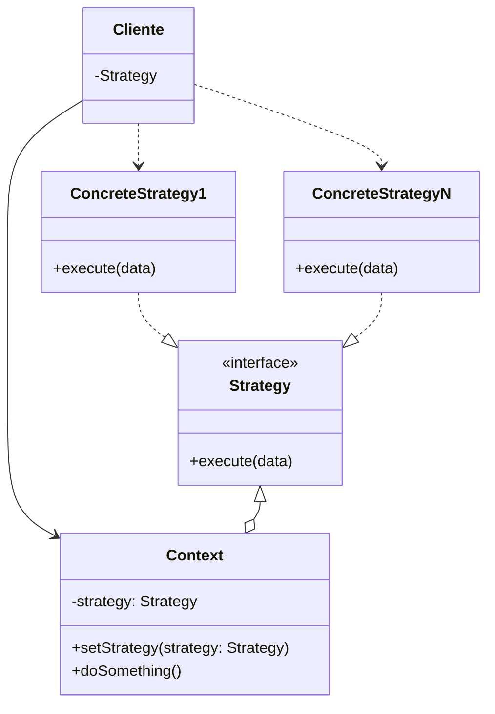
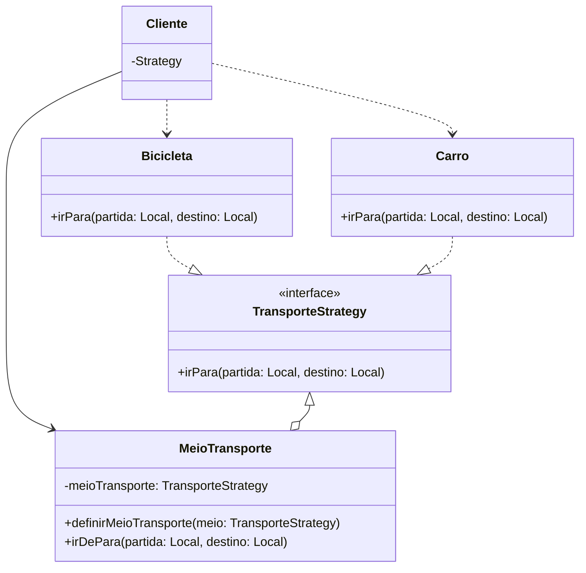
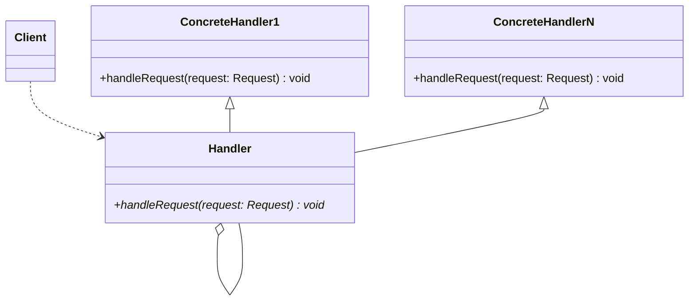

# 1. Programação Orientada a Objetos ***2***

> Como fazer um bom código orientado a objetos

## 1.1. Ementa


### 1.1.1. Livro texto da disciplina

GAMA, Erich. **Padrões de projeto: soluções reutilizáveis de software orientado a objetos.** Porto Alegre : Bookman, 2005

## 1.2. Padrões de projeto

> **Reutilizar a experiência** de outros devs com problemas semelhantes
> 
> Alto nível de reuso

- Facilita a reutilização de soluções de desenho
- Estabelece um vocabulário comum, facilitando a comunicação, documentação e aprendizado de sistemas de software
- Projetar OO é difícil, projetar OO reutilizável é mais complicado ainda
- Projeto deve ser flexível para atender requisitos futuros
- Bons projetistas não caem em POG (programação orientada a gambiarra), e projetam realmente orientado a objetos

### 1.2.1. Caracteristicas de um padrão de projeto

- Encapsulamento: um padrao encapsula um problema em uma solução bem definida
- Generalidade: todo padrão de projeto deve 
- Abstrato: representação abstratas

### 1.2.2. Conjuntos de padrões 

- ***Criação***: criar novos objetos
- ***Estruturais***: associaçoes entre classes e objetos
  - Melhora o design
- ***Comportamentais***: interações e divisões de responsabilidades
  - Melhora em tempo de execução

# 2. Padrões Compotamentais

## 2.1. Padrão Strategy

> As vezes a herança não resolve, cria soluções inflexíveis e difíceis de manter...


> **Família de algoritmos**

### 2.1.1. Diagrama de classe genérico



### 2.1.2. Diagrama de classe com exemplo




Exemplo: 
Uma classe *A* implementa dois métodos, ***m1(a1)*** e ***m2(a2)***  
As seguintes subclasses de A implementam os métodos:
- B: ***m1(a1)*** e ***m2(a2)***
- C: ***m1(a1)*** e ***m2(a3)***
- D: ***m1(a4)*** e ***m2(a2)***
- E: ***m1(a4)*** e ***m2(a3)***

```js
class A{
  m1(){
    console.log("Implementa o algoritmo 1")
  }
  m2(){
    console.log("Implementa o algoritmo 2")
  }
}
class B extends A{

}
class C extends A{
  m2(){
    console.log("Implementa o algoritmo 3")
  }
}
class D extends A{
  m1(){
    console.log("Implementa o algoritmo 4")
  }
}
class E extends A{
  m1(){
    console.log("Implementa o algoritmo 4")
  }
  m2(){
    console.log("Implementa o algoritmo 3")
  }
}
```

Uma forma de melhorar é ao identificar que a classe *E* pode na realidade herdar da *D*, me diminuindo uma sobreescrita de método

```js
class E extends D{
  m2(){
    console.log("Implementa o algoritmo 3")
  }
}
```

Mas ao usar o padrão Strategy é imporatante **identificar os aspectos que variam** e separá-los do que é comum à todas sub-classes

> Usar composição no lugar de herança

Pergunta: quais aspectos variam, quantas variações temos

### 2.1.3. Aplicando o padrão strategy

- Permite definir famílias de comportamentos, que podem ser (re)utilizados de forma intercambiável
- permite que o algoritmo varie independentemente dos clientes que o usam
- Cada comportamento é encapsulado com ***uma*** classe

> ENCAPSULAMENTO + MODULARIZAÇÃO = MANUTENIBILIDADE + REUSABILIDADE

```java

// Classe que agrupa os métodos diferentes usados
abstract class M1(){
  //Algoritmos de machine learning
  public abstract m();
}
abstract class M2(){
  //Algoritmos de criptografia
 public abstract m();
}
//Classes de suporte que implementam os diferentes algoritmos
public class A1 extends M1{
  public void m(){
    System.out.println("Implementa o algoritmo 1")
  }
}
class A2 extends M2{
  public void m(){
    System.out.println("Implementa o algoritmo 2")
  }
}
class A3 extends M2{
  public void m(){
    System.out.println("Implementa o algoritmo 3")
  }
}
class A4 extends M1{
  public void m(){
    System.out.println("Implementa o algoritmo 4")
  }
}
// Normalmente as classes acima estariam agrupadas em um pacote

// Contexts
public class A{
  private M1 estrategia1;
  private M2 estrategia2;

  public void setEstrategia1(M1 estrategia1){
    this.estrategia1 = estrategia1;
  }
  public void setEstrategia2(M1 estrategia2){
    this.estrategia2 = estrategia2;
  }
  public A(/*Não pode ter parametro*/){
    // Explicação de não poder ter parametro:
    // Ao herdar a classe A, os filhos irão tentar chamar o contrutor padrão new Nome(), logo é necessário ter um construtor padrão
    this.setEstrategia1(new M1());
    this.setEstrategia2(new M2());
  }
  public void m1(){//aprendizado de maquina
    //Delegação de resposabilidade
    this.estrategia1.m();
  }
  public void m2(){//criptografi
    //Delegação de resposabilidade
    this.estrategia2.m();
  }
}
public class B extends A{
  public B(){
    super();// Já é uma chamada implicita devido a como o java funciona
    //Toda classe em Java herda de uma classe Object
    // Como implicitamente já é chamado, todo o metodo public B() é redundante
  }
}
public class C extends A{
  public C(){
    this.setEstrategia1(new A1());
    this.setEstrategia2(new A3());
  }
}
public class D extends A{
  public D(){
    this.setEstrategia1(new A4());
    this.setEstrategia2(new A2());
  }
  
}
public class E extends A{
  public E(){
    this.setEstrategia1(new A4());
    this.setEstrategia2(new A3());
  }
}
```

Com isso caso exista um novo algoritmo a ser implementado, por exemplo um ***A5*** que faça parte de alguma estratégia, é fácil extender o projeto, basta ele herdar das classes abstratas que agrupam as estratégias

```java
public class A5 extends M1{
  public void m(){
      System.out.println("Implementa o algoritmo 5")
    }
}
```

> Ao abstrair com esse padrão iremos gerar bastantes classes

> Dica: sempre programe para o super-tipo, e não para o

### 2.1.4. Orientações para o Strategy

- Programe sempre para interface(abstrações)
- Dê preferência para composição ao invés de herança

> Reutilizar e intercambiar comportamentos entre diversas classes, facilitando a expansão, manutenção e reuso

## 2.2. Template Method

> Usado em criação de framework do tipo "Caixa Branca" ou "Inheritance-focused"

Para o uso do mesmo é necessário saber qual classe especializar e quais métodos irá sobrepor


```java
public abstract class AbstractClass{
    public final void templateMethod(){
    // Final significa que não pode ter sobreposição
    // nesse metodo nas classes que o herdam

    System.out.println("Executando: método template");
    primitiveOperation1();
    primitiveOperation2();
    }
    protected abstract void primitiveOperation1();
    protected abstract void primitiveOperation2();
}
public class Concrete1 extends AbstractClass{
    protected void primitiveOperation1(){
        System.out.println("Executando: método 1 do Concrete1");
    }
    protected void primitiveOperation2(){
        System.out.println("Executando: método 2 do Concrete1");
    }
}
public class Concrete2 extends AbstractClass{
    protected void primitiveOperation1(){
        System.out.println("Executando: método 1 do Concrete2");
    }
    protected void primitiveOperation2(){
        System.out.println("Executando: método 2 do Concrete2");
    }
}
public class TemplateMethod{
    public static void main(String[] args){
        AbstractClass c1 = new Concrete1();
        AbstractClass c2 = new Concrete2();
        c1.templateMethod();
        c2.templateMethod();
    }
}
```


## 2.3. Observer

> Vantagem

# 3. Padrões Estruturais

## 3.1. Padrão Chain of Responsibility

> Obj. Evitar o  acoplamento do remetente de uma solicitação ao receptor fornecendo uma cadeia de objetos para tratar uma solicitação

- O objeto que fez a solicitação não tem conhecimento explícito de quem a tratatá - essa solicitação é dita ter um receptor implícito
- Represent um encadeamento de objetos receptores para o processamento de uma série de solicitações diferentes
- Esses objetos receptores passam a solicitação ao longo de cadeia até que um ou cários objetos a tratem.
- Cada objeto receptor possui uma lógica descrevendo os tipos de solicitação que é capaz de processar e como passar adiante aquelas que requeiram processamento por outros receptores

### 3.1.1. Como é montado

- É uma **lista simplesmente encadeada** de objetos que podem servir um determinado pedido
- Em ve de acoplar o cliente a um objeto especifico para a execução de um determinado método
- Lista encadeada de processamento
  
### 3.1.2. Vantagens

- Determina em tempo de execução:
  - Qual objeto irá tratar a requisição
  - Cadeia de métodos que irá tratar o processamento
- Evita condicional
- Reduz acoplamento, toda implementação depende apenas desses objetos da interface que foi criada

### 3.1.3. Itens da cadeia

> Handler

- **Interface** para tratar os pedidos
- Implementa a ligação (lista) com o próximo elemento da cadeia de processamento

> Concrete Handler

- Objeto da interface Handler
- Nó de processamento da cadeia
- Se tratar o pedido o faz, se não o passa pra frente na cadeia

> Client

- Faz o pedido pra cadeia da processamento

### 3.1.4. Diagrama de Classes



## 3.2. Padrão Decorator

> Resposabilidades à instâncias, e nao à toda classe

- Muito usado em desenvolvimento de *jogos*
- Permite aplicar funcionalidades à um objeto específico
- Diminui a quantidade de classess

### 3.2.1. Exemplo base

Usado quando há uma classe base e há necessidade de especialização de indivíduos especificos

```cpp
class Component{
  public:
    void Operation() = 0;
}
class ComponenteConcreto: public Componet{
  // É a "casa"
   public:
    void Operation(){
      //regra de negócios base (funcional)
    };
}
class Decorator: public Componet{
  //Interface dos "móveis"
  //Núcleo do componente
  //PRIMEIRO A SER INSTANCEADO
  private:
    Component next_component;
   public:
    void Operation() = 0;
}
class DecoratorA: public Decorator{
  // Móvel 1 (mesa)
  // Parte 
  private:
    void novoEstado;
   public:
    void Operation() = 0;
}
class DecoratorB: public Decorator{
  //Móvel 2 (guarda-roupa)
  //Não contem a lógica completa do algoritmo
   public:
    void Operation() = 0;
    void NovoComportamento(){
      // comportamento base
    }
}
```

### 3.2.2. Exemplo com jogo

```cpp

class Campeao{
  //Component
  public:
    void set_path_to();
    void auto_atk();
    void health_regen();
    void death();
    void change_animation();
}
class Yone: public Campeao{
  //ConcreteComponent
    void p(){
      // Implementação básica
    };
    void q(){
      // Implementação básica
    };
    void w(){
      // Implementação básica
    };
    void e(){
      // Implementação básica
    };
    void r(){
      // Implementação básica
    };
}

class SummonerSpell: public Campeao{
  private:
    Campeao user;// Quem vai ta usando a habilidade
}
class Flash: public SummonerSpell{
  public:
    void blink(int x,int y){
      // Muda o (x,y) do personagem
    }
}
class Heal: public SummonerSpell{
  public:
    void addHealth(Campeao aliado_proximo){
      // Cura em X e X/2 o aliado mais próxim
    }
}

```

### 3.2.3. Exemplo na prática

- Tenho um carro básico
  - Componente concréto 
- Adiciono freio ABS
  - Um dos decorators
- Adiciono ar condicionado
  - Outro decorator
- Cada melhoria, adição de funcionalidade, no carro, é considerada uma adição de funcionalidade

```cpp
class Carro{
  // Abstract Class
  private:
    double custo;
    string descricao;
  public:
    void setCusto(double custo){
      this.custo = custo;
    }
    void setDescricao(string descricao){
      this.descricao = descricao;
    }
    string getDescricao(){
      return this.descricao;
    }
    double getCusto(){
      return this.custo;
    }
}
class DelRey: public Carro{
  //Concrete Class
  public:
    void DelRey(int custo, string descricao){
      super.setCusto(custo);
      super.setDecricao(descricao);
    }
}
class CarroDecorador: public Carro{
  //Abastract Class
  private:
    Carro carro_decorado;
  public:
    void CarroDecorador(Carro carro_decorado){
      //IMPORTANTE!!!!
      //Construtor já deve instânciar um Concrete 
      //component já existente que será decorado
      this.carro_decorado = carro_decorado;
    }
    Carro getCarroDecorado(){
      return carro_decorado;
    }
   double getCusto() = 0;/*{
     //Polimorfismo
     double a = super.getCusto() 
     //Adicionar a decoração
     double b = carro_decorado.getCusto();
     // Chamar a resposabilidade do objeto a ser decorado
     // 
     return 
   }*/
  double getDescricao() = 0;  
}

class CentralMultimidia: public CarroDecorador{
  public:
    void CentralMultimidia(Carro carro_a_ser_decorado){
      super(carro_a_ser_decorado);
    }
    double getCusto(){
      double a = getCarroDecorado().getCusto();
      /*
        * Custo do carro base a ser decorado
        * Será de um carro genérico, ou um carro concreto, 
        ou um carro com ar condicionado, 
        ou um carro com ar condicionado e 
        ou etc...
        * Chama a responsabilidade de quem ta sendo decorado
        * Adiciona a responsabilidade desta camada de decoração
      */
      double b = 1000; // Consulta no db por exemplo
      // Custo da central multimídia
      return a+b;
    }
    string getDescricao(){
      string a = getCarroDecorado().getDecricao();
      string b = "Aparelhagem de som";//Consulta db
      return a + "\n" + b;
    }
}class ArCondicionado: public CarroDecorador{
  public:
    void CentralMultimidia(Carro carro_a_ser_decorado){
      super(carro_a_ser_decorado);
    }
    double getCusto(){
      return getCarroDecorado().getCusto() + 500;
    }
    string getDescricao(){
      return getCarroDecorado().getDecricao() + "\n" + "Ar condicionado";
    }
}
class Venda{
  public:
    void vender(Carro carro){
      cout<<carro.getPreco()<<end<<carro.getDescricao()
    }
}
int main (){
  Carro c;
  c = new DelRey(30000,"Voyage"); // Dados viriam de um db por exemplo
  Venda.vender(c);
  c = new CentralMultimidia(c); // Adiciona decoração no carro base
  Vanda.vender(c);
}
```


## 3.3. Padrão composite

> Objetivos

- Compor objetos em estruturas de ***árvore*** para representar *hierarquias partes-todo*
- Permitir aos clientes tratarem de maneira uniforme objetos individuais e composiçoes de objetos
- Estrutura composta
  - Operação pode ser aplicada tanto na composição quanto nos objetos indivíduais

```java
public interface Component {
    public void doThis();
}
public class Leaf implements Component {
    public void doThis() {
        System.out.println("Leaf.doThis()");
    }
}
public class Composite implements Component{
    private Component element;
    // "element " será ou um nó intermediário ou um nó folha
    //---------------------------------
    public void doThis() {
        System.out.println("Composite.doThis()");
    }
    public void add(Component c) {
        System.out.println("Composite.add()");
    }
}
```

# 4. Padrões de criação
## 4.1. Factory

### 4.1.1. Simple Factory

- Encapsula criação de objetos
- Desacopla cliente dos objetos que irá criar
- Transfere a resposabilidade de instanciação para a fábrica
- Evita modificação de código quando novas classes são criadas, ou *quando a forma de instanciar é modificada*

### 4.1.2. Factory Method

> Interface para criação de objeto, permite deferir a instanciação para subclasses 

- Usando na construção de frameworks

```java
public abstract class Game{
  public abstract Personagem createPersonagem(int tipo);
  public void Jogar(){ // FactoryMethod
    //lógica de execução (controller)
    Personamge p1 = createPersonagem(1);
    Personamge p2 = createPersonagem(2);
    p1.atacar(p2);
    p2.correr();
    p2.atacar(p1);
  }
}

public class AdvancedGame extends Game{
  public Personagem
  //TODO
}
```

### 4.1.3. Abstract Factory

- Fornece uma interface para criar famílias de objetos relacionados sem especificar as suas classes concretas
- Existe uma **classe conhecida pelo cliente** que é a *"Fábrica Abstrata"*
- Cria conjuntos de objetos
- É útil quando tem variabilidade de familia de objetos

## 4.2. Padrão Singleton

> Problema

- Há objetos que precisamos apenas de um
- Garantir que determinadas classes sejam instanciadas uma única vez

> Solução

- Convenção para garantir que apenas um objetos seja instanciados para garantir uma classe

> Objetivos

- Garantir por exemplo que um objeto que tenha informações gerais 
- Não usar mais memória do que o necessário

> Lazy instantiation
> Só ocorre quando pedir
> Maior desempenho no início do programa


```java
public class Singleton{
  private static Singleton instancia = null;
  private Singleton(){
    super();
    /*
    Construtor de Object, é redundante
    Código do construtor virá aqui
    */
    }
  // Se o cliente tentar dar um 
  // new Singleton()
  // será gerado um erro pois o construtor padrão foi sobrescrito

  public static syncronized Singleton getInstancia(){
    if(instancia == null){
      instancia = new Singleton();
    }
    return instancia;
  }
  /* 
  Syncronized garante que o método seja atomico
  que só um cliente consiga
  acessar o método por vez 
  em um cenário multithread (semaforização)


  */
}
public class main{
  public static void main(){
    Singleton objetoUnico1 = Singleton.getInstancia();
    Singleton objetoUnico2 = Singleton.getInstancia();

    // As duas variáveis apontam para o mesmo objeto
  }
}
```

> Early instantiation
> Mais caro na "partida" do programa

```java
public class Singletion{
  private static Singleton instancia = new Singletion();

  private Singleton(){super();}
  public static Singleton getInstancia(){
    return instancia;
  }
}
```
> Conclusão
