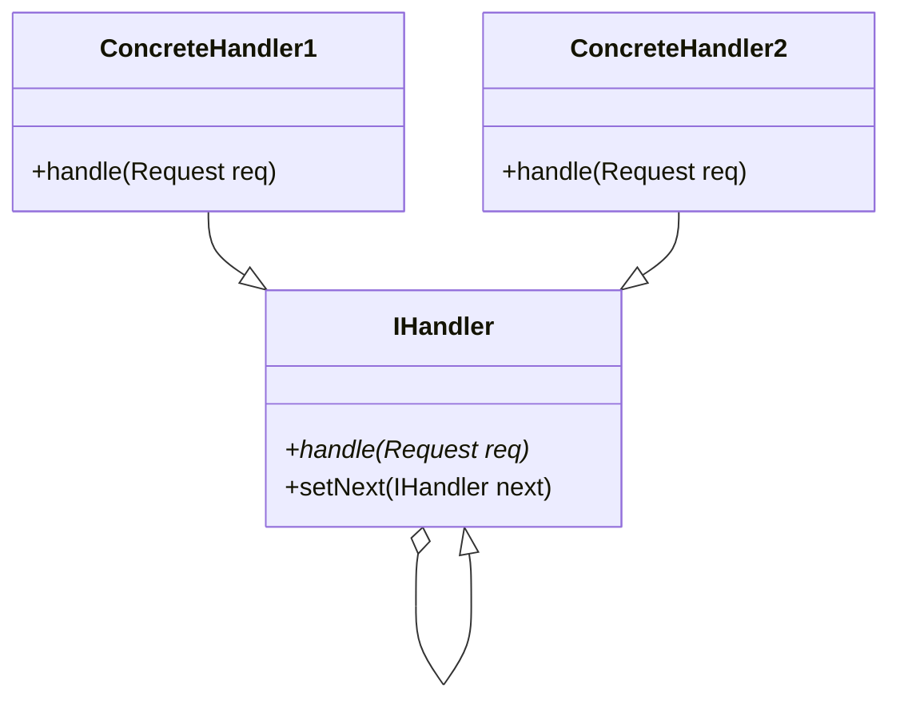

# Chain of Responsability

> Padrão de projeto para tratar um pedido ao longo de um cadeia.

## O que é

Nessa aula você irá aprender um padrão de projetos comportamental, que possíbilita fazer processamento de um pedido por uma sequência de processamento que lidam ou manipulam esse pedido.

## Problema motivacional

Imagine que você trabalha em uma loja de eletrônicos, e que você tem um pedido de um cliente. E este pedido é de um produto raro que acabou de lançar e ainda não tem no estoque, este cliente pede para conversar com seu gerente para tratar de fazer uma encomenda e assim você o encaminha para a sala do gerênte.
Chegando lá ele mostra o protudo que ele deseja comprar e o gerente verifica que o produto é de uma marca internacional, e dentro da empresa ele só tem acesso aos fornecedores brasileiros, então o gerente instruí o cliente para fazer uma ligação para a central estadual.
Então o cliente faz como foi instruído e liga na central e conversa com o representante da marca no estado sobre a possíbilidade de fazer este pedido raro internacional para ele, vendo que o produto é de um departamento diferente do dele, o representante encaminha a ligação do cliente pro representante nacional... 
Acho que você já pegou a ideia... 
Como isso poderia ser representado em código?

```py
estoque = ["Item 1", "Item 2", "Item 3"]
produtos_nacionais = ["Item 1", "Item 2", "Item 3"]
produtos_internacionais_departamento1 = ["Item 1", "Item 2", "Item 3"]
class Atendente:
    def lida_pedido(produto):
      if produto is in estoque:
        return "Pedido aceito"
      else:
        gerente = Gerente()
        gerente.lida_pedido(produto)

class Gerente:
    def lida_pedido(produto):
      if produto is in produos_nacionais:
        return "Pedido aceito"
      else:
        representante = Representante()
        representante.lida_pedido(produto)

class RepresentanteEstadual:
    def lida_pedido(produto):
      if produto is in produos_internacionais_departamento1:
        return "Pedido aceito"
      else:
        # Continua para o representante nacional
```


O que acabamos de criar aqui foi uma cadeia de responsabilidades, em que os funcionarios dessa empresa tem como responsabilidade receber um pedido, tentar resolver o problema e entregar o pedido para o cliente, e em caso de não consiguirem resolver o problema, o funcionario passa para o próximo funcionario na cadeia.

## Estrutura de  dados por trás do padrão

O padrão Chain of Responsability, é baseado na ideia de uma estrutura de dados bem famosa, a **lista encadeada**, em que nela temos um item, normalmente chamado de **nó**, que contem um dado, e a informação de onde encontrar o próximo item na memória.

Essa estrutura foi criada pois linguagens "antigas" e de [baixo nível](https://blog.betrybe.com/linguagem-de-programacao/linguagem-alto-e-baixo-nivel/) como o C, dão ao programador a possíbilidade de criar apenas "arrays", que são blocos de memória de tamanho fixo, em que esse tamanho é definido pelo programador ao criar o array e não pode ser alterado.

```c
int arr[5];
```


Inclusive essa estrutura de dados está por trás da lista que criamos em linguagens mais modernas e de alto nível, como o Python e o Javascript, que tem tamanho *dinâmico*, ou seja, podemos inserir e remover itens a qualquer momento.

```py
lista = ["Item 1", "Item 2", "Item 3"]
lista.append("Item 4")
lista.remove("Item 2")
```

### Material complementar: 

Nesta aula não aprofundamemos na estrutura de dados **lista encadeada**, mas é recomendado que você se aprofunde no conteúdo usando os links abaixo.

- [Introdução ao conteúdo em inglês com exemplo em várias linguagens](https://www.geeksforgeeks.org/linked-list-set-1-introduction/)
- [Introdução ao conteúdo em português com exemplos em C](https://www.ime.usp.br/~pf/algoritmos/aulas/lista.html#:~:text=Uma%20lista%20encadeada%20%C3%A9%20uma,segunda%2C%20e%20assim%20por%20diante.)
- [Listas e suas operações em Python](https://algoritmosempython.com.br/cursos/algoritmos-python/estruturas-dados/listas-encadeadas/)
- [Diferentes tipos de listas](https://www.facom.ufu.br/~abdala/DAS5102/TEO_ListasEncadeadas.pdf)


## Lista de processamento

Agora que você entendeu a estrutura de dados, ficou fácil de entender o que está acontecendo, troque o dado que é armazenado na lista por uma função que recebe como parametro algo, faz processamento nesse item e passa para frente (ou não) o item para continuar a ser tratado pela cadeia, e já temos tudo que precisamos para ter uma cadeia de responsabilidades.

## Organização do código

O objetivo de um padrão de projeto é ser uma solução que torna uma implementação mais fácil de entender e manter e reutilizar, então vamos mudar o código seguindo alguns princípios de design de orientação a objetos chamado [**S.O.L.I.D**](https://medium.com/desenvolvendo-com-paixao/o-que-%C3%A9-solid-o-guia-completo-para-voc%C3%AA-entender-os-5-princ%C3%ADpios-da-poo-2b937b3fc530): 

Primeiro é possível identificar que todas as classes do exemplo eram algum tipo de funcionário, e todos funcionáros tem algum tipo de forma de lidar com o pedido, então podemos criar uma classe que represente o funcionário geral, que é o pai das outras classes, e que possuir um [método abstrato](https://www.feg.unesp.br/Home/PaginasPessoais/profedsonluizfrancasenne/pc2-cap5.pdf) para lidar com o pedido, e uma informação de quem é o seu superior, que lidará com o pedido caso esse funcionario não consiga lidar.

```python
from abc import ABC, abstractmethod
# biblioteca que permite que classes sejam abstratas


class Funcionario(ABC):
    _superior = None

    @abstractmethod
    def lida_pedido(self, pedido):
        pass

    def define_superior(self, superior):
        self._superior = superior
        return superior
        # Esse retorno ajudará na hora de definir a ordem da cadeia
```

Agora que temos a classe funcionário, vamos criar uma classe que represente o vendedor, que herda de funcionário e implementa o método para lidar com o pedido.

```python
class Vendedor(Funcionario):
    estoque = ["Item 1", "Item 2", "Item 3"]

    def lida_pedido(self, pedido):
        if pedido in self.estoque:
            print("Vendedor diz: Toma aqui seu pedido")
        # Tenta passar o pedido para um superior, se o mesmo existir
        else:
            if self._superior is not None:
                self._superior.lida_pedido(pedido)
            else:
                print("Não temos o que você precisa")
```

### Hora do exercício

Crie uma classe que represente o gerente e uma classe que represente o representante regional, que herda de funcionário e implementa o método para lidar com o pedido. Depois.

#### Gabarito

```python
class Gerente(Funcionario):
    estoque = ["Item 4", "Item 5", "Item 6"]

    def lida_pedido(self, pedido):
        if pedido in self.estoque:
            print("Gerente diz: Toma aqui seu pedido")
        else:
            if self._superior is not None:
                self._superior.lida_pedido(pedido)
            else:
                print("Não temos o que você precisa")


class RepresentanteRegional(Funcionario):
    estoque = ["Item 7", "Item 8", "Item 9"]

    def lida_pedido(self, pedido):
        if pedido in self.estoque:
            print("Representante Regional diz: Toma aqui seu pedido")
        else:
            if self._superior is not None:
                self._superior.lida_pedido(pedido)
            else:
                print("Não temos o que você precisa")           
```

### Uso do código e criação da cadeia de responsabilidades

```py
repre_regional = RepresentanteRegional()
gerente = Gerente()
vendedor = Vendedor()

# Como o método define_superior retorna o parametro que foi passado, é possível definir a cadeia assim:
vendedor.define_superior(gerente).define_superior(repre_regional)

vendedor.lida_pedido("Item 1") 
# Vendedor diz: Toma aqui seu pedido

vendedor.lida_pedido("Item 9") 
# Representante Regional diz: Toma aqui seu pedido
vendedor.lida_pedido("Item 10")
# Não temos o que você precisa
```

## Outra forma de pensar cadeia de responsabilidade

Parabéns! Você já criou uma cadeia de responsabilidade! 

Agora tire um momento para pensar em problemas do mundo real que a solução é por meio de pequenos processamentos encadeados sobre um pedido, lembre-se que não necessáriamente o pedido é algo constante, e que existem cadeias que modificam o pedido ao longo do tratamento deste.


## Formalização do padrão

Agora que você entendeu o que é uma cadeia de responsabilidades, veja como é modelado o padrão em UML.



### Itens da cadeia

> Handler

- **Interface** para tratar os pedidos
  - Como o Python não tem interfaces, usaremos classes abstratas
  - Em linguagens 
- Implementa a ligação (lista) com o próximo elemento da cadeia de processamento

> Concrete Handlers

- Objeto da interface Handler
- Nó de processamento da cadeia
