# Esquema, instância e estado em um banco de dados

## Esquma

> Modelo

O esquema é uma descrição do banco de dados

## Instância

> Ocorrência

É qualquer ocorrência de um dado em seu banco, por exemplo o registro dos dados de um aluno

## Estado

> Conjunto

Conjunto de instâncias em um determidado momento

# SGBD - Sistema de Gerenciamento de Banco de Dados

> Software que gerencia banco de dados e meta dados

- Ex:
  - Oracle
  - PostgreSQL
  - MySQL
  - Sybase
  - MS Sql Server
  - MS Access
  - Firebird
  - MongoDB
  - Cassandra
  - ...

## Definição de SBD

> SBD = BD + SGBD + Aplicação

## Alternativa à abordade de SBD

Caso não usassemos SBD's para guardar as informações tudo seria armazenado em arquivos convencionáis (.txt), ou arquivos binários, e o acesso seria diretamente pela aplicação

## Problemas de usar arquivos convencionáis

- Inconsistência e redundancia
- Acesso aos dados
- Isolamento de dados
  - Os dados só podem ser acessados e manipulados por meio a interface do SGBD, como esse sistema gerencia a baixo nível não importa pra quem o está usando
- Integridade
  - Restrições de acesso e alteração seriam implementadas pelo programador da aplicação, variando de sistema pra sistema
- Atomicidade
  - Significa que em um conjunto de comandos, ou todos são executados ou nenhum é
  - Difícil de garantir quando usando arquivos convencionáis
- Acesso concorrente
  - Duas pessoas tentarem fazer um saque ao mesmo tempo na mesma conta, como garantir que as duas operações serão feitas na ordem correta
- Escalabilidade
  - Extremamente complexo acessar e fazer operações em arquivos muito grandes
- Segurança

## Componentes de um BD


## Independência de dados

- Independência ***lógica***
  - Alteração no nível lógico não afeta o programa que consome o banco
  - Exemplo: inserção de uma nova tabela
- Independência ***física***
  - Alteração na estrutura de arquivos e índices não afetam o nível lógico
  - Exemplo: criação de um índice para melhor desempenho

## Profissionais envolvidos

- Implementadores de BD
- Projetistas de BD Lógico
- Projetistas de BD Físico
- Administradores de BD (DBA)
- Programadores de aplicações e sistemas
- Usuários finais

## Histórico das arquiteturas de BD

- Sistemas monolíticos centralizados (mainframes)
- Arquitetura cliente/servidor em **duas** camadas
- Arquitetura cliente/servidor em **três** camadas
  - Cliente -> GUI/Apresentação (front-end)
  - Servidor WEB -> Aplicação e lógica de negócios 
  - Servidor BD -> SGBD/Serviços BD
- BD e Mobilidade
  - Ideia de fazer alterações na aplicação offline e quando se conectar todo trabalho feito é sincronizado
  - Exemplo: mandar mensagem no Whatsapp sem internet

## Linguagens de definição e manipulação

- DDL (**definição**)
  - esquema conceitual
  - esquema interno
  - esquema externo
- DML (**manipulação**)
  - busca
  - inserção
  - modificação
  - remoção

> Outras linguagens

- API
  - ODBC
  - JDBC
  - Outros drivers
    - Mongoose no Node para manipular e definir dados no MongoDB
- Interface
  - menus
  - formulários
  - gráficas
  - administração

## Modelos de dados - Exemplos

- Modelo ***Entidade-Relacionamento*** - ER(*)
- Modelo Orientado a Objetos
- Modelo Semântico de Dados
- Modelo Hierarquico
- Modelo de Redes
- Modelo Relacional (*)
- Modelo Relacional - Orientado a objetos

> Nesta disciplica estudaresmo o ER e o Relacional

# Modelo ER

## Projeto de DB

- Requisitos funcionais
- *Requisitos de dados*
  - Levantar requisitos
  - Derivar um diagrama
  - Gerar um modelo lógico (relacional)
  - Projeto físico

## Modelagem de dados

- Alto nível
- Foco no dominio do problema e não na solução
- Elementos básicos
  - Conceitos do mundo real
  - Caracteristicas dos conceitos
  - Relacionamentos entre os conceitos
- É feito para que um leigo consiga entender 

## Modelo Entidade-Relacionamento

> MER ou simplismente **ER**

- Independente de aplicação
- Fácil compreensão

> Conceitos básicos

- Entidade, Tipo entidade, Conjunto de Entidades
- Relacionamento e Conjunto de Relacionamentos
- Atributos

> **D**iagrama **E**ntidade-**R**elacionamento (***DER***) -> Representação gráfica

Exemplo de um DER de uma empresa


## ER - Entidade

> Conceito do mundo real com existência independente

- Exemplos: empregado, projeto, curso
  - empregado é um conceito físico
  - curso é um conceito abstrato

### Representação gráfica

> Retângulo

Na imagem acima temos de entidade o: EMPLOYEE, PROJECT, DEPARTAMENT

## ER - Atributo

> Propriedade de uma entidade

- Exemplos: código, nome, data de nascimento
  - Todos esses seriam atributos da entidade EMPLOYEE

### Representação gráfica

> Elipse ligada à entidade

Na imagem acima a entidade EMPLOYEE tem os atributos

- Name
  - Fname
  - Lname
  - Minit
- Bdate
- Adress
- Salary
- Sex
- Ssn

### Atributo Simples (ou atômico)

> Básico e indivisivel

Exemplos: sexo, cpf

### Atributo Composto

> Pode ser divido em partes

- Exemplos: endereço
  - Rua
  - Bairro
  - Número
  - Cidade
  - Estado

#### Como diferenciar

Fazendo uma analogia com a linguagem C++, atributos simples seriam os dados que podem ser representados por tipos primitivos (int, float, string, char, bool), e atributos compostos seriam dados compostos, *structs*.

### Atributo *multi*valorado

> *Conjunto de valores* para a mesma entidade

Associar com dados que precisariam de uma lista/array para ser repesentados

> Representado pela ***elipse com contorno duplo***

### Atributo *mono*valorado

> Atributo possui *um valor para cada entidade*

Associar com dados que precisariam de uma variável apenas de cada tipo, mesmo que seja um atributo multivalorado

### Atributo ***chave***

> Atributo *extritamente distinto para instâncias distintas* de uma entidade

Exemplo: CPF, códigos de matricula, código de uma disciplina  
Todo dado **único** é representado por um atributo chave

> Representado por um ***sublinhado*** no atributo

### Atributo derivado

> Valor pode ser obtivo a partir de outros atributos

Exemplo: idade pode ser obtida tendo a data de nascimento sendo armazenada  
Esses atributos *não precisam ser armazenados*

> Representado pela elipse ter o ***contorno tracejado***

## ER - Relacionamento

> *Associação* entre entidades

Exemplo: lotação de empregados em um departamento

### Representação gráfica 

> ***Losango*** ligado às entidades


### Papeis em relacionamentos

> Define como a entidade participa da relação

- Exemplo:
  - empregado *está lotado em* departamento
  - departamento *tem lotação de* empregados

> Normalmente implicito

### Auto-relacionamento

> Associação **entre instâncias da mesma entidade**

- Exemplo, supervisão de empregados:
  - empregado *é supervisor de* empregado
  - empregado *é supervisionado por* empregado


Note a cardinalidade, essa auto-relação diz que **1** supervisor supervisiona **n** supervisionados, e vice e versa

### Cardinalidade 

> Restrição da quantidade **máxima** de instâncias no relacionamento


No exemplo acima **N** funcionários trabalham pra *no máximo* **1** departamento

### Participação

- Participação total
  - Toda instância da entidade **tem** que estar em um relacionamento
  - Representado por uma linha dupla

### Entidade fraca

> Entidade que não tem chave

Para gerar uma identificação que não seja a chave é usada uma relação com uma entidade forte

- Exemplo: um funcionário tem uma chave, e está relacionado a um dependente, que só tem de atributos o nome e data de nascimento, para identificar o dependente precisamos saber do funcionário
- Nesse exemplo o nome poderia ser considerado uma *chave local*

> Representado por uma participação total e um duplo sublinhado na relação e no nome da entidade fraca

## ER Estendido - ERR

- Semântica adicional ao ER
- Entidades podem representar
  - Classes
  - Subclasses
  - Superclasses

### Especialização e Generalização

> Conceitos emprestados de OO

- Especialização
  - Gerar subclasse
- Generalização
  - Gerar superclasse a partir de várias subclasses

> Exemplo de especialização


- Secretário, Técnico e Engenheiro são subclasses da superclasse Empregado, cada uma com seu atributo específico
- Se tivesse criado primeiro um empregado e derivado os 3 eu teria especializado
- Se tivesse criado Secretário, Técnico e Engenheiro e descoberto que poderia junta-los em Empregado eu teria generalizado

#### Herança de relacionamentos

> As subclasses herdariam qualquer relacionamento existente na superclasse

- Uma instância da superclasse pode ser instância de zero ou mais subclasses, seguindo o exemplo acima um empregado poderia pertencer somente a entidade Empregado, ou ser um secretário técnico
  - Isso depende do critério de especialização, denotado pelo circulo com o **```d```** dentro

> Critério de especialização

- Disjunto
  - Subclasses são mutuamente exclusivas
  - Segundo o exemplo um empregado poderia ser *somente 1* tipo dos 3 tipos de empregado
  - Representado por um ***d*** no meio do círculo
- Sobreposto
  - Subclasses **não** são mutuamente exclusivas
  - Segundo o exemplo um empregado poderia ser *mais de 1* tipo dos 3 tipos de empregado
  - Representado por um ***o*** no meio do círculo
    - Caso não coloque nada é implícito que é o critério padrão

### Union Type

> *Duas* superclasses gerando *uma* subclasse

### Agregação

> Atributos de relacionamentos


Aqui a relação entre uma companhia e um aplicação, denotada entrevista, tem 3 atributos, que não são nem da companhia nem da aplicação

#### Problema da agregação

> Gerar um conceito oferta de emprego a partir da entrevista

Para isso agrupamos o conceito acima em um objeto próprio, destacado em vermelho


Porem essa abordagem não é a mais recomendada, algumas literaturas não permitem, logo é gerada outra solução

> Solução utilizando entidade fraca


# Modelo Relacional

> Definição

Representa um bd como uma coleção de relações, relação é uma *tabela de valores*  
Cada *linha* é um conjunto de valores relacionados  
Cada *coluna* é um conjunto de valores do mesmo tipo

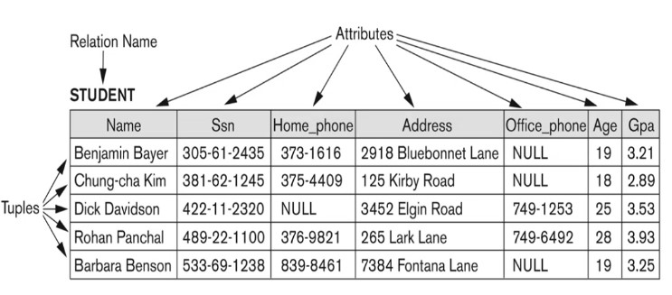

## Representação em tuplas

Para representar usamos tuplas os dados  

ALUNO= <nome,cpf,matricula,telefone,endereco,idade>  

Podemos gerar uma instância assim  
aluno1 =<"Heitor", "111.111.111-11", 11921BCC026, 34988887777,rua da UFU 1000, 20>  

Ou podemos acessar cada item individualmente assim  
aluno1.idade = 21  

### Relação, estado, grau e cardinalidade

> Relação e cardinalidade

Relação r de um esquema R(A1,A2,...,An), denotado pro r(R) é um conjunto de tuplas, *n* é a cardinalidade  

r = {t1,t2,...,tn}

> Estado

- O *estado da relação r* são as *tuplas válidas* que *representam um estado particular do mundo real*
- O esquema R é estático, mas os estados da relação r são dinâmicos

## Caracteristicas

- As tuplas não possuem ordem
- Os atributos estão ordenados de acordo com o esquema da relação
- **Não há atributos compostos ou multivalorados**, todos atributos são atômicos(indivisíveis)
- NULL é um valor possível
- Relacionando com o ER uma entidade vira uma relação no modelo relacional, assim como o relacionamento

## Restrições

> Condições que devem ser mantidas para os estados válidos

### Categorias de restrições

- Inerentes
  - Caracteristicas do modelo de dados, por exemplo não existir atributo multivalorado
- Baseada no esquema
  - Restrição do modelo de dados, por exemplo o dominio
    - Sexo = {M,F,NB}
  - Interpretação do minimundo
- Baseada na aplicação
  - Não tem como representar a restrição no esquema, ai ela é implementada na aplicação que usará o bd

## Superchave

> Subconjunto de atributos que não existam mais de uma tupla com a mesma combinação de valores para esses atributos

Obs: se esse sub conjunto for a relação inteira, o conjunto todo será a superchave, para evitar de ter relações duplicadas

## Chave

É uma superchave tal que a remoção de qualquer atributo da mesma gera um subconjunto que não é superchave da relação  

> Chave primária

É uma chama candidata dentre todas que eu escolho pra ser primária, não pode ser nula

## Chave estrangeira e integridade referencial

> Tem a ver com duas relações

É um valor de uma relação que é emprestado de outra relação, fazendo referencia ao segundo, ou sendo nulo

## Esquema de BD

É um conjunto de esquemas de relações que pertencem ao BD

```S = {R1,R2,...Rn}```

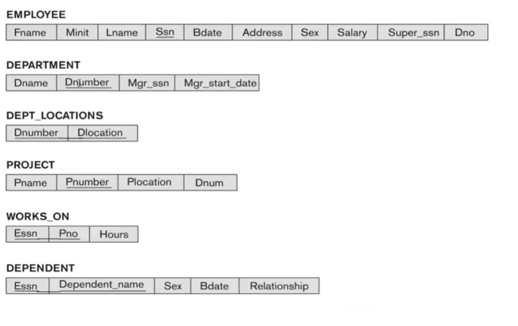

Neste exemplo os campos sublinhados são as chaves

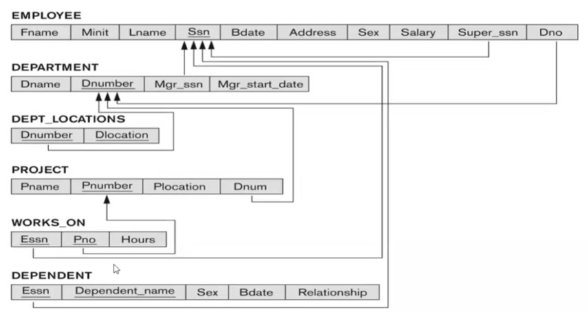

Neste exemplo a seta segue da relação filho em direção a relação pai  

Ou seja, o *Pno* da tabela **WORKS_ON** é uma chave estrangeira de *Pnumber* da tabela **PROJECT**. Isso significa que todo valor de *Pno* ou está presente no atributo *Pnumber* na tabela pai ou então *Pno* é nulo

# Mapeamento MER - MR

## Projeto lógico

> Primeira camada entre o conceito e implementação

Especificação **detalhada** da estrutura em um modelo implementavel pelo SGBD

## Roteiro passo a passo

### Mapeamento de tipos de *entidade regular*

> MER

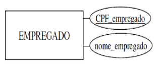

> ER

EMPREGADO(<ins>CPF_empregado</ins>,nome_empregado)

### Mapeamento de tipos de *entidade fraca*

> MER

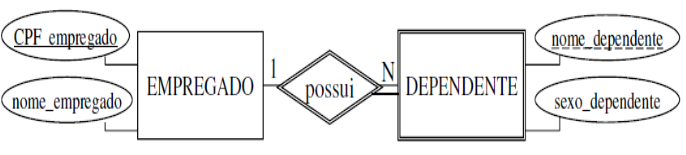

> ER

DEPENDENTE(<ins>CPF_empregado, nome_dependente</ins>,sexo_dependente)

**FK**CPF_empregado(DEPENDENTE)=**PK**(EMPREGADO)
**PK**(DEPENDENTE)=(CPF_empregado, nome_dependente)

- A chave primária da relação será composta de sua chave local e da chave primária de sua entidade forte
- Note que o sublinhado é continuo, denotando uma chave composta por 2 atributos, não são duas chaves

### Mapeamento de tipos de *relacionamento 1:1*

#### Com relacionamento **total/total**

> MER

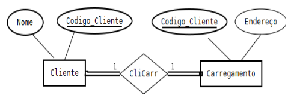

> ER (criar uma relação)

CLIENTE_CARREGAMENTO(<ins>Codigo_Cliente</ins>,Nome, Endereço)

#### Com relacionamento **total/parcial**

> MER

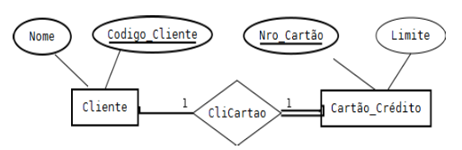

> ER (criar duas relações)

CLIENTE(<ins>Codigo_Cliente</ins>,Nome)  
Cartao_Credito(<ins>Nro_Cartao</ins>,Limite, <ins>Codigo_Cliente</ins>)

**FK**Codigo_Cliente(Cartao_Credito)=**PK**(Cliente)

#### Com relacionamento **parcial/parcial**

> MER

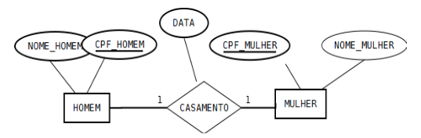

> ER (criar três relações)

HOMEM(<ins>CPF_HOMEM</ins>, NOME_HOMEM)  
MULHER(<ins>CPF_MULHER</ins>, NOME_MULHER)  
CASAMENTO(<ins>CPF_HOMEM</ins>, <ins>CPF_MULHER</ins>, DATA)

**FK**CPF_HOMEM(CASAMENTO)=**PK**(HOMEM)
**FK**CPF_MULHER(CASAMENTO)=**PK**(MULHER)

### Mapeamento de tipos de *relacionamento 1:N*

Agrupa a chave de quem tem cardinalidade 1 aos atributos de quem tem cardinalidade N

> MER

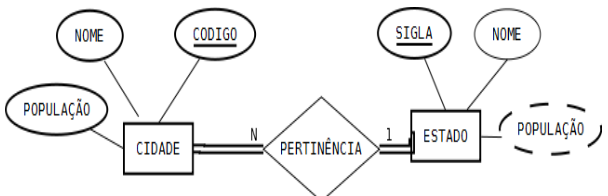

> ER

ESTADO(<ins>SIGLA</ins>, NOME)  
CIDADE(<ins>CODIGO</ins>, NOME, POPULAÇÃO, SIGLA_ESTADO)

**FK**SIGLA_ESTADO(CIDADE)=**PK**(ESTADO)

CLIENTE_CARREGAMENTO(<ins>Codigo_Cliente</ins>,Nome, Endereço)


### Mapeamento de tipos de *relacionamento M:N*

Agrupa-se os atributos do relacionamento com as chaves das entidades participantes

> MER


> ER

ALUNO(<ins>MATRICULA</ins>, NOME)  
DISCIPLINA(<ins>CODIGO</ins>, NOME)  
CURRICULO(<ins>MATRICULA, CODIGO_DISCIPLINA</ins>, ANO, SEMESTRE, NOTA)

**FK**MATRICULA(CURRICULO)=**PK**(ALUNO)  
**FK**CODIGO_DISCIPLINA(CURRICULO)=**PK**(DISCIPLINA)

### Mapeamento de atributos *multivalorados e compostos*

Não existe o conceito do atributo multivalorado no MR

Crias-se uma relação com o atributo multivalorado e a chave da entidade original

> MER

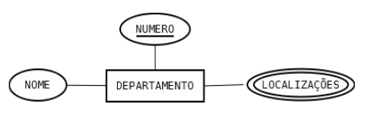

> ER

DEPARTAMENTO(<ins>NUMERO</ins>, NOME)  
LOCALIZAÇÕES(<ins>NUMERO_DEPTO, LOCALIZACAO</ins>)

**FK**NUMERO_DEPTO(LOCALIZAÇÕES)=**PK**(DEPARTAMENTO)

### Mapeamento de tipos de *relacionamento de grau > 2*

Não existe o conceito do atributo multivalorado no MR

Crias-se uma relação com o atributo multivalorado e a chave da entidade original

> MER

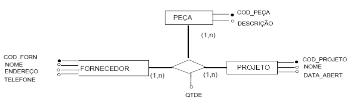

> ER

PEÇA(<ins>COD_PEÇA</ins>, DESCRIÇÃO)  
FORNECEDOR(<ins>COD_FORN</ins>,NOME, ENDEREÇO, TELEFONE)  
PROJETO(<ins>COD_PROJETO</ins>, NOME, DATA_ABERT)  
FORNECIMENTO(<ins>COD_PEÇA, COD_FORNECEDOR, COD_PROJETO</ins>, QTDE)  

### Mapeamento de *Generalização/Especialização*

superclasse C = {<ins>k</ins>,1, a2, ..., an} com **m** subclasses {S1, S2, ..., Sm} pode ser mapeada de quatro formas, aqui chamadas de

- **Opção A**: uma tabela para cada entidade, inclusive C (superclasse)
  - Mais flexivel
- **Opção B**: uma tabela para cada entidade Si fundida com C
  - Aplicavel para especialização *total e disjunta*
- **Opção C**: fusão de todas as entidades com *um* atributo tipo
  - Usado para especialização *disjunta*
- **Opção D**:  fusão de todas as entidades com *m* atributos tipo

### Mapeamento de *subclasses compartilhadas* (herança múltipla)

### Mapeamento de *categorias* (tipos de união)