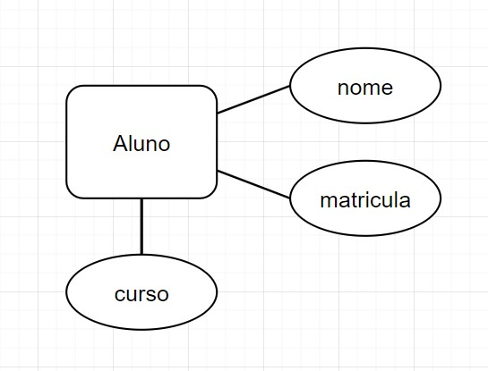
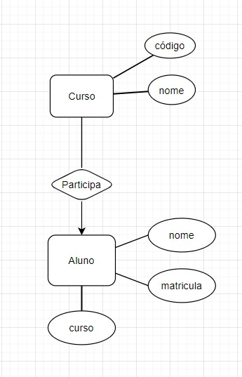
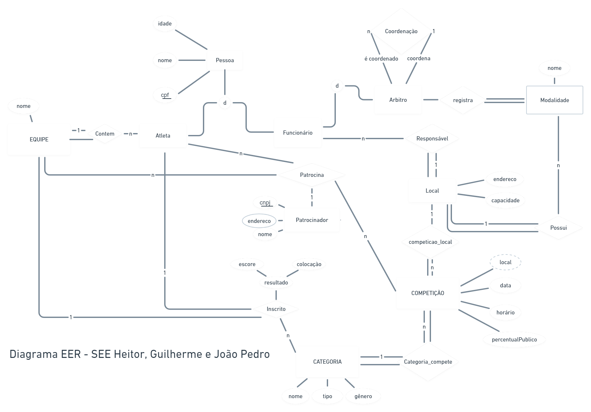

# Lista 1 - Heitor Freitas Ferreira

## I.00 Defina Esquema de BD e Instância de um BD.

O esquema é uma descrição do banco de dados  
Instância é qualquer ocorrência de um dado em seu banco, por exemplo o registro dos dados de um aluno

## I.01 Apresente um exemplo de cada um dos itens acima

Esquema de aluno

Instância de aluno

nome|matricula|curso|
-|-|-|
Heitor|11921BCC026|Ciência da Computação
Guilherme|11921BCC016|Sistemas de Informação

## I.02 Defina SGBD e dê um exemplo.

Sistema de Gerenciamento de Banco de dados é um software que utilizamos para gerenciar o banco de dados, como exemplos temos:

- Oracle
- PostgreSQL
- MySQL
- Sybase
- MS Sql Server
- MS Access
- Firebird
- MongoDB
- Cassandra
- ...

## I.03 Qual o problema da Redundância de Dados e como os SGBD lidam com esse problema?

Quando tentamos usar a abordagem de salvar em arquivo binário ou de texto, não existe o controle de termos salvo o mesmo dado mais de uma vez, por exemplo, se não tratado um usuário poderia criar duas contas iguais

## I.04 Defina atomicidade de transações em BD, qual problema se não for observada e como os SGBD lidam com o problema.

Atomicidade significa que em um conjunto de comandos em uma transação, ou todos são executados ou nenhum é, isso é para evitar de em uma transferencia de dinheiro (por exemplo), que é composta de, sacar em uma conta e depositar em outra, caso de algum problema excepcional e o banco de dados trave após fazer o saque e antes do depósito, o saque não é efetivado

## I.05 Defina os três níveis de abstração dos dados armazenados por meio de um SGBD.

- Externo
  - Visão do usuário
- Conceitual(lógico)
  - Esquema de dados
- Interno(físico)
  - Dado armazenado na máquina

## I.06  Em relação à independência de dados: O que   é Independência Lógica? O que é Independência Física? Cite um exemplo de cada.

- Independência ***lógica***
  - Alteração no nível lógico não afeta o programa que consome o banco
  - Exemplo: inserção de uma nova tabela
- Independência ***física***
  - Alteração na estrutura de arquivos e índices não afetam o nível lógico
  - Exemplo: criação de um índice para melhor desempenho

## I.07 Defina Entidade, Atributo e Relacionamento e apresente um exemplo de cada.

### Entidade

> Conceito do mundo real com existência independente

### Atributo

> Propriedade de uma entidade

### Relacionamento

> *Associação* entre entidades

## I.08 O que é atributo chave? Dê um exemplo. O que é uma chave composta? Dê um exemplo.

Atributo chave é um atributo que é único entre todas as instâncias de uma entidade, uma chave composta é quando precisa de dois atributos para representar a chave da entidade

- Exemplos:
  - chave única: CPF em entidade pessoa
  - chave composta: nome completo + data nascimento

## I.09 O que é Especialização? E Generalização? Quais os tipos?

**Generalização** é quando a partir de várias sub-entidades, percebemos que podemos agrupa-las em uma entidade mãe, já **especialização** é o contrário, a partir de uma entidade, derivamos *n* entidades.  
Esta última tem 2 tipos, especialização disjunta, em que a entidade pode assumir *apenas uma* entidade filha, e especialização sobreposta, que a entidade pode assumir *mais de uma* entidade filha

## I.10 Desenhe um Diagrama EER1  para o BD de um Sistema de Eventos Esportivos-SEE

