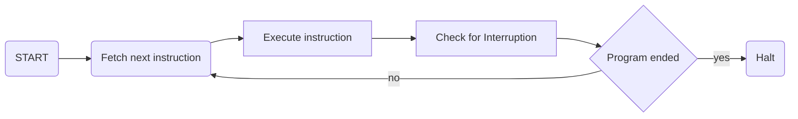
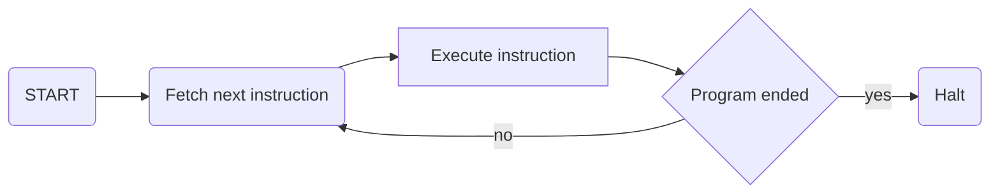
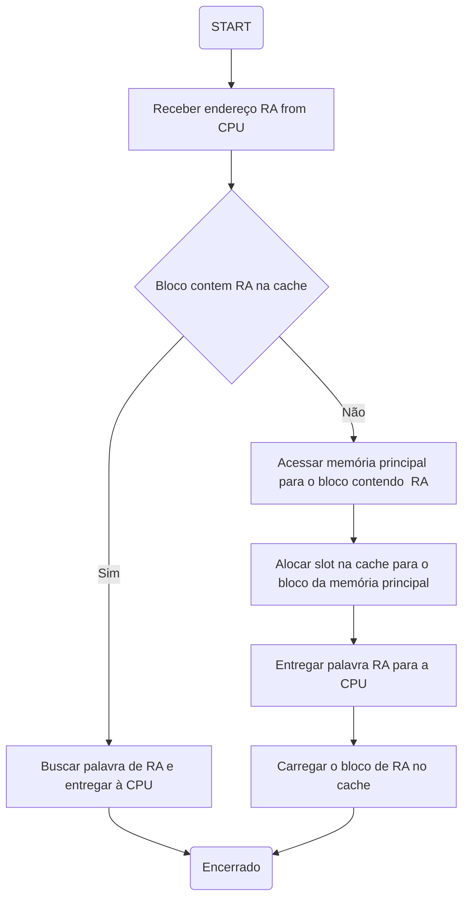
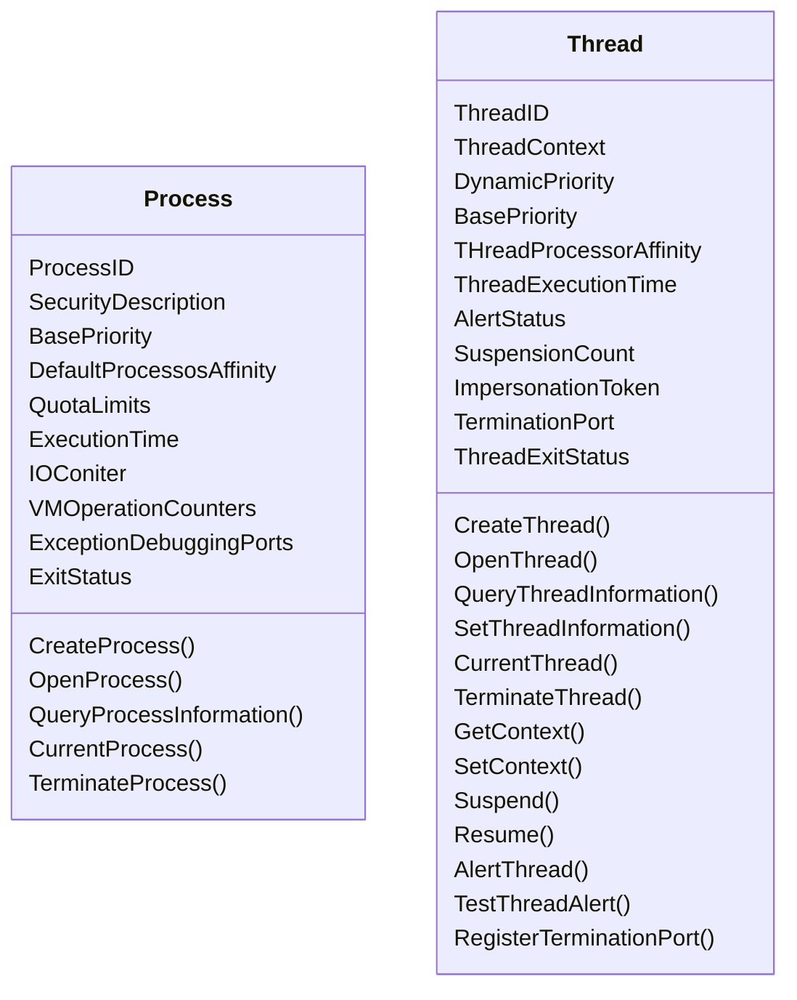
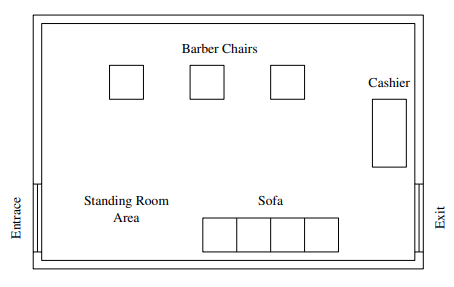
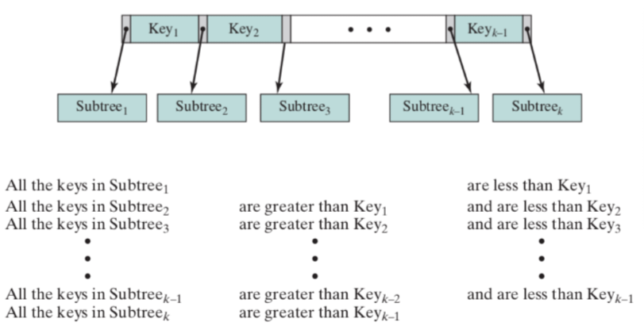

# 1. Visão geral de um SO

## 1.1. Elementos básicos

- Sistema operacional
  - software que explora os recursos de hardware de um ou mais processadores, memória e dispositivos de entrada/saída para prover um conjunto de serviços aos usuários
  - Facilita a vida de quem usa o ambiente computacional
- Elementos básicos
  - Processador
  - Memória
  - Entrada/Saída
  - Registradores
    - São mais rápidos que a memória principal, mas em contrapartidada armazenam menor quantidade de informações
  - Registradores visíveis ao usuário
    - Possíbilita o programador assembly minimizar as referências à memória principal
  - Registradores de controle e status
    - Permite saltos entre instruções
    - Utilizado pelo processador para controlar as operações desempenhadas pelo menos e concedore às rotinas do sistema operacional o controle da execução de programas
    - Possíbilita mudança de fluxo
    - Jump (in)condicional
  - Program counter registrer
    - Endereço de intruição da ser buscada
  - Registrador de instrução
    - Instrução mais recente já buscada
  - MAR, MBR, IO Address Register e IO Buer Register
  - Palavra de status do programa
    - Contém informação

## 1.2. Evolução do microprocessador

- Revolução do hardware
  - Computação portátil e de mesa com invenção do microprocessador (processador em um único chip)
  - Evolução
    - Contínia a ponto de agora serem muito mais raoudos para a maioria dos cálculos devidos à física envolvida na movimentação de informações em intervalos de tempo abaixo de nanossegundos
    - Multiprocessadores onde cada chip (soquete) contém vários processadores (núcleos)
  - GPU
    - Únidades de processamento grático, computação eficiente em matrizes de dados usando técnicicas como "Single Instruction Multiple Data" SMID
- SoC
  - System on Chip
  - Junção de todos

## 1.3. Execução de uma instrução pelo processador

> Com interrupção



> Sem interrupção




## 1.4. Hierarquia de memória

Como o avanço da capacidade de processamento foi maior que o avanço da velocidade das memórias primárias (RAM), foram criados outros níveis de memória mais rápidos e com menor capacidade, como a memória cache.

> Dilema do projetista

A ideia é usar memória de grande capacidade, que tem custo por bit baixo, problema é que isso afeta o desempenho pois será uma memória mais lenta.  
Solução: Usar vários níveis de memória com diferentes velocidades

### 1.4.1. Hierarquia típica

> Pontos importante

- Custo crescente por bit
- Aumento da capacidade
- Aumento do tempo de acesso
- Diminuição da frequência de acesso à memória pelo processador

> Memórias (da mais rápida à mais lenta)

1. Memória "inboard"
   - Registradores
   - Cache
   - Memória principal (RAM)
2. Memória "offboard"
   - Disco Rígido
   - CDs e DVDs
   - BlueRay 
3. Armazenamento "offline"
   - Fita magnética

### 1.4.2. Princípio da localidade de referência

Durante o curso de execução de um programa, as referências à memória pelo processador, tanto para a **instruções** quanto para **dados**, **tendem a se agrupar**.

## 1.5. Memória cache

> Guarda instruções e dados do que passou pela memória principal.

Invisível ao SO, ela interage com outro hardware de gerenciamento de memória.

> Problema a ser gerenciado: *incompatibilidade persistente entre as velocidades* do processador e da memória principal.

## 1.6. Níveis da cache

Normalmente se tem 2 níveis de cache, um primeiro nível **L1** com a maior velocidade possível, e um nível **L2** fora do chip, um pouco menos rápida e com maior armazenamento, e um nível **L3** que normalmente é comum entre todos os núcleos do microprocessador.

## 1.7. Como a informação passa da memória principal para a cache

> Memória principal

Similar à um array de tamanho $2^n$ que armazena *palavras* 

É agrupada essas posições do array em *blocos* com ***k*** palavras, ou seja, existem **M** blocos onde $M = 2^n/k$

> Cache

Consiste de *C* Slots de *k* palavras, *C* é consideravelmente menor que o número de blocos da memória principal

- Se uma palavra em um bloco de memória que não está no cache for lida, o bloco vai para a cache
- Como aqui há mais blocos do que slots, um slot individual não pode ser exclusivo e dedicado permanentemente a um bloco específico. 




## 1.8. Acesso direto à memória

### 1.8.1. IO Programada

[TODO]

### 1.8.2. IO orientada à interrupção

1. Processador emite comando de IO para o módulo e em seguida realiza outro trabalho
2. Módulo de IO interrompe o processador quando estiver pronto para trocar dados 
3. Processador  executa transferência de dados, e retorna ao processamento anterior

- Mais eficiente que a programada
- Requer intervenção ativa do processador para tranferir dados entre memória e módulo de IO

### 1.8.3. Acesso direto à memória

## 1.9. Organização de um multiprocessador e Organização de multiplos núcleos

## Objetivos e funções do SO

> Programa que controla execução de programas e aplicações, age como interface entre usuário e hardware

O objetivo é a conveniência, abstrai os elementos da ISA e da arquitetura em geral para formas mais palataveis de utilização

- Conveniência
  - Um SO torna o sistema computacional mais conveniente para o uso
- Eficiência
  - Permite que os recursos do sistema computacional seja utilizado de maneira eficiênte
- Habilidade de evolução
  - SO deve ser construído de forma a permitir o desenvovimento, teste e introdução eficazes de novas funções do sistema sem interferir no serviço

## Serviços oferecidos pelo SO

- Desenvolvimento de programas
  - variedade de funcionalidades e serviços para assistir o programador na criação de programas
- Execuçao de programas
  - Intruções e dados precisam ser carregados na memória, dispositivos de entrada/saída e arquivos precisam ser inicializados e outros recursos devem ser preparados
    - #include <"biblioteca">
- Acesso a dispositivos de IO
  - Cada dispositivo tem sua peculiaridade, como conjuntos de instruções e sinais, que o SO deve abstraír para o usuário
- Controle de acesso à arquivos
  - Esconder do usuário a natureza do dispositivo de armazenamento, bem como o formato do arquivo armazenado
- Acesso ao sistema
  - Proteção de recursos baseado em autorizações e permissões
  - Resolver conflitos de dispota por recursos
- Detecçção de erro
  - Lidar com erros ou avisar sobre os mesmos
- Responsa de erro
  - Abortar a operação ou tentar repeti-la
- Accounting
  - Coletar estatísticas a cerca de varios recursos
  - Monitorar parâmetros de performance
  - Informações podem ser usadas para

## SO como uma interface computacional

> Níveis de abstrações

- ISA
  - Repertório de instruoes em linguagem de máquina que permite que um computadore pode serguir, ou seja, interface entre hardware e software
  - Programas aplicativos e utilitários podem acessar a ISA diretamente 
- ABI (Application Binary Interface)
  - chamada do sistema para o SO e recursos de hardware
- API
  - Permite acesso aos recursos de hardware e serviçoes disponíveis por meio do ISA do usuário, complementado com chamada s de HLL (High Level Library)
  - Depende da linguagem de programação usada
  - Abre espaço para portabilidade de aplicativos software, por meio de recompilação, para outros sistemas que suportam a mesma API

## SO como um gerenciador de recursos

> Responsável pelo gerenciamento dos recursos computacionais voltados para tranferência, armazenamento e processamento de dados, bem como o controle dessas funções

Como mecanismo de controle, cabe duas ressalvas

1. SO funciona como um programa comum em um computador, um seja, as funções do SO são pequenos códigos de prograas executados pelo processador
2. Frequentemente o SO renuncia o controle do processador e depende do processador para readquiri-lo

> Conclusão: SO nada mais é que um programa de computador

- Principais recursos
  - Gerenciados pelo SO, sendo parte do SO na memoria principal, contempla o kernel que contém as funções usados com mais frequência no SO


## Fácilidade de evoluçã de um SO

> SO evoluem por várias razoes

- Upgrade de hardware e novos tipos de hardwares
- Novos serviços
  - Novas necessidade do usuários e/ou gerentes de sistemas
- Correção de bugs

### Etapas da evolução de um SO

- Processamento serial
  - máquinas eram executadas em consoles
  - programador era o projetista
  - máquinas não tinham SO
  - Usuário usava a ISA diretamente
  - Programador não só fazia o código mas também gerenciava como esse código era carregado e gerenciado na memória
  - Muito tempo era perdido na preparação do ambiente
  - Caracteristicas:
    - Um usuário por vez
    - Não há SO
    - Entrada e saída por fitas magnéticas ou cartões perfurados
    - Tempo de preparação (setup), carregar o compilador, código fonte, salvar o programa compilado,
  - Desvantagens
    - Escalonamento
      - Cada usuario reserva um tempo que ele imaginava que o programa deveria precisar para executar, caso o programa terminasse antes não havia problema, se não desse tempo o programa era encerrado
- SO em lote
  - *Bloco de programas a serem executados*
  - Automatização de um processo
  - Usuário não tem mais acesso à ISA, mas sim depende do SO
  - Tarefas comuns acomodadas em um programa a parte, comum a todos programas
  - Carregados os programas em cartão perfurado para a fita de memória
  - Programas sao executados em sequência, ao terminar a execução os resultados são salvos na fita de memória e é começada a execução do próximo programa a ser executado
  - Na memória ficam então os programas do usuário e um programa "Monitor"
    - Processos de interrupção
    - Drivers de dispositivos
    - Sequênciamento de tarefas
    - Linguâgem de controle
  - Etapas
    - Monitor lê uma tarefa de cada vez da entrada
    - Carrega a tarefa para a área de programas do usuário
    - Uma instrução do monitor gera um desvio para o começo do programa do usuário
    - Execução do programa continua até terminar ou ocorre um erro, quando então o controle é devolvido para o monitor
  - Requisitos desejáveis no monitor
    - Proteçroção de memória
    - Privilégio de intruições
    - Interrupções
    - Observaçoes
    - C
- SO multiprogramado
  - Mais de um programa na memória principal
- SO com time-share

# 2. Processos e threads

> Conceitos prévios

- Plataforma de computador
  - Coleção de hardware (processador, memória, IO, disco...)
- Aplicativos de computador
  - Desenvolvidos para realizar uma tarefa
  - Aceitam dados do mundo externo
  - Realizam um processamento e gera saída
- Sistema Operacional
  - Interface para uso de aplicativos
  - Camada de software entre aplicativos e hardware
- Background
  - Gerenciamento de execução de aplicativos para que
  1. reursos físicos sejam disponibilizados para aplicativos
  2. Processador e dispositivos IO sendo usados com eficiência
  3. Processador físico compartilhado entre aplicativos de forma que parecam estar em andamento

### O que é um processo

> Entidade composta por ao menos o código do programa e um conjunto de dados associado ao código

Em qualaquer momento, enquanto o programa está em execução, o processo é caracterizado exclusivamente por algumas informações


### Estrutura de um processo

> Process control block

Informações armazenadas em uma estrutura de dados, criada e gerenciada pelo SO

- Identificador
  - Número **único**associado ao processo (process id)
- Estado
  - Em que estado ele se encontra
    - Executando
    - Bloqueado
    - Intermediário (instanciação)
    - ...
- Prioridade
  - Nível de prioridade em relação aos outros processos
- Contador de programa
  - Endereço da próxima instrução no programa
- Ponteiro de memória
  - Ponteiros para o código do programa e dados associados ao processo
  - Quaisquer blocos de memória compartilhados com outros processos
- Dados de contexto
  - Dados que estão presentes no registros do processador durante a execução
  - Permite que o processo seja retomado 
- IO Status
  - inclui solicitações pendentes de IO, dispositivos de IO, lista de arquivos em uso pelo processo e assim por diante
- Informações de contabilidade
  - Quanto do recurso o processo está utilizando
  - Podem contemplar a quantidade de tempo do processo e tempo "clock" utilizados, limites de tempo, números de contas e assim por diante

### Estados do modelo de processos

> Modelo com dois estados

- Executando
  - Usando o processador
  - Está na memória principal
- Não executando
  - Não usa o processador
  - Está na memória principal
  - Está na fila de prioridade circular aguardando chegar sua vez de estar executando novamente

>  Por que usar um modelo com mais estados?

Precisamos entender como um processo é criado e destruído

> Criação

- New batch job
  - Sistema em lote, processo é criado em resposta à submissão de tarefas
- Loggin interativo
  - Ambiente interativo, processo é criado quando um novo usuário executa o login
- Criação para prover um serviço
  - SO por criar um processo para executar funções em favor de um programa de usuário
  - Impressão, comunicação em rede...
- Processos gerados por outros procesoss
  - Propósito de oferecer *modularidade* ou *paralelismo*, processo cria outro processo, gerando um processo filho

> Finalização de um processo

- System("exit")
- Usuário clicou para fechar um processo

Motivos para finalização de um processo

- Finalização normal
  - Acabou o programa
- Excedeu o limite máximo de tempo
- Processo necessita de mais memória do que a existente no computador
- Processo tenta acessar memória fora dos limites do mesmo
- Erro aritmético (x/0)
- Processo aguarda tempo a mais que o máximo especificado
- Falha de IO
- Instrução inválida
  - Tentar dar jump para um pedaço de memória que não seja código e sim dado
- Instrução com privilégio
- Mal uso de dados
- Intervenção
  - Deadlock
- Pai foi encerrado
  - Evitar processo orfão
- Processo pai encerra o filho 

### Modelo com cinco processos

- Running
  - Está rodando no momento no processador
- Ready
  - Pronto para entrar em ready
- Blocked/waiting
  - Não pode entrar em running
  - Aguardando IO
- New
  - Acaba de ser criado
  - Precisa ser inicializado e inicializar as estruturas
  - Lidar com criação do processo quando não se há memória
  - ...
- Exit
  - Processo liberado da fila de processos, seja por ser interrompido ou abortado

### Modelo com sete processos

> Todos os outros estados 

- Suspenso
  - Processo está *bloqueado* e seus dados vai pra **memória secundária**
  - Não sai deste estado até que um terceiro o retire da mesma (quem o colocou)
- Pronto e suspenso
  - Após estar suspenso e o evento que ele estava aguardando ocorrer, o processo pode ser ativo (trago para a memória principal)

## Estruturas de controle de processos

> SO mantem tabelas de informações sobre os arquivos

> Detalhes mudam de um SO para outro, mas em geral temos 4 categorias

1. Memória 
1. Dispositivos
1. Arquivos
1. Processos

- Process control block
- Process image
  - Coleção dos processos, dados, pilha, atributos
- User data
  - Dados do programa usuário, estruturas de dados dele que podem ser modificadas
- Programa do usuário
  - Código
- Pilha
  - Uma ou mais pilhas por processo
  - Armazena parametros dos procedimentos
  - Armazena endereços de retorno

> Categorias das estruturas de controle de processos

- Identificadores do *processo*
- Estado do *processador* e sua informação de contexto
- Informação de controle de processo
  - Infos adicionais para o SO coordenar vários processos

### Identificador de processo

- Identificadores
  - Números armazenados no bloco de controle de processo
- Process ID
  - Número **único** para cada processo
- Parent Process ID
  - Número do processo pai
- User ID
  - Número do usuário que criou o processo

### Estado do processador e sua informação de contexto

- Controle de estado de registrador
  - Registradores associados ao processo
- Incluem
  - Program Counter
  - Condition Codes
  - Status Information

### Informação de controle de processo

- Agendamento e estado da informação
  - Informações para o *escalonador de processo*
  - Estado do processo
    - Prontidão (em execução, pronto, aguardando, interrompido...)
  - Prioridade
    - Usado para inserção na fila do escalonador
  - Informações de agendamento
    - Informações sobre tempo de execução e que está em espera
  - Evento
    - Informação do evento que o processo pode estar aguardando para ser retomado
- Vinculação à outros processos e fila destes n processos, ou outras estruturas
- Comunicação entre processos
  - Sinalizadores
  - Mensagens
- Privilégios de processos
- Gerênciamento de memória
  - Ponteiro para as áreas da memória virtual que foi atribuída ao processo
- Dono do processo e utilização de dados

## Troca de contexto de processo

> Dúvida: como readquirir o qontrole para o chaveamento

- Interrupção
  - Sinal externo ao processo
  - Transfere o controle para gerenciador de interrupções que depois passa para o SO
- Armadilha (trap)
  - Execução do processo
- Chamada do supervisor
  - Chamada do SO

> Dúvida: como reconhecer a troca de modo de kernel para user

### Passo a passo

1. Salvar o contexto, incluíndo os registradores
2. Atualizar o bloco de controle do processo para o processo que está sendo executado para que possa mudar o estado do mesmo
3. Mover o bloco de controle do processo para a fila que o convem
4. Selecionar o próximo processo de acordo com as prioridades vigentes
5. Atualizar o bloco de controle para o processo selecionado acima
6. Atualizar a estrutura de dados do gerenciamento da memória
7. Recuperar o contexto do processador, ou seja, carregar os registradores, PC...

## SO também é um processo

> Como um processo que gerencia processos é gerenciado

### Abordagem tradicional

SO é um núcleo a parte idenpendente

> Implicações

- Na hora do chaveamento o SO é tratado como processo
- Logo ele é chaveado igualmente entre outros processos
- Chaveaento é algo caro computacionalmente

### Alternativas

Pegar partes do SO e permitir que ele rode na área do usuário no modo protegido.  

Logo não há chaveamento para o processo e o SO, apenas mudança de contexto

> Funções do SO como conjunto de processos a parte

- Encoraja separação modular com o mínimo de interfaces entre módulos  
- Serviço oferecido atraves de troca de mensagens  
- Caso o sistema seja monoprocessado não há ganho real de performance
- Coisas comuns são 

## Problema de seguranças 

- Instrusos
  - Masquerader
    - Usuário não está autorizado a usar o desktop e invade os controles de acesso para explorar a conta de um usuário legítimo
    - Achar uma conta com usuário e senha vazadas por exemplo
  - Misfeasor
    - Usuário legítimo que acessa algo indevidamente
    - Exemplo da algar com a PIA
  - Usuário clandestino
    - Usuário terceiro que acessa e suprime a coleta de auditoria

> Softwares malignos 

- Malware
  - Parasita
    - Fragmentos de programa malicioso, só roda quando o host está rodando
  - Programas auto contidos
    - Programas independentes executados

### Detecção de intrusos

> IDS's 

- Host Based
  - Monitora as características de um usuário e os eventos do mesmo
- Network Based
  - Monitora o trafego da rede transportes e protocolos de aplicação para identificar atividades suspeitas

## Processos e thread

- Caracteristicas instrinsecas à um processo
  - Dono dos recursos
    - Espaço de endereço virtual para imagem do processo que contem:
      - programa
      - dados
      - pilha
      - atributos definidos no bloco de controle
  - Execução e agendamento de execução
    - Caminho de execução em um programa, e o estado que o descreve (running, ready, etc)
- Thread ou processo leve
  - Processo de carga leve
    - Dentro de outro 
    - Compartilha memória global
    - Similar à chamada de função

## Multithread

Capacidade de um SO de oferecer suporte a vários caminhos simultâneos de execução ou unidades escalonáveis de um único processo.

Possui capacidade de ter vários processos, cada um como $n$ threads

> Associar cada thread como versões do mesmo processo com PC's (contador de programa) independentes

Cada thread com sua característica:

1. Estado de execução
2. Contexto caso não esteja executando
3. Pilha de execuçao da thread
4. Armazenador estático para variáveis locais
5. Acesso à memória e recursos do processo compartilhado com todas as threads do mesmo processo

> Operações básicas de thread para mudança de estado

- spawn
  - THread pode gerar outra dentro do mesmo processo
- blocked
  - Precisa esperar por um evento, processador executa outra thread que esteja em "ready"
- unblocked
  - Após ocorrer o evento que a bloqueou, passa para o estado de "ready"
- finished
  - após finalizar seu propósito, contexto, registro e pilha são desalocados


## Tipos de threads

- ***Kernel thread (KLT)***
  - Próprio SO usa multiplas threads em seus processos
  - Vantagens
    - kernel pode escalonar múltiplas threads para o mesmo processo sobre plataforma
    - Se uma thread é bloqueada, o kernel escalona outra thead para o mesmo processo, para que o mesmo não seja completamente bloqueado
    - Multiplas rotinas de thread
  - Desvantagens
    - Transferencia de uma thread para outra dentro do mesmo processo requer a mudança de modo de execução (caro computacionalmente)
- ***User thread (ULT)***
  - Gerenciamento feito pela aplicação
  - Uso de uma biblioteca de thread dentro da linguagem de programação
  - Vantagens
    - Chaveamento de thread não requer privilégio do modo "kernel" pois todas estruturas para o gerenciamento estão contidas no espaço de endereçamento de um único processo
    - Escalonamento dentro da aplicação, nao depende do SO, basta o SO manter o estado do processo em running
    - Pode ser executada em qualquer SO, não exigindo mudança de kernel
  - Desvantagens
    - Operação de IO bloqueia o processo inteiro, mesmo se as threads dentro dele estão em outros estados
    - Aplicações com multiplas threads em nível usuário não tiram vantagens de multiplos núcleos

> **Thread Library**: código para criar, destruír, passar mensagens entre threads, agendar execução, salvar e restaurar contexto de thread


### Granularidade de threads

- Grosseira
  - Módulos chamados sistemas
  - Atribuídos processadores individuais
  - Ambiente dedicado para IA, outra para Física
- Fina
  - Muitas tarefas semelhantes distribuídas por vários processadores
  - Exemplo: Percorrer matriz NxN a quebrando em vários pedaços e cada pedaço ficar com um núcleo
- Hibrida
  - Alguns processos paralelos, outros single thread

## Design de um process

- Nomear processos
- Threads são fornecidas dentro dos processos
- Como os processsos são representados
- Como os recursso do processo são protegidos
- Mecanismos para comunicação e sincronização entre processos
- Como proessos são relacionados entre si

## Windows Kernel


### Processo e threads como Objetos




#### Atributos

- Process Id
  - Valor esclusivo que identifica o processo para o SO
- BasePriority
  - Prioridade de execução de linhas de base para os "threads" do processo
- Default Processor Affinity
  - Conjunto padrão de processadores nos quais as "threads" do processo podem ser executadas
  - Em qual processador a afinidade é maior
  - É melhor ser executado onde já havia sido executado
- Quota limits
  - Espaço de arquivo
  - Memória paginada e não paginada que o processo pode usar
- Execution time
  - Quantidade total de tempo que todas as "threads" no processo foram executadas
- Alert Status

> Access token token dado quando o usuário faz login

Cada processo criado pelo token recebe uma cópia do mesmo

- Controla o que o processo pode ou não fazer

# 3. Organização da memória

## Exclusão mútua e sincronização

> Concorrência

- Aplicações múltiplas
  - Multiprogramação necessita em compartilhamento de tempo de processamento entre as aplicações ativas
- Aplicações estruturadas
  - Modularidade de software
- Estruturas do SO 
  - SO é implementado como um conjunto de processos

### Princiípios de concorrência entre processos

> Tanto em multiprogramado quanto em multiprocessado, as técnicas de entrelaçamento e sobreposição podem ser vistam como exemplos de concorrência, e ambas apresentam os mesmos problemas:

- Compartilhamento de recussos globais
  - Se processos compartilham recursos globais, e ambos fazem IO, a oderm de execução dos processos pode afetar o resultado
- Difícil para o SO gerencias alocação de recursos
  - Se um processo requisita uso de IO e em seguida é suspenso, pode ser ineficiente para o SO bloquear o canal e nã permitir o uso por outros processos
- Difícil a localização de erros de programação, resultados não são fácilmente reproduziveis

> **Região critica**: Conjunto de instruções do processo que fazem referencia ao recurso que também é referenciado por outro conjunto de instruções em outro processo

### Exclusão mútua

> Exclusão mútua: evitar incesistências

- Garantir que 2 ou mais processos não estejam simultaneamente dentro de suas regiões críticas referentes ao mesmo recurso compartilhado
- Mútua exclusão deve ser contemplada de forma independente da velocidade relativa dos processos ou mesmo do número de processadores
- Nenhum processo executando fora da região crítica pode bloquear outro processo
- Nenhum processo pode aguardar um tempo arbitrariamente longo

#### Exclusão mútua: Abordagem por software

Algo para marcar para o processo e/ou ao SO que está executando uma região crítica ou não

```python
isOnCritical = [False,False]
data = 0
def f(processID):
  while
  if not isOnCritical[processID]:
    # região critica
    isOnCritical = True
    data+=1

if __name__ == "__main__"
  thread = Thread(target = f, args = 1)
  thread.start()
  f(0)
  thread.join()
```

### Exclusão mútua: Suporte por hardware

> Desabilitar interrupções ao entrar em uma região critica

- Desabilita interrupções
- Entra na região critica
- Habilita interrupções

Exclusão mútual é garantida na marra, com um preço algo a ser pago

> Solução alternativa: instruções de forma atômica

#### Test and Set instruction

Operação atômica não sujeita a interrupções que testa o valor de seu argumento, modificando-o sob certa condição e retornando true ou false conforme a operação realizada

```python
def testset(i:int)->bool:
  if i == 0:
    i = 1
    return true
  else:
    return false

qntProcess: int = 3 # qualquer valor
bolt: int 
def troca(i,j):
  tmp = i
  i = j
  j = tmp

def p(i: int):
  while True:
    if testset(bolt):
      break
  print("Entrando na região crítica")
  bolt = 0

```

### Mecanismos de semáforos

> Comunicação por meio de sinais para parar o processamento antes de receber um sinal em particular

Variável especial para sinalização que possibilita o envio de um sinal a um processo através do comando ```signal(s)``` e a espera por um sinal através do comando ```wait(s)```

```python 
class Semafaro:
  def __init__(self, value: int):
    self.value = value
    self.queue = []

  def wait(self):
    self.value -= 1
    if self.value < 0:
      self.queue.append(current_thread())
      block()

  def signal(self):
    self.value += 1
    if self.value <= 0:
      t = self.queue.pop(0)
      wakeup(t)
```

> [TODO] Problemas produtor/consumidor com semáforos e semáforos binários

#### Problema da barbearia

Uso de semáforos na implementação de concorrência é o problema encontrado no corte de cabelo emu ma barbearia são similares aos encontrados num sistema operacional real



```python

class BarberShop:
  def __init__(self):
    self.capacity = Semaforo(20)
    self.sofa = Semaforo(4)
    self.barber_chain = Semaforo(3)
    self.cust_ready = Semaforo(0)
    self.finished = Semaforo(0)
    self.coord = Semaforo(0)
    self.payment = Semaforo(0)
    self.coord = Semaforo(3)
    self.leave_b_chair = Semaforo(0)
    self.receipt = Semaforo(0)
  
  def cut_hair():
    print("Cortando cabelo")

  def barber(self):
    while True:
      self.cust_ready.wait()
      self.coord.wait()
      self.coord.wait()

      self.cut_hair()

      self.coord.signal()
      self.finished.signal()
      self.leave_b_chair.wait()
      self.barber_chain.signal()
  
  def accept_payment():
    print("Pagamento aceito")
  
  def cashier(self):
    while True:
      self.payment.wait()
      self.coord.wait()
      self.accept_payment()
      self.coord.signal()
      self.receipt.signal()
      
```
> Problema: Todos os barbeiros estão ocupados e o cliente não tem onde sentar, se um barbeiro for mais rápido que o outro o primeiro será forçado a liberar a poltrona e pagar pelo corte completo, enquanto o outro não pode deixar a poltrona mesmo após terminar o cortes

> Solução: mais semáforos (Fig 5.21 do livro texto)

### Mecanismos de monitores

> Construção em linguagem de programação que provê funcionalidade equivalente a do semáforo, mas mais fácil de usar

Caracteristicas do monitor

- Dados de vearáveis locais sãoaacessíveis somente pelos procedimentos do monitor
- Processo tem acesso ao monitor invocando um procedimento
- Somente um processo pode executar um monitor em um dado instante, ou seja, qualquer outro processo que invocar o monitor será suspendido
  - Logo garante a exclusão mútua

### Problema dos escritores/leitores

> Ler não gera inconsistência, escrever gera inconsistência

Sequintes condições devem ser satisfeitas

1. Qualquer número de leitores pode simultaneamente ler o arquivo;
2. Somente um escritor pode escrever no arquivo;
3. Se um escritor está escrevendo no arquivo, nenhum leitor por ler.

> Soluções possíveis

- Leitores tem prioridade
- Escritores tem prioridade

## Deadlock

Bloqueio permanente de um conjunto de processos que competem por recursso do sistema ou comunicam-se com outros processos.

> Situação em que dois ou mais processos estão esperando por um evento que somente outro processo pode gerar, similar a bloqueio de carros em cruzamento

Condições necessárias para existência do deadlock

1. Exclusão mútua - Somente um processo pode utilizar o dado ou recurso por vez
2. Manter e esperar - um processo pode manter recursso alocados enquanto espera pela alocação de outro recurso
3. Nenhuma preempção - nenhum recurso pode ser retirado de maneira forçada de um processo que a está utilizando

### Estratégia de prevenção

> Vacina

Projetar o sistema de modo que a possibilidade de *deadlock* seja executada a *priori*.

> Classes de prevenção

- Método indireto
  - previnir a ocorrência de uma tas três condições necessárias descritas anteriormente
- Método direto
  - previnir a ocorrência da espera circular

1. Geralmente a primeira condição não é desabilitavel, posto que o acesso para estes recursos já pressupõe a garantia de exclusão mútua
2. Por esta condição poderíamos exigir cqu todos pos rocessos requisitassem todos os recursos ao mesmo tempo, em vez de uma por vez com espera

### Estratégia de evitar o deadlock

É necessário informar oo SO tudo que cada processo necessita

```python
resorces = [R1,R2,..., Rn] # Total de recursos no sistema
avaliable =[V1,V2,...,Vn] # Total de recursos disponíveis

claim [[C11,C12,C3,...,C1m],[C21,C22,C23,...,C2m],...,[Cn1,Cn2,Cn3,...,Cnm]] # Requerimento de cada processo acerca de cada recurso

allocation [[A11,A12,A13,...,A1m],[A21,A22,A23,...,A2m],...,[An1,An2,An3,...,Anm]] # Alocação conrente dos recursos por cada um dos processos
```

> Com base nos vetores e matriz acima, as relações devem ser satisfeitas

1. Recursos o alocados, ou disponíveis, $R_i = V_i + \sum\limits_{i=1}^{n}A_ki$ $\forall i $

## Memória virtual

- Particionamento fixo
  - Escolhe o tamanho do processo maior
  - Alta fragmentação interna
- Particionamento variável
  - Diversos tamanhos de partição e o SO escolhe o que melhor se encaixa
- Alocação dinâmica
- Paginação simples
- Segmentação simples


> Termos importantes

| Termo                           | Definição                                                                                                                                                                          |
| ------------------------------- | ---------------------------------------------------------------------------------------------------------------------------------------------------------------------------------- |
| Memória virtual                 | Alocação de memória no qual a memória secundária pode ser endereçada como se fizesse parte da memória principal                                                                    |
| Endereço virtual                | Endereço atribuído a um local na memória virtual para permitir que esse local seja acessado como se fizesse parte da memória principal, ou seja, uma extensão da memória principal |
| Espaço de endereçamento virtual | memória virtual atribuída a um processo                                                                                                                                            |
| Espaço de endereçamento         | O que a máquina é capaz de endereçar (tamanho do barramento de endereço)                                                                                                           |
| Endereço real                   | Endereço de uma posição na memória princpal, ou seja, nedereço físico considerando o espaço real disponível na memória física instalada no sistema computacional                   |


### Estrutura de controle da unidade de gerenciamento de memória

> Localidade e memória virtual

Princípios básicos para gereciamento de memória

1. Todas as referências dentro de um processo são endereços lógicos traduzidos dinamicamente para endereços físicos em tempo de execução (**process at run time**)
2. Um processo pode ser dividido em várias partes, essas partes não necessárimente estão contíguas na memória principal

Implicações que conduzem a melhora de performace

- Mais processos podem ficar na memória principal, posque que apenas algumas partes de cada processo são carregados
- Processos podem ser maiores que a memória principal, pois apenas algumas partes são carregadas
- Proporciona um multiprogramação efetiva e libera os usuários das procupações acerca da memória principal

#### Paginação simples

| ***Paginação simples***                                                                                                                     | ***Paginação virtual da memória***                                                                                                                                                              |
| ------------------------------------------------------------------------------------------------------------------------------------------- | ----------------------------------------------------------------------------------------------------------------------------------------------------------------------------------------------- |
| Memória principal particionada em pequenos frames de tamanho fixo                                                                           | Memória principal particionada em pequenos frames de tamanho fixo                                                                                                                               |
| Programa é dividido em páginas de tamanho fixo  pelo compilador ou sistema de gerenciamento de memória                                      | Programa é dividido em páginas de tamanho fixo pelo compilador ou sistema de gerenciamento de memória                                                                                           |
| Fragmentação interna dentro dos frames                                                                                                      | Fragmentação interna dentro dos frames                                                                                                                                                          |
| Não há fragmentação externa                                                                                                                 | Não há fragmentação externa                                                                                                                                                                     |
| SO deve manter uma tabela de páginas para cada processo mostrando qual frame está alocado para cada página                                  | SO deve manter uma tabela de páginas para cada processo mostrando qual frame está alocado para cada página                                                                                      |
| SO deve manter uma lista de frames vazios                                                                                                   | SO deve manter uma lista de frames vazios                                                                                                                                                       |
| Processador usa o número de página, deslocamento para calculpar o caminho absoluto para a memória principal                                 | Processador usa o número de página, deslocamento para calculpar o caminho absoluto para a memória principal                                                                                     |
| Todas os segmentos de um  processo devem estar na memória principal para o processo ser capaz de executar, a não ser que seja usado overlay | Nem todos os segmentos de um processos precisam estar nos frames da memória principal para o processo ser capaz de executar. Segmentos poder ser carregados e descarregados conforme necessário |
| N.S.A.                                                                                                                                      | Ler um segmento para a memória principal necessita de escrever um ou mais segmentos para a memória secundária                                                                                   |

- Desvantagem
  -  Tamanho da página é proporcional ao do espço de endereço virtual
  -  Tabela de páginas invertida
     -  Abordagem alternativa para o uso de tabelas de páginas de um ou vários níveis é o uso de uma estrutura da **tabela de páginas invertida**

#### Segmentação simples (particionamento variável)

Similar a uma página, mas com **tamanho variável**

Contem uma informação a mais que se refere ao tamanho do segmento

#### Paginação e segmentação combinadas
#### 

Combina as vantagens da segmentação e da paginação


### Algoritmos para gerenciar a memória

> Objetivo: Desenvolver política de escolher qual parte da memória virtual irá para a memória principal em um dado momento


Considerações

1. Usar ou não memória virtual
2. Usar segmentação, paginação ou o conjunto de ambos
3. Qual algoritmo escolher para gerenciar

#### Política de BUSCA

1. Paginação sob demanda
   1. Trazida para a memória apenas quando se faz referência a algo que está na página (instrução/dado)
   2. Quando o processo é iniciado várias páginas faltando
   3. Segundo o princípio da localidade, ao longo do ciclo de vida do processo as referencias futuras vão tender a estar na memória principal
2. Pré-processamento
   1. Trazidas para a memória principal sem que haja um gatilho de necessidade
   2. Considerando páginas contíguas na memória, se estou usando a página $n$, logo mais precisarei da página $n+1$
   3. **Maioria das páginas trazidas não são utilizadas**
3. Política de alocação
   1. Considerando segmetação pura, politicas como best-fit,first-fit, etc são consideradas como alternativas
   2. Se há paginação, o posicionamento na memória principal é irrelevante
  
#### Política de ATRIBUIÇÃO/LOCALIZAÇÃO

> Onde na memória principal o processo deve residir

#### Política de SUBSTITUIÇÃO

> Quando uma página deve ser removida para dar local a outra

Conceitos:

1. Quantos frames devem ser alocados para cada processo ativo
2. Se o conjunto de páginas a ser considerado para substituição deve ser limitado àquelas do processo que causou a falta de páginas ou abrange todos os frames da memória principal?
3. No conjunto de páginas consideradas, qual página particular deve ser selecionada para substituição?

> 1,2 são resdent set management, 3 é page replacement policy


FRAME LOCKING:

- Restrição à política de substituição onde alguns dos frames podem estar bloqueados
- Quando um frame é bloqueado, ele não pode ser substituído
- Muito do kernel do SO como suas estruturas de armazenamento de frames não pode ser substituída
- Buffers de IO e áreas críticas de tempo podem ser bloqueadas

Algoritmos básicos:

- **Optmal**:
  - Política ideal, para substituição de página para a qual o tempo para a próxima referência é o maior e que resulta em menor número de falhas de página
  - Impossível de implementar
  - Exige que o SO tenha conhecimento do futuro
  - Serve como padrão ou referência para comparar com algoritmos aplicaveis
- **Least recently used**
  - Substitui a página que não foi referenciada há mais tempo
  - Pelo princípio da localidade, deve ser a página com menor probabilidade de ser referenciada no futuro próximo
- **FIFO**
  - Páginas alocadas na memória principal são colocadas em uma fila circular, estilo *round-robin*
- **Clock** (padrão, existem variações com melhor performance)
  - Transforma a memória principal em uma lista circular de frames de tamanho N
  - Associação de um bit adicional a cada frame (USE-BIT)
  - Quando o frame é carregado, o use-bit é colocado em 1
  - Quando todos os frames estão carregados, o SO começa a varrer a lista circular, começando pelo frame mais antigo, se o USE-BIT é 1, troca por 0 e continua, se for 0, substitui a página e sai do loop


#### Resident Set management

> Memória principal paginada, não é necessário e de fato pode não ser possível trazer todas páginas de um processo para a memória

1. quanto menor a quantidade de memória alocada a um processo mais processos podem estar na memória
2. Se o número relativo de páginas de um processo mantidas em meória for baixo, a taxa com que ocorrem faltas de páginas será alta
3. Depois de um dado tamanho, alocações adicionais de memória para um processo não irão diminuir a taxa de faltas de páginas

- **Fixed allocation policy**: aloca um número fixo de frames para cada processo.
  - Número decidido no momento de criação do processo e pode ser determinado com base no tipo de processo
  - Com a política de alocação fica, sempre que ocorrer uma falha de página na execução de um processo, uma das páginas desse processo deve ser substituídap pela página necessária
- **Replacement Scope**: escopo de uma estratégia de substituição pode ser categorizado como global ou local
  - Ambas políticas são ativadas por uma falta de página
  - *Local*: substituição de páginas do processo que causou a falta de página
  - *Global*: substituição de páginas de qualquer processo
  - Políticas locais são mais fáceis de analisar, não há evidência donvincente de que tenham um desempenho melhor que as globais
  - Políticas globais são atraentes em razão de sua simplicidade de implementação e sobrecarga mínima

#### Política de retirada de informação

> Oposto de política de busca, determina quando uma página modificada deve ser gravada na memória secundária


- **Demand cleaning**
  - Página é gravada na memória secundária apenas qunado é selecionada para a substituição
- **Precleaning**
  - Pré-limpeza, páginas são gravadas na memória secundária em lote antes de serem substituídas

#### Load Control

> Determinação do número de processos que ficarão residentes na memória principal (***nível de multiprogramação***)

[CÉREBRO DERRETEU, DESCULPE QUEM ESTAVA ACOMPANHANDO, VOU REFAZER]
[TODO]

# 4. Entrada/Saída

## Uniprocessos Scheduling

- Múltiplos processos são mantidos em memória principal, cada qual alternando o uso do processador, esperando alguma operação de I/O ser completada ou algum outro evento ocorrer

### Tipos de escalonamentos

| Tipo        | Descrição                                                                                               |
| ----------- | ------------------------------------------------------------------------------------------------------- |
| Long-term   | Decisão de adicionar um processo ao conjunto de processos                                               |
| Medium-term | Decisão de adicionar o número de processos que estão parcialmente ou completamente na memória principal |
| Short-term  | Decisão de drogar processos disponúveis será executada pelo processador                                 |
| IO          | Decisão de trocar a requicisão de IO pendende do processo deve ser lidada por outro dispositivo de IO   |

- Long e medium estão relacionados com aspectos de performance, ou grau de multiprogramação
  - Realizado quando um processo é criado ou permutado da secundária para a primária, bloqueado ou não
- Short alto grau de refinamento o escalonamento de processo que estão prontos em memória à espera do processador

> Objetivo do escalonador: Atribuir processos para processadores, para melhorar parametros como va~zoa, tempo de resposta e eficiência


### Algoritmos de escalonamento

### Performance dos algoritmos

### Escalonamento do UNIX Tradicional

# 5. Sistemas distribuídos

# 6. File System

Elemento central, todos os SOs oferecem um FS

Permite salvar e compartilhar dados a longo prazo, sendo o file system remoto ou local

Alivia a carga de dificuldade de lidar com os dados e o armazenamento perene

## Excecoes

Aplicacoes de tempo real e ou especializados, a entrada para o app e por meio de um arquivo


##Sistema de gerenciamento de arguivos

Programas utilizarios do SO executados com um privilegio

## Operacoes tipicas

- Criar
- Remover
- Abrir
- Fechar

## Elementos que compoem um arquiv

- Campo (field)
  -  Elemento basico dos dados que contem um unico valor
-  Colecao (record)
   -  Conjunto de campos relacionados que podem ser tratados como uma unidade 
-  Arquivo
   -  Conjunto de colecoes
-  Banco de dados
   -  Permite que multiplos processos acessem a massa de dados
-  retrieve_one
-  retrive_next
-  retrive_all
-  retiive_few
   -  "select com query"
-  insert_one
-  delete_one
-  update_one

## Objetivos

- Atender as necessidades e requisitos de gerenciamento de dados do usu[ario, que incluem o armazenamento de dados  e a capacidade de realizar as operacoes acima mencionadas
- Atender {as necessidades e requisitos de gerenciamentode dados do usuario para garantir a validade dos dados
- Otimizar desempenho, tanto de taxa de transfer"encia quanto tempo de resposta
- Suporte para IO com diferentes dispositivos de armazenamento
- Minimizar ou eliminar o potencial de perda ou destruicao de dados
- Conjunto padronizado de rotinas de interface de IO

## Requisito do usu[ario

1. Criar, excluir, ler, gravar e modificar arquivos
2. Ter acesso controlado aos arquivosde outros usuarios
3. Controlar quais tipos de acessos sao permitidos
4. Mover dados entre arquivos
5. Fazer backup em caso de danos
6. Ter permissao para acessar seus arquivos pelo nome e nao pelo identificador numerico

## Arquitetura em camadas

1. Primeira camada (proximo ao usuario)
   1. Pile
   2. Sequential
   3. Indexed Sequencial
   4. Indexed
   5. Hashed
2. Segunda camada
   1. Logical IO
3. Terceira camada
   1. Supervisor basico de IO
      - Iniciar e finalizar o dispositivo
      - Manter as estruturas de controle
      - 
4. Quarta camada
   1. Sistema de arquivo basico
      - Interface principal
5. Quinta camada (proximo a maquina)
   1.  Drivers de dispositivo
   2.  

### Metodos de acesso

> Pilha

Registros de comprimento variavel, campos de comprimento variavel, dados sao gerados em ordem cronologica, forma mais simples, serve apenas para guardar os dados. Como cada campo tem tamanhos variaveis, ha um campo pro tipo, um pro valor e um pro tamanho. Comporta apenas busca exaustiva.  

> Arquivo sequencial

Registros de tamanho fixo, com um conjunto fixo de campos com tamanhos pre estabelecidos. Como os tamanhos sao fixos, e armazenado apenas o dado sem o meta dado

> Arquivo sequencial indexado

Arquivo adicional que tem dois campos, uma chave e um ponteiro para a localizacao do arquivo, reduz drasticamente a quantidade de registros acessados, mas aumenta os acessos a disco

> Arquivo indexado

Registras acessados

> B-Trees

Arquivo de indice estruturado



Mexer na estrutura e bastante custoso, pois e necessario rebalancear tudo