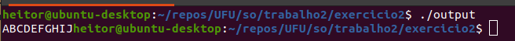

# Ex1

## Assembly gerado com **GCC** no linux

```
	.file	"ex1.c"
	.text
	.globl	i
	.data
	.align 4
	.type	i, @object
	.size	i, 4
i:
	.long	3
	.comm	j,4,4
	.section	.rodata
.LC0:
	.string	"Hello World !"
.LC1:
	.string	"% d % d % d % d"
	.text
	.globl	main
	.type	main, @function
main:
.LFB0:
	.cfi_startproc
	endbr64
	pushq	%rbp
	.cfi_def_cfa_offset 16
	.cfi_offset 6, -16
	movq	%rsp, %rbp
	.cfi_def_cfa_register 6
	subq	$16, %rsp
	movl	$3, -8(%rbp)
	leaq	.LC0(%rip), %rdi
	call	puts@PLT
	movl	j(%rip), %edx
	movl	i(%rip), %eax
	movl	-8(%rbp), %esi
	movl	-4(%rbp), %ecx
	movl	%esi, %r8d
	movl	%eax, %esi
	leaq	.LC1(%rip), %rdi
	movl	$0, %eax
	call	printf@PLT
	movl	$0, %eax
	leave
	.cfi_def_cfa 7, 8
	ret
	.cfi_endproc
.LFE0:
	.size	main, .-main
	.ident	"GCC: (Ubuntu 9.3.0-17ubuntu1~20.04) 9.3.0"
	.section	.note.GNU-stack,"",@progbits
	.section	.note.gnu.property,"a"
	.align 8
	.long	 1f - 0f
	.long	 4f - 1f
	.long	 5
0:
	.string	 "GNU"
1:
	.align 8
	.long	 0xc0000002
	.long	 3f - 2f
2:
	.long	 0x3
3:
	.align 8
4:

```

## Assembly gerado com **Clang** no linux

```
	.text
	.file	"ex1.c"
	.globl	main                            # -- Begin function main
	.p2align	4, 0x90
	.type	main,@function
main:                                   # @main
	.cfi_startproc
# %bb.0:
	pushq	%rbp
	.cfi_def_cfa_offset 16
	.cfi_offset %rbp, -16
	movq	%rsp, %rbp
	.cfi_def_cfa_register %rbp
	subq	$16, %rsp
	movl	$3, -8(%rbp)
	movabsq	$.L.str, %rdi
	movb	$0, %al
	callq	printf
	movl	i, %esi
	movl	j, %edx
	movl	-4(%rbp), %ecx
	movl	-8(%rbp), %r8d
	movabsq	$.L.str.1, %rdi
	movb	$0, %al
	callq	printf
	xorl	%eax, %eax
	addq	$16, %rsp
	popq	%rbp
	.cfi_def_cfa %rsp, 8
	retq
.Lfunc_end0:
	.size	main, .Lfunc_end0-main
	.cfi_endproc
                                        # -- End function
	.type	i,@object                       # @i
	.data
	.globl	i
	.p2align	2
i:
	.long	3                               # 0x3
	.size	i, 4

	.type	.L.str,@object                  # @.str
	.section	.rodata.str1.1,"aMS",@progbits,1
.L.str:
	.asciz	"Hello World !\n"
	.size	.L.str, 15

	.type	.L.str.1,@object                # @.str.1
.L.str.1:
	.asciz	"% d % d % d % d"
	.size	.L.str.1, 16

	.type	j,@object                       # @j
	.bss
	.globl	j
	.p2align	2
j:
	.long	0                               # 0x0
	.size	j, 4

	.ident	"Ubuntu clang version 14.0.0-++20210816052626+d6fe8d37c68d-1~exp1~20210816153436.513"
	.section	".note.GNU-stack","",@progbits
	.addrsig
	.addrsig_sym printf
	.addrsig_sym i
	.addrsig_sym j

```

## Diferenças

A principal diferença entre o código gerado pelos dos compiladores encontrada foi onde foram declaradas as variáveis e constantes, com o GCC isso é feito antes da main, alguns comandos são diferentes, dentro da main o primeiro comando que diverge de um pra outro é que no gcc na linha 30 foi usando  comando

```leaq	.LC0(%rip), %rdi```

Já no clang a linha correspondente usa o comando

```movabsq	$.L.str, %rdi```

Outra diferença é na chamada do printf, o gcc no primeiro print que não necessitou de formatação executou no lugar o "puts" provavelmente por questões de otimização

# Ex2

Resolver problema da biblioteca ter sido compilada em outra arquitetura

```sudo apt install gcc-multilib```

Gerar um *.o* compatível com a arquitetura 32 bits

```gcc -Wall -g -c -m32 ex2.c```

Linkedissão do passcode.o com o ex2.o

```gcc ex2.o passcode.o -m32 -o output```

Executar o arquivo output

```./output```



# Ex3

# Ex4

## prog02

Número de execução|real|user|sys
-|-|-|-
0|0,039s|0,000s|0,039s
1|0,039s|0,008s|0,029s
2|0,042s|0,004s|0,037s
3|0,042s|0,006s|0,034s
4|0,043s|0,004s|0,038s
5|0,042s|0,015s|0,027s
6|0,044s|0,012s|0,032s
7|0,019s|0,000s|0,019s
8|0,019s|0,004s|0,015s
9|0,054s|0,016s|0,032s
10|0,040s|0,004s|0,036s
Média|0,0423s|0,0075s|0,0306s

## prog03

Número de execução|real|user|sys
-|-|-|-
0|0,011s|0,000s|0,011s
1|0,007s|0,003s|0,004s
2|0,012s|0,000s|0,012s
3|0,011s|0,000s|0,011s
4|0,009s|0,000s|0,009s
5|0,007s|0,000s|0,007s
6|0,012s|0,000s|0,012s
7|0,011s|0,000s|0,011s
8|0,012s|0,000s|0,011s
9|0,011s|0,004s|0,007s
10|0,007s|0,000s|0,007s
Média|0,0108s|0,0007s|0,0098s

# Ex5