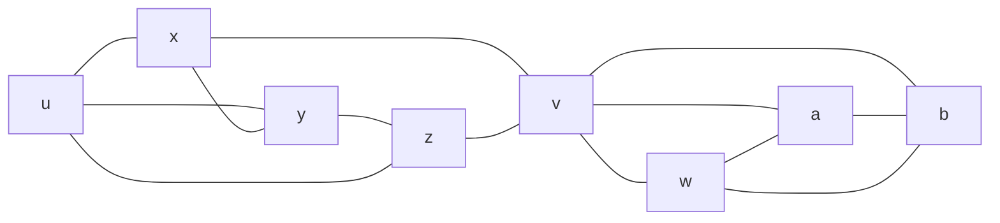
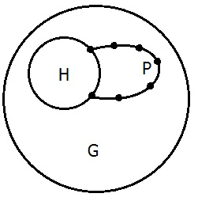

# Recaptulando

## K-Conectividade

> Dado um grafo conexo, você precisa de remover **pelo menos k *vértices*** para tornar o grafo desconexo.

Ou também, devido ao teorema de Menger pode ser expressa por

> Dado um grafo conexo, ele é k-conexo se e somente se quaisquer par de vértice existem k caminhos independentes entre eles.

# Grafo 2-Conexo

> Grafo em que qualquer par de vértices tem pelo menos 2 caminhos independentes entre eles.

> Grafo que precisa de mais de um vértice ser removido para se tornar desconexo desconexo.

## Exemplo de grafo 1-Conexo

> **v** é ponte

# Teorema 3.1.1 Blocos

## Definições

| Termo            | Definição                                                                |
| ---------------- | ------------------------------------------------------------------------ |
| Ligação          | Conjunto mínimo de arestas que se removidas provocam desconexão do grafo |
| Vértice de corte | Vértice que ao ser removido provoca desconexão do grafo                  |
| Bloco            | Subgrafo conexo maximal sem uma ponte                                    |
| Ponte            | Aresta que, se removida, desconecta o grafo                              |
| Ciclo            | Passeio sem vértices repetidos que começa e termina no mesmo vértice     |

## Propriedades de um bloco

Devido a maximidade do bloco, blocos em um grafo compartilham no máximo um vértice, este vértice compartilhado é uma ponte.

Portanto todo nó em um grafo está em um único bloco, e este grafo é a união de todos os blocos.

1. Os ciclos em um grafo são os ciclos de seus blocos.
2. As ligações de um grafo são os cortes mínimos de seus blocos.

> Prova

1. Qualquer ciclo é um subgrafo conexo sem uma ponte (dai vem sua maximidade), logo é um bloco.
2. Cosiderano um corte no grafo, com os vértices $xy \subset B$, sendo $B$ um bloco, pela maximidade do bloco, o grafo não possuí um caminho $B$, logo todo caminho entre $x$ e $y$ passa por $B$, então se eu cortar um caminho em $B$ que separa $x$ e $y$, também cortam o caminho

> Logo blocos são para a 2-conectividade o que componentes conexas são para a conectividade.

Como os blocos são disjuntos a não ser pelos  vértices de corte (articulações), eles dão a estrutura do grafo pela intersecção de blocos nos vértices de corte.

[DESENHAR UM GRAFO COM BLOCOS E VÉRTICES DE CORTE E TRANSFORMAR NA ÁRVORE DE BLOCOS]

Logo todo bloco de um grafo ou é um subgrafo conexo maximal, ou é uma ponte ou é um vértice isolado.

# Proposição 3.1.2

> Um grafo é 2-conexo s.s.s. pode ser construído a partir de um ciclo por sucetivamente adicionar caminhos $H$ em grafos H já existentes.

You can think of P and H as being subgraphs of a larger graph. Here's another version of what I think is intended by Diestel there:

If H is a subgraph of G, then a path P in G is an H-path if the endpoints of P are in H and none of the other vertices or edges are in H.

# Aplicação

- Apresentar o código do wikiscrapper
- Comentar sobre a forma de popular o grafo (bfs *vs* dfs)
- Algorigmo de gerar lista ordenada com base nos critérios
  1. Quantidade de caminhos disjuntos entre o vértice de origem e o vértice de destino
  2. Considerando os com a mesma quantidade de caminhos disjuntos, escolher o vértice de menor distância